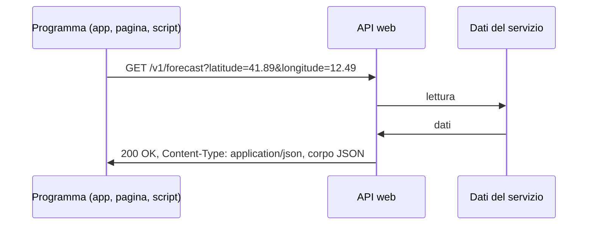

# Lezione 5.2: API REST

> Contenuto originale. Riferimenti: Wikipedia, "Representational state transfer", https://it.wikipedia.org/wiki/Representational_state_transfer ; documentazione delle API di Open Library, https://openlibrary.org/developers/api e https://openlibrary.org/dev/docs/api/search ; documentazione di Open-Meteo, https://open-meteo.com/en/docs e condizioni d'uso, https://open-meteo.com/en/terms . Gli script sono nella cartella `laboratorio`.

Obiettivo: spiegare che cos'è un'API web e come è organizzata secondo lo stile REST, e interrogare API pubbliche con REST Client e con Python.

## 5.2.1 Che cos'è un'API web

Un'**API** (Application Programming Interface) è un'interfaccia pensata per i programmi invece che per le persone. Un'**API web** risponde a richieste HTTP (lezione 1.4) restituendo dati, di solito in JSON, invece di pagine HTML. Le app per smartphone, i siti moderni e i servizi cloud comunicano quasi sempre attraverso API.



## 5.2.2 Lo stile REST

**REST** (Representational State Transfer) è uno stile di progettazione descritto da Roy Fielding nel 2000. Un'API "REST" o "RESTful" ne segue i principi principali:

- **Risorse identificate da URL**: `/api/libri` (la raccolta dei libri), `/api/libri/19` (un libro). Gli URL indicano *che cosa*, non *che cosa fare*: si evita `/api/cancellaLibro?id=19`.
- **Metodi HTTP con un significato preciso**, che corrispondono alle quattro operazioni sui dati (CRUD: create, read, update, delete):

| Metodo | Operazione | Esempio | Risposta tipica |
|---|---|---|---|
| GET | leggere | `GET /api/libri/19` | 200 con il libro |
| POST | creare | `POST /api/prestiti` con i dati nel corpo | 201 con la risorsa creata |
| PUT, PATCH | sostituire, modificare | `PATCH /api/copie/5` | 200 |
| DELETE | eliminare | `DELETE /api/prenotazioni/7` | 204 senza corpo |

- **Rappresentazioni**: la risorsa viaggia in un formato, indicato dall'intestazione `Content-Type` (quasi sempre `application/json`).
- **Senza stato**: ogni richiesta contiene tutto ciò che serve per elaborarla (compresa l'eventuale autenticazione); il server non ricorda le richieste precedenti.
- **Codici di stato** usati in modo coerente:

| Codice | Significato nelle API |
|---|---|
| 200, 201, 204 | riuscita; risorsa creata; riuscita senza contenuto |
| 400 | richiesta non valida (parametri o JSON sbagliati) |
| 401, 403 | autenticazione mancante; permesso negato |
| 404 | risorsa inesistente |
| 409 | conflitto con lo stato attuale (per esempio copia già in prestito) |
| 429 | troppe richieste: superato il limite d'uso |
| 500, 503 | errore del server; servizio non disponibile |

- **Parametri** nell'URL per filtrare, ordinare e dividere i risultati in pagine: `?q=calvino&limit=10&page=2`.

Il corpo di una risposta di errore contiene di solito un messaggio in JSON, utile per capire che cosa correggere.

## 5.2.3 API pubbliche: chiavi, limiti, licenze

Molti enti e aziende offrono API pubbliche: dati meteorologici, cataloghi di biblioteche, orari dei trasporti, dati aperti della Pubblica Amministrazione.

- **Chiave di accesso** (API key): molte API richiedono una registrazione e un codice personale da inviare con ogni richiesta. La chiave identifica chi usa il servizio e va trattata come una password: non si scrive nel codice pubblicato né si condivide. In questa lezione si usano solo API **senza chiave e senza registrazione**.
- **Limiti d'uso**: numero massimo di richieste al secondo o al giorno. Open Library chiede non più di una richiesta al secondo senza identificazione e un'intestazione `User-Agent` con il nome dell'applicazione; Open-Meteo permette fino a 10 000 richieste al giorno per usi non commerciali.
- **Condizioni d'uso e licenze dei dati**: i dati di Open-Meteo sono distribuiti con licenza CC BY 4.0, che richiede di citare la fonte; le API di Open Library non vanno usate per scaricare grandi quantità di dati.
- **Documentazione**: ogni API descrive risorse, parametri e formato delle risposte; molte usano lo standard **OpenAPI**, da cui si generano pagine interattive di prova.

Le due API del laboratorio:

| API | Risorsa | Parametri principali | Contenuto della risposta |
|---|---|---|---|
| Open Library (Internet Archive), ricerca libri | `https://openlibrary.org/search.json` | `q` (testo), `author`, `fields` (campi da restituire), `limit` | elenco `docs`, con `title`, `author_name` (elenco), `first_publish_year` |
| Open-Meteo, previsioni | `https://api.open-meteo.com/v1/forecast` | `latitude`, `longitude`, `current` o `hourly` (variabili), `timezone` | oggetto `current` con `time` e valori; `current_units` con le unità di misura |

Struttura di una risposta di Open-Meteo (esempio abbreviato; i valori reali cambiano a ogni richiesta):

```json
{
  "latitude": 41.9,
  "longitude": 12.5,
  "timezone": "Europe/Rome",
  "current_units": {"time": "iso8601", "temperature_2m": "°C", "wind_speed_10m": "km/h"},
  "current": {"time": "2026-06-10T10:00", "temperature_2m": 24.3, "wind_speed_10m": 7.2}
}
```

## 5.2.4 Laboratorio

Tempo indicativo: 45 minuti. Cartella di lavoro `C:\corso-reti\lab52`, con i file della cartella `laboratorio`.

### Parte 1: REST Client

Aprire `api_pubbliche.http` in VS Code (estensione REST Client, lezione 1.4) ed eseguire le richieste una alla volta con **Send Request**.

```http
### 3. Meteo attuale a Roma (Open-Meteo): latitudine e longitudine, variabili richieste
GET {{meteo}}/v1/forecast?latitude=41.89&longitude=12.49&current=temperature_2m,wind_speed_10m&timezone=Europe/Rome
```

Per ogni risposta annotare codice di stato, `Content-Type`, dimensione, e la struttura del JSON (quali oggetti, quali elenchi). Domande:

1. Richieste 1 e 2: che cosa cambia nella risposta aggiungendo o togliendo campi dal parametro `fields`?
2. Richiesta 3: sostituire le coordinate con quelle della propria scuola (si leggono su una mappa online con il tasto destro sul punto). Dove si trovano le unità di misura?
3. Richiesta 5: quale codice di stato restituisce l'API con una latitudine impossibile? Che cosa contiene il corpo?

### Parte 2: un client in Python

```powershell
python client_api.py libri "il barone rampante"
python client_api.py meteo 41.89 12.49
```

Punti principali del codice:

```python
indirizzo = url + "?" + urllib.parse.urlencode(parametri)     # "q=il+barone+rampante&limit=5..."
richiesta = urllib.request.Request(indirizzo, headers={"User-Agent": USER_AGENT})
with urllib.request.urlopen(richiesta, timeout=10) as risposta:
    return risposta.status, json.loads(risposta.read().decode("utf-8"))
```

- `urllib.parse.urlencode` costruisce i parametri dell'URL, codificando spazi e caratteri speciali
- `urllib.request.Request` permette di aggiungere intestazioni, qui `User-Agent` come chiede Open Library
- `timeout=10` evita che il programma resti bloccato se il servizio non risponde
- `urllib.error.HTTPError` intercetta le risposte con codice 4xx e 5xx, da cui si legge comunque il corpo con il messaggio di errore; `URLError` indica che il servizio non è raggiungibile (rete assente, nome inesistente)
- `d.get("author_name", [])` gestisce i campi che in alcune risposte mancano: un client robusto non presume che ogni campo sia sempre presente
- `richiesta_json` attende, se necessario, perché passi almeno un secondo tra due richieste, rispettando il limite d'uso

Test: `python test_client_api.py` (10 test). I test non usano Internet: avviano sul proprio PC un piccolo server che risponde con la stessa struttura documentata dalle due API, compresi un errore 400 e una risposta non JSON. È una tecnica comune per provare un client in modo ripetibile, senza dipendere dalla rete e senza consumare il limite d'uso del servizio reale.

### Attività

1. Aggiungere a `client_api.py` il comando `previsione LAT LON`, che mostri la temperatura prevista ora per ora nelle prossime 24 ore (parametri `hourly=temperature_2m` e `forecast_days=1`, richiesta 4 del file `.http`).
2. Nella ricerca di libri, stampare anche il numero di edizioni (campo `edition_count`, da aggiungere a `fields`).
3. Se la rete della scuola usa un proxy o blocca un sito, quale eccezione riceve il programma? Che cosa vede l'utente?

## 5.2.5 Aspetti orientativi (discussione)

- Progettare, documentare e mantenere API è un'attività centrale dello sviluppo software (sviluppatori back-end, integratori di sistemi); molte aziende vendono l'accesso alle proprie API come prodotto.
- Le API pubbliche della Pubblica Amministrazione e i dati aperti permettono a cittadini e imprese di creare nuovi servizi.
- Domanda: perché un servizio gratuito impone limiti d'uso? Che cosa succederebbe se un'app molto diffusa interrogasse l'API a ogni apertura, per ogni utente?
