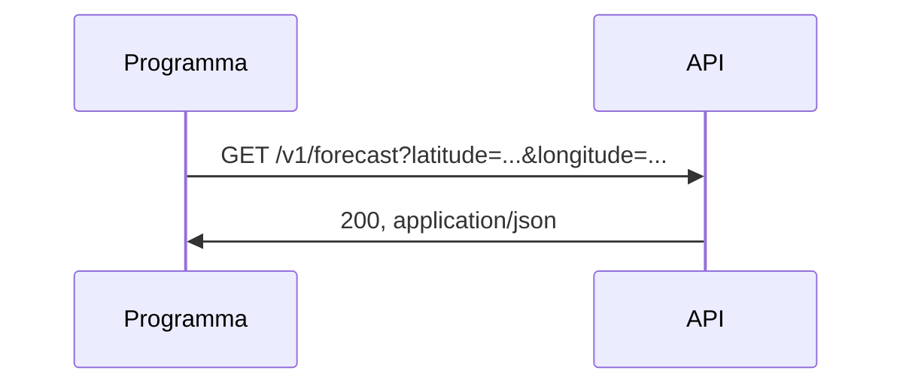

## Lezione 5.2: API REST

Modulo 5: Dati in movimento. Reti, Cloud e Gestione dei Dati

---

## API web

- Interfaccia per programmi, dati in JSON

---

## Lo stile REST

| Metodo | Operazione | Codice tipico |
|---|---|---|
| GET | leggere | 200 |
| POST | creare | 201 |
| PUT, PATCH | modificare | 200 |
| DELETE | eliminare | 204 |

- Risorse come URL, senza stato, codici coerenti (400, 404, 409, 429)

---

## API pubbliche

- Chiavi di accesso: come password
- Limiti d'uso: Open Library 1 richiesta al secondo; Open-Meteo 10 000 al giorno
- Licenze dei dati: Open-Meteo CC BY 4.0
- Documentazione, OpenAPI

---

## Laboratorio

1. REST Client: `api_pubbliche.http` (Open Library, Open-Meteo)
2. `python client_api.py libri "il barone rampante"`
3. `python client_api.py meteo 41.89 12.49`
4. 10 test con un server locale che imita le API

---

## Aspetti orientativi

- API: prodotto e infrastruttura del software moderno
- Dati aperti della Pubblica Amministrazione
- Perché un servizio gratuito limita le richieste?
