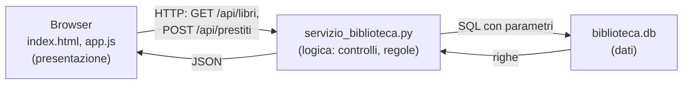

# Lezione 5.3: Laboratorio, servizio e client

> Contenuto originale. Riferimenti: MDN Web Docs, "Using the Fetch API", https://developer.mozilla.org/en-US/docs/Web/API/Fetch_API/Using_Fetch ; MDN, "Cross-Origin Resource Sharing (CORS)", https://developer.mozilla.org/en-US/docs/Web/HTTP/Guides/CORS . I file sono nella cartella `laboratorio`.

Obiettivo: costruire e osservare il percorso completo di un'applicazione web: pagina nel browser, API, database.

## 5.3.1 L'architettura a tre livelli

Il laboratorio riunisce quanto visto nei moduli precedenti: HTTP (lezione 1.4), database (modulo 4), JSON e API (lezioni 5.1 e 5.2).



- **Presentazione**: la pagina HTML e il codice JavaScript che gira nel browser; mostra i dati e raccoglie le azioni dell'utente.
- **Logica**: il servizio Python; applica le regole (una copia smarrita non si presta, la scadenza è a 30 giorni) e decide che cosa restituire.
- **Dati**: il database, che garantisce la conservazione e i vincoli.

Il browser non accede mai direttamente al database: può solo chiedere al servizio le operazioni che l'API prevede. Per lo stesso motivo l'API non espone i dati personali degli studenti, che alla pagina non servono.

Risorse dell'API:

| Metodo e URL | Risultato | Codici |
|---|---|---|
| `GET /api/generi` | elenco dei generi | 200 |
| `GET /api/libri?cerca=...&genere=...` | libri con copie totali e disponibili | 200 |
| `GET /api/libri/{id}` | un libro con le sue copie | 200, 404 |
| `POST /api/prestiti` con `{"collocazione": "A1-2", "id_studente": 3}` | nuovo prestito | 201, 400, 404, 409 |
| `POST /api/prestiti/{id}/restituzione` | registrazione della restituzione | 200, 400, 404, 409 |

## 5.3.2 Il servizio

```python
elif m := re.fullmatch(r"/api/libri/(\d+)", parti.path):
    c = connetti()
    try:
        self.json(200, dettaglio_libro(c, int(m.group(1))))
    finally:
        c.close()
```

- il servizio usa `http.server` della libreria standard, come il server didattico della lezione 1.4, in versione `ThreadingHTTPServer` (una richiesta non blocca le altre)
- `re.fullmatch` riconosce gli URL con un numero variabile (`/api/libri/19`) e ne estrae il numero; `:=` assegna il risultato mentre lo controlla
- ogni errore previsto solleva `ErroreApi(codice, messaggio)`, trasformato in una risposta JSON `{"errore": "..."}` con il codice di stato corretto
- tutte le interrogazioni usano parametri (`?`); le modifiche avvengono in transazione (`with c:`)
- `file_statico` serve solo file con nomi semplici della cartella `static`: una richiesta come `/static/../biblioteca.db` viene rifiutata, perché altrimenti chiunque potrebbe scaricare il database
- la disponibilità delle copie è calcolata in SQL con `NOT EXISTS`: una copia è disponibile se non è smarrita e non ha prestiti senza data di restituzione

## 5.3.3 La pagina e fetch

```javascript
async function caricaLibri() {
  const parametri = new URLSearchParams({ cerca: ..., genere: ... });
  const risposta = await fetch("/api/libri?" + parametri);     // richiesta HTTP dal browser
  const libri = await risposta.json();                         // corpo JSON -> array di oggetti
  for (const libro of libri) {
    const riga = tabella.insertRow();
    riga.insertCell().textContent = libro.titolo;              // testo, mai HTML
    ...
  }
}
```

- `fetch` invia una richiesta HTTP e restituisce una **promessa**; `await` attende la risposta senza bloccare la pagina (funzioni `async`)
- `fetch` segnala un errore solo se la rete non funziona: con un codice 404 o 409 la risposta arriva normalmente, e il programma deve controllare `risposta.ok` o `risposta.status`
- i dati vengono inseriti con `textContent`, che tratta tutto come testo: un titolo che contenesse `<script>` non diventerebbe codice eseguibile (prevenzione del cross-site scripting, Corso 2, modulo 5)
- per il nuovo prestito `fetch` usa `method: "POST"`, l'intestazione `Content-Type: application/json` e il corpo prodotto da `JSON.stringify`

La pagina e l'API sono servite dallo stesso servizio, con la stessa origine (`http://127.0.0.1:8000`). Se la pagina fosse ospitata altrove, il browser bloccherebbe la lettura delle risposte a meno che il servizio non la autorizzi con l'intestazione `Access-Control-Allow-Origin` (meccanismo **CORS**): è una protezione del browser, non del server.

## 5.3.4 Laboratorio

Tempo indicativo: 60 minuti. Cartella di lavoro `C:\corso-reti\lab53`, con i file della cartella `laboratorio` (compresa la sottocartella `static`) e una copia di `biblioteca.db` della lezione 4.1.

### Parte 1: avvio e prova con REST Client

```powershell
python servizio_biblioteca.py
```

Il servizio stampa ogni richiesta ricevuta con il codice di risposta. Aprire `richieste_biblioteca.http` ed eseguire le dieci richieste: per ciascuna verificare che il codice di stato sia quello indicato nel commento e leggere il corpo della risposta.

### Parte 2: la pagina nel browser e i DevTools

1. Aprire `http://127.0.0.1:8000/` nel browser: il catalogo mostra 29 libri, con le copie disponibili.
2. Aprire gli **Strumenti per sviluppatori** (`F12`), scheda **Rete** (Network), e ricaricare la pagina: individuare la richiesta del documento HTML, dello script `app.js`, del foglio di stile e le due richieste all'API. Per `/api/libri` osservare intestazioni, **Anteprima** (Preview) del JSON e tempi.
3. Cercare "calvino", poi scegliere il genere "fantascienza": quali richieste parte la pagina? Con quali parametri?
4. Fare clic su un titolo: quale richiesta viene inviata?
5. Registrare un prestito della copia `D4-1` per lo studente 12: nella scheda Rete osservare metodo, corpo inviato (**Payload**) e risposta 201; la tabella si aggiorna da sola. Ripetere la stessa richiesta: codice 409 e messaggio di errore nella pagina. Nella scheda **Console** compare l'avviso della risposta 409.
6. Nel terminale del servizio confrontare le righe stampate con le richieste viste nel browser.

### Parte 3: test automatici

```powershell
python test_servizio.py
```

I 28 test avviano il servizio su una porta libera con una copia temporanea del database e verificano: pagina e file statici, rifiuto dei percorsi non ammessi, elenchi e filtri, disponibilità delle copie, tutti i codici di errore, ciclo completo prestito e restituzione, codifica UTF-8 delle risposte.

### Attività

1. Aggiungere la risorsa `GET /api/statistiche`, che restituisca il numero di prestiti in corso e i tre libri più prestati, e un test. Mostrare le statistiche nella pagina.
2. Aggiungere alla pagina, accanto a ogni copia non disponibile, un pulsante per registrare la restituzione (richiede di conoscere il numero del prestito: quale risorsa dell'API andrebbe modificata?).
3. Chiunque raggiunga il servizio può registrare prestiti. Quali misure servirebbero in un servizio reale (Corso 2, moduli 5 e 6)?
4. Con il servizio avviato, eseguire `curl.exe --path-as-is http://127.0.0.1:8000/static/../biblioteca.db` (l'opzione `--path-as-is` invia il percorso così com'è; il browser invece lo semplificherebbe in `/biblioteca.db`): che cosa risponde il servizio, e perché è importante?

## 5.3.5 Aspetti orientativi (discussione)

- Questa architettura è quella della maggior parte delle applicazioni web: gli sviluppatori front-end lavorano sulla pagina, quelli back-end sul servizio e sui dati, gli sviluppatori full-stack su entrambi.
- Nel modulo 6 lo stesso servizio potrebbe essere eseguito nel cloud, in un container, con il database gestito dal fornitore.
- Domanda: se il servizio diventa lento con molti utenti, in quale dei tre livelli si potrebbe intervenire, e come?
