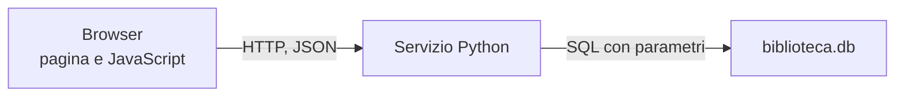

## Contenuti

- Tre livelli
- L'API della biblioteca
- fetch nella pagina
- Laboratorio
- Aspetti orientativi

## Tre livelli

- Il browser non accede mai al database

## L'API della biblioteca

| Richiesta | Codici |
|---|---|
| GET /api/libri?cerca=&genere= | 200 |
| GET /api/libri/{id} | 200, 404 |
| POST /api/prestiti | 201, 400, 404, 409 |
| POST /api/prestiti/{id}/restituzione | 200, 400, 404, 409 |

## fetch nella pagina

- `await fetch(...)`, `await risposta.json()`
- Controllare `risposta.ok`: i codici 4xx non sono errori di rete
- `textContent`, mai `innerHTML`
- Stessa origine; altrimenti CORS

## Laboratorio

1. `python servizio_biblioteca.py`; `richieste_biblioteca.http`
2. Browser e DevTools: Rete, Payload, Console
3. `python test_servizio.py`: 28 test

## Aspetti orientativi

- Front-end, back-end, full-stack
- Lo stesso servizio nel cloud (modulo 6)
- Servizio lento: dove intervenire?
