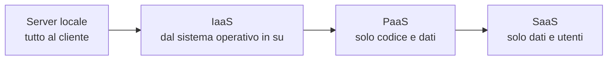

# Lezione 6.1: Modelli del cloud

> Contenuto originale. Riferimenti: NIST, "The NIST Definition of Cloud Computing" (SP 800-145, 2011), https://csrc.nist.gov/pubs/sp/800/145/final ; Wikipedia, "Cloud computing", https://it.wikipedia.org/wiki/Cloud_computing ; Strategia Cloud Italia, https://cloud.italia.it/strategia-cloud-pa/ ; Polo Strategico Nazionale, https://www.polostrategiconazionale.it/ . La soluzione dell'attività è nel file `laboratorio/soluzioni_docente.md`.

Obiettivo: definire il cloud computing, distinguere i modelli di servizio e di distribuzione e riconoscerli nei servizi usati ogni giorno.

## 6.1.1 Che cos'è il cloud

Il **cloud computing** è l'uso di risorse informatiche (server, spazio di archiviazione, database, programmi) fornite attraverso la rete da un fornitore, che le gestisce nei propri data center. Invece di acquistare e mantenere i server, un'organizzazione li "noleggia" e paga in base all'uso.

La definizione più citata, del NIST (l'ente statunitense per gli standard), indica cinque caratteristiche essenziali:

- **servizio su richiesta**: l'utente attiva le risorse da solo, da una console web o con un programma, senza chiedere a una persona del fornitore
- **accesso attraverso la rete**, da qualunque dispositivo
- **risorse condivise**: le stesse macchine fisiche servono molti clienti, separati tra loro
- **elasticità rapida**: le risorse aumentano o diminuiscono in pochi minuti, anche in modo automatico
- **servizio misurato**: l'uso viene misurato e fatturato (ore di calcolo, gigabyte, richieste)

## 6.1.2 Modelli di servizio: IaaS, PaaS, SaaS

I modelli differiscono per **che cosa gestisce il fornitore** e che cosa resta al cliente.

| Livello | Server locale | IaaS | PaaS | SaaS |
|---|---|---|---|---|
| Applicazione e dati | cliente | cliente | cliente | fornitore (i dati restano del cliente) |
| Ambiente di esecuzione (linguaggi, database) | cliente | cliente | fornitore | fornitore |
| Sistema operativo | cliente | cliente | fornitore | fornitore |
| Virtualizzazione, server, rete, archiviazione | cliente | fornitore | fornitore | fornitore |
| Edificio, energia, raffreddamento | cliente | fornitore | fornitore | fornitore |

- **IaaS** (Infrastructure as a Service): il fornitore offre macchine virtuali, dischi e reti; il cliente installa e aggiorna sistema operativo e programmi. Esempio: una macchina virtuale Linux su cui installare il servizio della biblioteca.
- **PaaS** (Platform as a Service): il cliente carica solo il proprio codice o usa servizi già pronti (un database gestito, un servizio di archiviazione a oggetti); il fornitore si occupa di sistema operativo, aggiornamenti, scalabilità.
- **SaaS** (Software as a Service): un'applicazione completa usata dal browser o da un'app: posta elettronica, registro elettronico, suite per l'ufficio online.

Diagramma: più si sale, meno il cliente deve gestire.

Esistono molte varianti con nomi simili: DBaaS (database), FaaS (funzioni eseguite su richiesta, dette anche serverless), STaaS (archiviazione).

## 6.1.3 Modelli di distribuzione

- **Cloud pubblico**
  risorse di un fornitore condivise tra molti clienti, accessibili via Internet.
- **Cloud privato**
  infrastruttura con le stesse caratteristiche, usata da una sola organizzazione, nei suoi data center o in quelli di un fornitore.
- **Cloud ibrido**
  combinazione di cloud privato (o server locali) e pubblico, collegati tra loro: per esempio dati sensibili in casa e servizi web nel cloud pubblico.
- **Cloud di comunità**
  condiviso da organizzazioni con esigenze comuni, per esempio enti pubblici.

Molte organizzazioni usano più fornitori contemporaneamente (**multicloud**), per ridurre la dipendenza da uno solo (**lock-in**).

## 6.1.4 Regioni e zone

I grandi fornitori hanno data center in tutto il mondo, organizzati in:

- **regioni**: aree geografiche (per esempio un'area metropolitana), ciascuna con più data center; diversi fornitori hanno regioni anche in Italia;
- **zone di disponibilità**: gruppi di data center della stessa regione, a qualche chilometro di distanza, con alimentazione, raffreddamento e rete indipendenti; se una zona si ferma, le altre continuano a funzionare.

La scelta della regione determina dove si trovano fisicamente i dati (importante per le leggi sulla protezione dei dati, lezione 6.4) e il tempo di risposta per gli utenti.

## 6.1.5 Il cloud nella Pubblica Amministrazione italiana

La **Strategia Cloud Italia** (Dipartimento per la trasformazione digitale e Agenzia per la Cybersicurezza Nazionale) guida la migrazione al cloud degli enti pubblici:

- i dati e i servizi della PA sono classificati come **strategici**, **critici** od **ordinari**, secondo il danno che deriverebbe dalla loro compromissione;
- i servizi cloud usabili dalla PA devono essere **qualificati** dall'Agenzia per la Cybersicurezza Nazionale, che ne verifica sicurezza e affidabilità;
- il **Polo Strategico Nazionale** è l'infrastruttura cloud dello Stato per i dati e i servizi strategici e critici;
- la migrazione è finanziata dal Piano nazionale di ripresa e resilienza.

La scuola usa già molti servizi SaaS: registro elettronico, piattaforme per la didattica, posta.

## 6.1.6 Laboratorio: classificazione dei servizi

Tempo indicativo: 30 minuti, a coppie.

Per ogni servizio indicare: è un servizio cloud? Se sì, quale modello di servizio (IaaS, PaaS, SaaS) e chi è responsabile di aggiornamenti, dati, account degli utenti.

| N. | Servizio |
|---|---|
| 1 | La posta elettronica della scuola usata dal browser |
| 2 | Il registro elettronico |
| 3 | Una macchina virtuale noleggiata per installare il servizio della biblioteca (lezione 5.3) |
| 4 | Un database gestito dal fornitore, a cui il servizio della biblioteca si collega |
| 5 | Lo spazio di archiviazione a oggetti in cui salvare le copertine dei libri (lezione 6.3) |
| 6 | Il foglio di calcolo installato sul PC del laboratorio |
| 7 | Un servizio online di videochiamate |
| 8 | Un server acquistato dalla scuola e installato nella sala server |
| 9 | Una piattaforma che esegue il codice Python caricato dal cliente, senza che questi gestisca server |
| 10 | La sincronizzazione delle foto dello smartphone |

Domande:

1. Quali caratteristiche del NIST mancano al server della scuola (servizio 8)?
2. Per i servizi SaaS della lista, chi decide quando aggiornare il programma? Che cosa resta comunque responsabilità della scuola?
3. La scuola vuole spostare nel cloud il servizio della biblioteca: meglio IaaS o PaaS? Elencare vantaggi e svantaggi.

## 6.1.7 Aspetti orientativi (discussione)

- Il cloud ha cambiato il lavoro dei sistemisti: meno installazione di hardware, più automazione, configurazione di servizi e controllo dei costi (cloud engineer, cloud architect).
- Le competenze sul cloud sono tra le più richieste; i grandi fornitori offrono percorsi di formazione e certificazioni, spesso con materiale gratuito.
- Domanda: quali rischi corre una scuola che affida tutti i suoi servizi a un unico fornitore?
