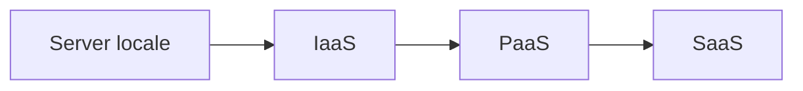

## Contenuti

- Cinque caratteristiche (NIST)
- IaaS, PaaS, SaaS
- Distribuzione, regioni, zone
- Cloud nella PA
- Laboratorio
- Aspetti orientativi

## Cinque caratteristiche (NIST)

- Servizio su richiesta
- Accesso attraverso la rete
- Risorse condivise
- Elasticità rapida
- Servizio misurato

## IaaS, PaaS, SaaS

- IaaS: macchine virtuali; PaaS: codice e servizi gestiti; SaaS: applicazioni complete
- Al cliente restano sempre dati e utenti

## Distribuzione, regioni, zone

- Pubblico, privato, ibrido, di comunità; multicloud e lock-in
- Regioni: aree geografiche; zone: data center indipendenti

## Cloud nella PA

- Strategia Cloud Italia: dati strategici, critici, ordinari
- Servizi qualificati dall'Agenzia per la Cybersicurezza Nazionale
- Polo Strategico Nazionale

## Laboratorio

- Dieci servizi da classificare: cloud o no, modello, responsabilità
- IaaS o PaaS per la biblioteca?

## Aspetti orientativi

- Cloud engineer, cloud architect
- Formazione e certificazioni dei fornitori
- Un solo fornitore per tutto: quali rischi?
