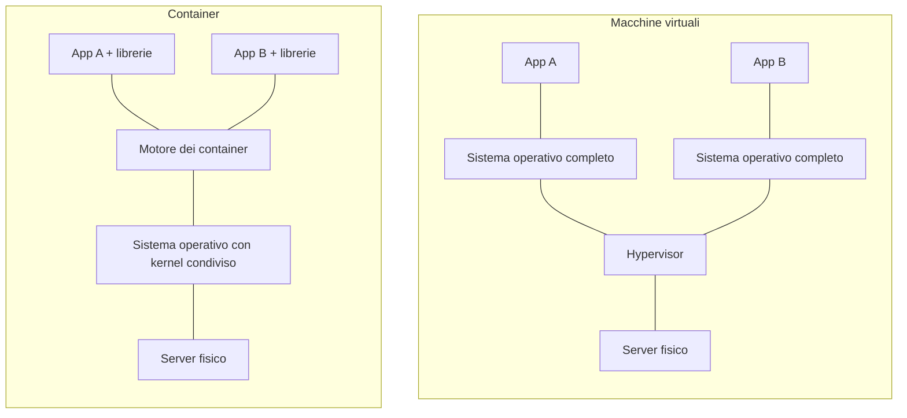

# Lezione 6.2: Virtualizzazione e container

> Contenuto originale. Riferimenti: Wikipedia, "Hypervisor", https://it.wikipedia.org/wiki/Hypervisor ; documentazione Docker, "Docker overview", https://docs.docker.com/get-started/docker-overview/ e "Dockerfile reference", https://docs.docker.com/reference/dockerfile/ ; documentazione Kubernetes, "Overview", https://kubernetes.io/docs/concepts/overview/ . I file sono nella cartella `laboratorio`.

Obiettivo: spiegare come un solo server fisico può ospitare molti sistemi isolati, distinguere macchine virtuali e container e comprendere il ruolo dell'orchestrazione.

## 6.2.1 Macchine virtuali

La **virtualizzazione** permette di eseguire su un solo computer fisico più **macchine virtuali** (VM): computer simulati, ciascuno con il proprio sistema operativo, isolati tra loro. Il software che le crea e le controlla è l'**hypervisor**.

- **Hypervisor di tipo 1** (bare metal): funziona direttamente sull'hardware, senza un sistema operativo sotto; si usa nei data center e nel cloud. Esempi: VMware ESXi, Microsoft Hyper-V, KVM.
- **Hypervisor di tipo 2** (hosted): è un programma di un normale sistema operativo; si usa sui PC per prove e didattica. Esempio: VirtualBox.

L'hypervisor divide tra le VM processori, memoria, dischi e rete. È la tecnologia che rende possibile il cloud IaaS (lezione 6.1): la "macchina" noleggiata è una VM su un server del fornitore, condiviso con altri clienti.

Vantaggi: un server fisico usato meglio (meno macchine, meno energia), VM create e copiate in pochi minuti, **snapshot** (fotografie dello stato a cui tornare), spostamento di una VM da un server all'altro.

## 6.2.2 Container

Un **container** isola un'applicazione con tutto ciò che le serve (librerie, configurazione), ma **condivide il nucleo (kernel) del sistema operativo** del computer che lo ospita. Non contiene un sistema operativo completo: per questo è molto più leggero di una VM.

- **Immagine**: un modello di sola lettura con tutto il necessario per eseguire l'applicazione; si costruisce da un file di istruzioni, il **Dockerfile**, e si distribuisce tramite un **registro** di immagini.
- **Container**: un'istanza in esecuzione di un'immagine. Dalla stessa immagine si possono avviare molti container identici.

Diagramma: macchine virtuali e container sullo stesso tipo di server.



| | Macchina virtuale | Container |
|---|---|---|
| Contiene | un sistema operativo completo | applicazione e librerie |
| Dimensione tipica | gigabyte | decine o centinaia di megabyte |
| Avvio | minuti | secondi |
| Isolamento | molto forte (hardware simulato) | buono, ma il kernel è condiviso |
| Sistemi diversi sullo stesso server | sì (Windows e Linux insieme) | no, stesso tipo di kernel |
| Uso tipico | server completi, sistemi diversi, applicazioni tradizionali | servizi web, microservizi, ambienti uguali in sviluppo e produzione |

I due approcci si combinano: nel cloud i container girano spesso dentro macchine virtuali.

Il vantaggio pratico dei container: **"funziona sul mio computer" diventa "funziona ovunque"**, perché l'immagine contiene la stessa versione di Python e delle librerie in sviluppo, nei test e in produzione.

## 6.2.3 Orchestrazione

Un servizio reale può avere decine di container su molti server. Un **orchestratore** (il più diffuso è **Kubernetes**, open source) li gestisce automaticamente a partire da uno **stato desiderato** dichiarato dall'amministratore ("quattro repliche del servizio della biblioteca, ciascuna con mezzo core di CPU"):

- **collocazione**: sceglie su quali server avviare i container, in base alle risorse libere;
- **autoriparazione**: se un container o un intero server si ferma, ricrea i container altrove;
- **scalabilità**: aumenta o riduce il numero di repliche, anche in base al carico;
- **bilanciamento del carico**: distribuisce le richieste tra le repliche;
- **aggiornamenti progressivi**: sostituisce le repliche una alla volta con la nuova versione, e torna indietro se qualcosa non funziona.

## 6.2.4 Laboratorio

Tempo indicativo: 50 minuti. Cartella di lavoro `C:\corso-reti\lab62`, con i file della cartella `laboratorio`. Non serve installare Docker: il Dockerfile si legge e si commenta.

### Parte 1: confronto di scenari

A coppie, per ogni scenario scegliere tra server fisico, macchina virtuale e container, motivando la scelta con la tabella della sezione 6.2.2.

1. Il laboratorio di informatica deve provare un sistema operativo diverso da quello installato sui PC.
2. Il servizio della biblioteca (lezione 5.3) deve funzionare allo stesso modo sul PC dello sviluppatore e nel cloud.
3. Un programma gestionale richiede Windows Server, mentre il resto dei servizi della scuola gira su Linux.
4. Durante le iscrizioni online il sito della scuola riceve dieci volte le visite normali per due settimane.
5. Un software di controllo di una macchina industriale deve rispondere in tempi garantiti, senza altri programmi sullo stesso computer.

### Parte 2: lettura di un Dockerfile

Il file `Dockerfile` descrive l'immagine del servizio della biblioteca:

```dockerfile
FROM python:3.12-slim
WORKDIR /app
COPY servizio_biblioteca.py .
COPY static/ static/
COPY biblioteca.db .
RUN useradd --create-home servizio && chown -R servizio /app
USER servizio
EXPOSE 8000
CMD ["python", "servizio_biblioteca.py", "8000"]
```

| Istruzione | Significato |
|---|---|
| `FROM` | immagine di partenza: un Linux minimo con Python 3.12 |
| `WORKDIR` | cartella di lavoro dentro l'immagine |
| `COPY` | copia file dalla cartella del progetto all'immagine |
| `RUN` | comando eseguito durante la costruzione: qui crea un utente senza privilegi |
| `USER` | utente con cui gira il servizio: non l'amministratore, per limitare i danni in caso di vulnerabilità |
| `EXPOSE` | documenta la porta su cui il servizio ascolta |
| `CMD` | comando eseguito all'avvio di ogni container |

Il file `.dockerignore` elenca ciò che non va copiato nell'immagine (test, file temporanei).

Domande:

1. Il servizio della lezione 5.3 ascolta solo su `127.0.0.1`. Dentro un container questo indirizzo è quello del container stesso: che cosa si dovrebbe cambiare perché il servizio sia raggiungibile dall'esterno del container (`docker run -p 8000:8000`)?
2. Il database è copiato dentro l'immagine. Che cosa succede ai prestiti registrati quando il container viene eliminato e ricreato? Come si risolve (volumi, database gestito)?
3. Perché conviene che il servizio non giri come amministratore?

### Parte 3: simulazione di un orchestratore

```powershell
python orchestratore.py
```

```text
Dopo il rilascio di 4 repliche: {'nodo-a': ['biblioteca-1', 'biblioteca-3'], 'nodo-b': ['biblioteca-2', 'biblioteca-4'], 'nodo-c': []}
Dopo il guasto di nodo-a:      {'nodo-a': [], 'nodo-b': ['biblioteca-1', 'biblioteca-2', 'biblioteca-4'], 'nodo-c': ['biblioteca-3']}
Richieste 7 repliche:          {... 'nodo-c': ['biblioteca-3', 'biblioteca-6']}
Repliche in attesa: ['biblioteca-7']
Dopo il ritorno di nodo-a:     {'nodo-a': ['biblioteca-7'], ...}
```

- `Cluster` rappresenta i server (nodi) con la loro capacità di CPU in millesimi di core; ogni replica richiede 500 millesimi
- `applica` confronta lo stato attuale con quello desiderato e crea o elimina repliche: è il principio **dichiarativo** degli orchestratori
- `colloca` sceglie il nodo attivo con più capacità libera; se nessun nodo ha spazio, la replica resta **in attesa**
- `guasto` toglie un nodo e ricolloca le sue repliche sugli altri: è l'**autoriparazione**

Test: `python test_orchestratore.py` (8 test).

### Attività

1. Modificare `colloca` perché le repliche dello stesso servizio vadano, quando possibile, su nodi diversi. Perché è una buona regola?
2. Che cosa succede, nella simulazione, se si guastano due nodi su tre? Quante repliche restano in esecuzione?

## 6.2.5 Aspetti orientativi (discussione)

- Virtualizzazione e container sono il lavoro quotidiano dei sistemisti e delle figure DevOps, che uniscono sviluppo e gestione dei sistemi automatizzando costruzione, prova e rilascio del software.
- Kubernetes e i container sono tra le competenze più richieste negli annunci per il cloud.
- Domanda: se lo stesso server fisico ospita VM di clienti diversi, quali garanzie devono dare il fornitore e l'hypervisor?
