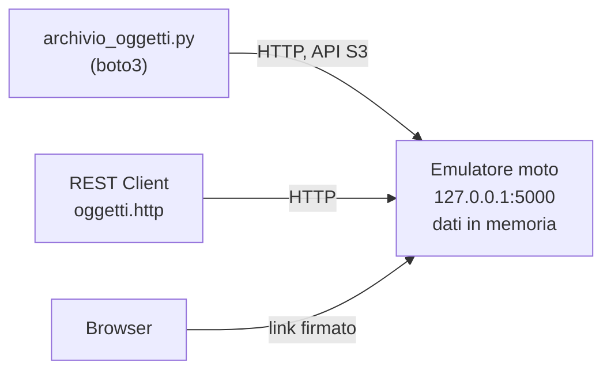

# Lezione 6.3: Laboratorio, archiviazione a oggetti

> Contenuto originale. Riferimenti: documentazione di Amazon S3, "What is Amazon S3?", https://docs.aws.amazon.com/AmazonS3/latest/userguide/Welcome.html ; documentazione boto3, "Presigned URLs", https://docs.aws.amazon.com/boto3/latest/guide/s3-presigned-urls.html ; emulatore moto (licenza Apache 2.0), https://github.com/getmoto/moto e https://docs.getmoto.org/en/latest/docs/server_mode.html . Gli script sono nella cartella `laboratorio`.

Obiettivo: usare un servizio di archiviazione a oggetti con l'API S3, su un emulatore locale che non richiede account né connessione ai servizi reali.

## 6.3.1 Tre modi di conservare i dati

| Tipo | Come si usa | Esempi | Uso tipico |
|---|---|---|---|
| a blocchi | un disco "grezzo" collegato a una macchina, che lo formatta | il disco di una macchina virtuale | sistema operativo, database |
| a file | cartelle e file condivisi in rete | cartella condivisa di Windows, NAS | documenti di un ufficio |
| a oggetti | oggetti identificati da una chiave, letti e scritti con richieste HTTP | servizi S3 dei fornitori cloud | immagini, video, copie di sicurezza, dati per l'analisi, siti statici |

L'**archiviazione a oggetti** è il modo più economico e scalabile di conservare grandi quantità di dati nel cloud: non ci sono dischi da dimensionare, si paga lo spazio usato e le richieste (lezione 6.4).

## 6.3.2 Bucket, oggetti, chiavi, metadati

- **Bucket**: il contenitore degli oggetti, creato in una regione. Nei servizi reali il nome deve essere unico tra tutti i clienti del fornitore.
- **Oggetto**: un file (dati) con i suoi **metadati**: tipo di contenuto (`Content-Type`), dimensione, data di modifica, **ETag** (un'impronta del contenuto) e metadati personalizzati scelti dall'utente.
- **Chiave**: il nome univoco dell'oggetto nel bucket, per esempio `copertine/1984.jpg`. Le "cartelle" non esistono davvero: sono parti della chiave separate da `/`, e gli elenchi si filtrano per **prefisso**.
- Un oggetto non si modifica in parte: si **sostituisce** interamente caricando di nuovo la stessa chiave. Con il **versionamento** attivo, le versioni precedenti restano recuperabili.

Ogni operazione è una richiesta HTTP (lezione 1.4):

| Operazione | Richiesta HTTP |
|---|---|
| elenco degli oggetti | `GET /bucket?list-type=2&prefix=copertine/` |
| caricamento | `PUT /bucket/chiave` con il contenuto nel corpo |
| lettura | `GET /bucket/chiave` |
| solo metadati | `HEAD /bucket/chiave` |
| cancellazione | `DELETE /bucket/chiave` |

L'**API S3**, introdotta da Amazon, è diventata uno standard di fatto: molti altri fornitori e prodotti open source offrono servizi compatibili, e gli stessi programmi funzionano cambiando solo l'indirizzo.

Diagramma: il laboratorio, senza servizi reali.



### Chi può leggere un oggetto

- Per impostazione predefinita gli oggetti sono **privati**: servono richieste **firmate** con le credenziali di un utente autorizzato. La libreria `boto3` calcola la firma automaticamente.
- Un **link firmato** (presigned URL) contiene una firma temporanea: chi lo riceve può leggere quell'oggetto, e solo quello, fino alla scadenza, senza avere credenziali.
- Un oggetto (o un intero bucket) può essere reso **pubblico**: chiunque conosca l'indirizzo può leggerlo. Molte fughe di dati sono nate da bucket resi pubblici per errore: la configurazione dei permessi è responsabilità del cliente (lezione 6.4).

## 6.3.3 Laboratorio

Tempo indicativo: 60 minuti. Cartella di lavoro `C:\corso-reti\lab63`, con i file della cartella `laboratorio` (compresa la sottocartella `esempi`).

### Parte 0: installazione

```powershell
python -m pip install --user "moto[server]"
```

Il pacchetto installa l'emulatore moto con il server HTTP e la libreria `boto3`, usata per i servizi AWS. Non serve alcun account: l'emulatore funziona solo sul proprio PC e conserva i dati in memoria.

### Parte 1: avvio dell'emulatore

In un terminale separato di VS Code:

```powershell
python -m moto.server -p 5000
```

L'emulatore resta in ascolto su `http://127.0.0.1:5000` e stampa una riga per ogni richiesta ricevuta: tenerlo visibile durante il laboratorio. Chiudendolo (`Ctrl+C`) tutti i dati vengono persi.

### Parte 2: operazioni con Python

```powershell
python archivio_oggetti.py crea
python archivio_oggetti.py carica-cartella esempi
python archivio_oggetti.py elenco
python archivio_oggetti.py elenco esempi/immagini/
python archivio_oggetti.py info esempi/regolamento.txt
python archivio_oggetti.py scarica esempi/orari.json copia_orari.json
```

```text
      467  esempi/immagini/segnaposto_copertina.svg
      274  esempi/orari.json
      235  esempi/regolamento.txt
Oggetti: 3
```

Punti principali del codice:

```python
boto3.client("s3", endpoint_url="http://127.0.0.1:5000", region_name="eu-south-1",
             aws_access_key_id="chiave-di-prova", aws_secret_access_key="segreto-di-prova",
             config=Config(s3={"addressing_style": "path"}))
s3.put_object(Bucket=bucket, Key=chiave, Body=f, ContentType=tipo, Metadata=metadati)
```

- `endpoint_url` indirizza il client all'emulatore invece che al servizio reale; con un fornitore reale si toglierebbe questo parametro e si userebbero credenziali vere, mai scritte nel codice
- `addressing_style: "path"` usa indirizzi nella forma `http://host/bucket/chiave`, adatta a un server locale
- `mimetypes.guess_type` ricava il tipo di contenuto dall'estensione del file: il browser lo usa per sapere come mostrare l'oggetto
- `carica_cartella` percorre le sottocartelle con `os.walk` e costruisce chiavi con `/`, anche su Windows
- l'elenco arriva a pagine di al massimo 1000 oggetti: il **paginatore** di `boto3` richiede automaticamente le pagine successive
- `info` usa una richiesta `HEAD`: legge i metadati senza scaricare il contenuto

Nel terminale dell'emulatore osservare le richieste HTTP corrispondenti a ogni comando (`PUT`, `GET`, `HEAD`).

### Parte 3: permessi, link firmati, oggetti pubblici

1. Aprire `oggetti.http` ed eseguire le richieste 1 e 2 (elenco) e 3 (lettura di un oggetto senza credenziali): risposta **403**.
2. Creare un link firmato: `python archivio_oggetti.py link esempi/regolamento.txt`. Incollarlo nella richiesta 4 del file, o nel browser: ora la lettura riesce. Nel link si riconoscono i parametri `X-Amz-Expires` (durata in secondi) e `X-Amz-Signature` (firma).
3. Rendere pubblico un oggetto: `python archivio_oggetti.py pubblica esempi/orari.json`, poi eseguire la richiesta 5 e aprire lo stesso indirizzo nel browser.
4. Richiesta 6: oggetto inesistente, risposta **404** con un messaggio in XML.

L'emulatore non controlla tutte le richieste senza firma con la stessa severità di un servizio reale (per esempio permette l'elenco): la regola da ricordare è che un servizio reale rifiuta ogni operazione non firmata su un bucket privato.

Test: `python test_archivio_oggetti.py` (14 test; il test avvia da solo l'emulatore su una porta libera, non serve il terminale della parte 1).

### Attività

1. Caricare due volte lo stesso file con contenuti diversi e confrontare l'ETag con `info`. Che cosa rappresenta?
2. Aggiungere il comando `metadati CHIAVE NOME VALORE`, che ricarichi un oggetto aggiungendo un metadato personalizzato.
3. Il servizio della biblioteca (lezione 5.3) dovrebbe mostrare le copertine dei libri conservate in un bucket privato. Come dovrebbe costruire gli indirizzi delle immagini per la pagina web, senza rendere pubblico il bucket?

## 6.3.4 Aspetti orientativi (discussione)

- L'archiviazione a oggetti è alla base di copie di sicurezza, siti web, piattaforme video e raccolte di dati per l'analisi e l'intelligenza artificiale.
- Gli emulatori locali come moto sono usati dagli sviluppatori per provare il software senza costi e senza toccare i dati reali.
- Domanda: perché un bucket con i documenti degli studenti reso pubblico per errore è un incidente di sicurezza, anche se nessuno ha "violato" il sistema?
