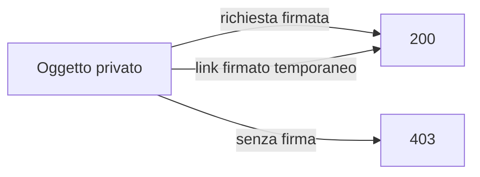

## Contenuti

- Blocchi, file, oggetti
- Bucket e oggetti
- Chi può leggere
- Laboratorio
- Aspetti orientativi

Strumento: moto, emulatore locale dei servizi AWS, licenza Apache 2.0, https://github.com/getmoto/moto

## Blocchi, file, oggetti

- Blocchi: dischi delle macchine virtuali
- File: cartelle condivise
- Oggetti: chiavi, HTTP, scalabili ed economici

## Bucket e oggetti

- Bucket: contenitore in una regione
- Oggetto: dati e metadati (Content-Type, ETag, personalizzati)
- Chiave: `copertine/1984.jpg`; prefissi come cartelle
- PUT, GET, HEAD, DELETE; API S3 standard di fatto

## Chi può leggere

- Oggetti pubblici: attenzione agli errori di configurazione

## Laboratorio

1. `python -m pip install --user "moto[server]"`
2. `python -m moto.server -p 5000`
3. `archivio_oggetti.py`: crea, carica, elenco, info, scarica, link, pubblica
4. `oggetti.http`: 403, link firmato, 404; 14 test

## Aspetti orientativi

- Copie di sicurezza, siti, video, dati per l'analisi
- Emulatori per provare senza costi
- Bucket pubblico per errore: un incidente di sicurezza
