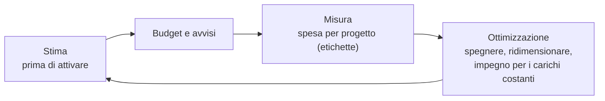

# Lezione 6.4: Costi e responsabilità

> Contenuto originale. Riferimenti: Microsoft Learn, "Shared responsibility in the cloud", https://learn.microsoft.com/en-us/azure/security/fundamentals/shared-responsibility ; Regolamento (UE) 2016/679 (GDPR), https://eur-lex.europa.eu/eli/reg/2016/679/oj ; Strategia Cloud Italia, https://cloud.italia.it/strategia-cloud-pa/ . Gli script sono nella cartella `laboratorio`; i prezzi del listino sono inventati a scopo didattico.

Obiettivo: stimare il costo di un servizio cloud, riconoscere le voci che pesano di più e distinguere le responsabilità del fornitore da quelle del cliente.

## 6.4.1 Come si paga il cloud

Con un server acquistato la spesa è un **investimento** iniziale (in sigla CAPEX), ammortizzato negli anni; nel cloud è una **spesa corrente** (OPEX), proporzionale all'uso. Modelli di prezzo principali:

- **a consumo** (pay as you go): si paga per ora o secondo di calcolo, per gigabyte al mese, per richiesta; nessun impegno;
- **con impegno**: sconto in cambio della promessa di usare una certa quantità di risorse per uno o tre anni; conviene per i carichi costanti;
- **risorse interrompibili**: capacità inutilizzata del fornitore a prezzo molto ridotto, che può essere ritirata con breve preavviso; adatta a calcoli che si possono ripetere;
- **per utente al mese**: tipico del SaaS (posta, suite per l'ufficio);
- **livelli gratuiti**: piccole quantità gratuite, spesso per un periodo limitato, utili per imparare ma da controllare.

Voci di costo tipiche di un servizio IaaS o PaaS:

| Voce | Unità | Osservazioni |
|---|---|---|
| calcolo | ore di macchina virtuale | si paga anche se la macchina è accesa e inutilizzata |
| dischi | GB al mese | si pagano finché esistono, anche con la macchina spenta |
| archiviazione a oggetti | GB al mese, più le richieste | molto economica per GB |
| database gestito | ore, più lo spazio | comprende aggiornamenti e copie di sicurezza |
| traffico in uscita | GB trasferiti verso Internet | spesso la voce sottovalutata; il traffico in entrata è di solito gratuito |
| servizi aggiuntivi | secondo il servizio | bilanciatori del carico, indirizzi IP pubblici, assistenza |

Il controllo dei costi è un'attività continua: **budget con avvisi**, **etichette** per attribuire le spese ai progetti, spegnimento automatico delle risorse di prova, scelta della dimensione giusta delle macchine (**rightsizing**), scalabilità automatica invece di macchine grandi sempre accese.

Diagramma: il ciclo di controllo dei costi.



## 6.4.2 Responsabilità condivisa

Il fornitore è responsabile della sicurezza **del** cloud (edifici, server, rete, virtualizzazione); il cliente della sicurezza **nel** cloud, cioè di ciò che vi mette e di come lo configura. La divisione cambia con il modello di servizio:

| Area | Server locale | IaaS | PaaS | SaaS |
|---|---|---|---|---|
| Dati e loro classificazione | cliente | cliente | cliente | cliente |
| Account, identità, accessi | cliente | cliente | cliente | cliente |
| Dispositivi degli utenti | cliente | cliente | cliente | condivisa |
| Applicazione | cliente | cliente | condivisa | fornitore |
| Controlli di rete | cliente | cliente | condivisa | fornitore |
| Sistema operativo | cliente | cliente | fornitore | fornitore |
| Infrastruttura fisica | cliente | fornitore | fornitore | fornitore |

(Schema semplificato dalla documentazione di Microsoft; la divisione precisa dipende dal fornitore e dal servizio.)

In ogni modello restano al cliente: **i dati, gli account e i permessi, le configurazioni**. Un bucket reso pubblico per errore (lezione 6.3), una password debole o un utente non rimosso sono responsabilità del cliente anche nel servizio più gestito.

## 6.4.3 Dove si trovano i dati

- La **regione** scelta (lezione 6.1) stabilisce dove sono conservati i dati; le copie di sicurezza possono trovarsi in altre regioni.
- Il **GDPR** permette di trasferire dati personali fuori dall'Unione Europea solo a determinate condizioni (capo V del Regolamento): scegliere regioni europee semplifica il rispetto delle regole.
- Anche con i dati in Europa, conta la legge a cui è soggetto il fornitore: per questo si parla di **sovranità digitale** e la Strategia Cloud Italia richiede garanzie maggiori per i dati strategici e critici della Pubblica Amministrazione.
- **Lock-in**: più servizi specifici di un fornitore si usano, più è costoso spostarsi; formati aperti, API standard (come S3) e container riducono la dipendenza.

## 6.4.4 Laboratorio

Tempo indicativo: 50 minuti. Cartella di lavoro `C:\corso-reti\lab64`, con i file della cartella `laboratorio`.

### Parte 1: tre scenari

Il file `listino_esempio.json` contiene un listino inventato, con ordini di grandezza plausibili; `scenari.json` descrive tre servizi della scuola.

```powershell
python costi_cloud.py
```

```text
sito_biblioteca             128.21 EUR/mese   voce principale: database gestito
piattaforma_verifiche       391.86 EUR/mese   voce principale: calcolo (macchine virtuali)
archivio_video              654.73 EUR/mese   voce principale: traffico in uscita
```

```powershell
python costi_cloud.py piattaforma_verifiche
```

```text
piattaforma_verifiche
  calcolo (macchine virtuali)       241.11 EUR
  database gestito                   87.60 EUR
  traffico in uscita                 27.00 EUR
  dischi                             20.00 EUR
  richieste agli oggetti             15.00 EUR
  archiviazione a oggetti             1.15 EUR
  totale mensile                    391.86 EUR   (annuale 4702.32)
```

Punti principali del codice:

```python
prezzo = listino["macchine_virtuali"][gruppo["tipo"]]["euro_ora"]
if gruppo.get("impegno_1_anno"):
    prezzo *= 1 - listino["sconto_impegno_1_anno"]      # sconto in cambio dell'impegno
calcolo += prezzo * gruppo["quantita"] * gruppo["ore_mese"]
...
uscita = max(0, s["traffico_uscita_gb"] - listino["traffico_uscita_gratuito_gb"])
```

- listino e scenari sono file JSON (lezione 5.1): si modificano senza toccare il programma
- nella piattaforma delle verifiche due macchine sono sempre accese, con lo sconto per l'impegno; otto si aggiungono solo per le 40 ore di picco al mese: è l'**elasticità** del cloud
- `max(0, ...)` evita un costo negativo quando il traffico resta nella quota gratuita

### Parte 2: confronto con un server della scuola

```powershell
python costi_cloud.py --locale
```

Il server locale (4000 euro in 5 anni, 250 W sempre acceso, manutenzione) costa circa 155 euro al mese contro i 128 del servizio cloud della biblioteca. Il confronto non comprende voci importanti: locale e raffreddamento, rete, copie di sicurezza, tempo del personale, rischio di guasto senza ricambio. Elencare quali di queste voci peserebbero di più per la scuola.

Test: `python test_costi_cloud.py` (10 test).

### Parte 3: scelte e responsabilità

1. Nello scenario `archivio_video` la voce principale è il traffico in uscita. Proporre due modi per ridurla (per esempio una piattaforma video esterna, una rete di distribuzione dei contenuti, video a risoluzione minore) e verificarne l'effetto modificando `scenari.json`.
2. Aggiungere uno scenario "laboratorio virtuale": 25 macchine piccole accese 3 ore al giorno per 20 giorni al mese. Quanto costa? E se qualcuno dimentica le macchine accese per tutto il mese?
3. Per il servizio della biblioteca in versione PaaS, compilare una tabella con le responsabilità della scuola e quelle del fornitore per: aggiornamento di Python, copie di sicurezza del database, password dell'amministratore, protezione dei dati degli studenti, sicurezza fisica del data center.

## 6.4.5 Aspetti orientativi (discussione)

- La gestione dei costi del cloud è diventata una disciplina con figure dedicate (FinOps), che uniscono competenze tecniche ed economiche.
- Giuristi, responsabili della protezione dei dati e tecnici lavorano insieme nella scelta dei fornitori cloud.
- Domanda: per una scuola, il cloud costa di più o di meno di un server proprio? Da che cosa dipende la risposta?
