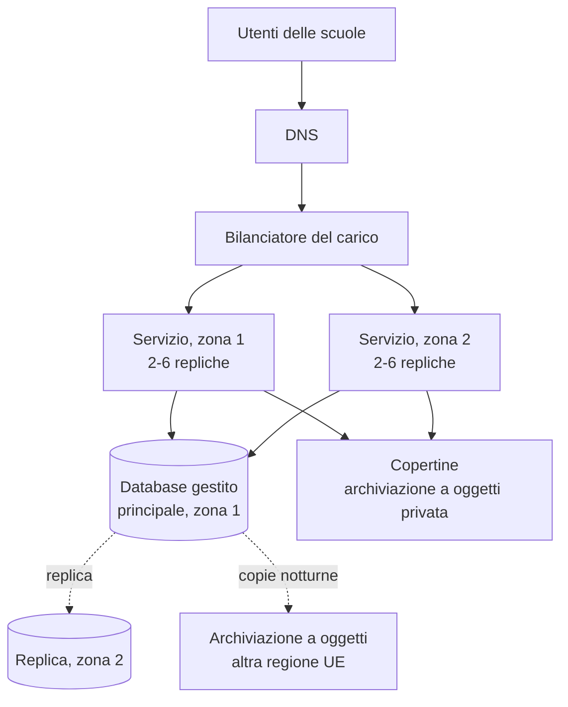

# Lezione 6.5: tracce di soluzione

Valori calcolati con `disponibilita.py`.

- Attività 1: bilanciatore (99,99%), due server in parallelo (99,5% ciascuno), due database in parallelo (99,95% ciascuno): disponibilità 99,987%, circa 1,1 ore di fermo all'anno, contro 5,5 ore con un solo database.
- Attività 2: 99,9% corrisponde a 8,76 ore di fermo all'anno.
- Attività 3: ogni server avrebbe dati diversi; un prestito registrato su un server non sarebbe visibile agli utenti serviti dall'altro. Serve un database condiviso.

## Elementi attesi nello schema (parte 2)

- presentazione: file statici della pagina in archiviazione a oggetti o serviti dai server applicativi
- logica: container del servizio su almeno due server in due zone, dietro un bilanciatore con controllo dello stato; scalabilità automatica per i picchi di inizio anno
- dati: database gestito (PaaS) con replica in un'altra zona e copie di sicurezza pianificate, conservate anche in un'altra regione europea
- copertine in archiviazione a oggetti privata, lette con link firmati
- monitoraggio, registri, avvisi di budget
- punti singoli di guasto rimasti da discutere: la regione (tutte le zone nella stessa area), il fornitore stesso, il servizio DNS, la connessione delle scuole

Esempio di schema in formato Mermaid:

