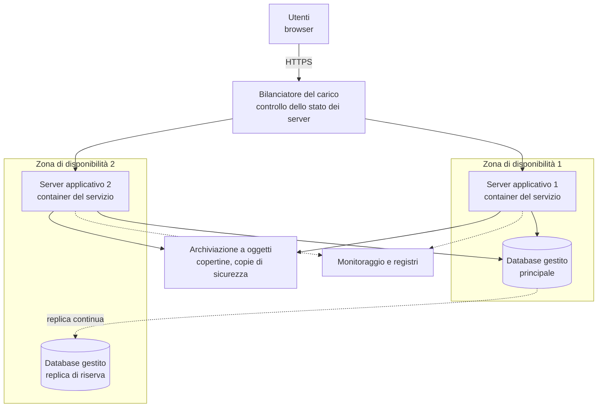

# Lezione 6.5: Architettura cloud

> Contenuto originale. Riferimenti: Microsoft Learn, "Azure Well-Architected Framework", https://learn.microsoft.com/en-us/azure/well-architected/ ; "What are availability zones?", https://learn.microsoft.com/en-us/azure/reliability/availability-zones-overview ; Wikipedia, "Bilanciamento del carico", https://it.wikipedia.org/wiki/Bilanciamento_del_carico . Gli script sono nella cartella `laboratorio`; una traccia di soluzione nel file `laboratorio/soluzioni_docente.md`.

Obiettivo: progettare l'architettura cloud di un servizio web in modo che regga l'aumento degli utenti e continui a funzionare anche in caso di guasti.

## 6.5.1 Dal servizio sul PC al servizio nel cloud

Il servizio della biblioteca (lezione 5.3) gira su un solo processo, con il database in un file. Funziona per una prova, ma ha due limiti:

- **capacità**: un solo server serve un numero limitato di richieste;
- **punto singolo di guasto**: se il server o il suo disco si fermano, il servizio non esiste più.

Un'architettura cloud affronta i due problemi separando i livelli (presentazione, logica, dati) e **replicando** i componenti.

## 6.5.2 Scalabilità

- **Scalabilità verticale** (scale up): una macchina più potente. Semplice, ma ha un limite e richiede di fermare il servizio.
- **Scalabilità orizzontale** (scale out): più macchine uguali che lavorano insieme. Non ha un limite pratico e permette di aggiungere o togliere server secondo il carico (**scalabilità automatica**), pagando solo ciò che serve (lezione 6.4).

Per scalare orizzontalmente, i server dell'applicazione devono essere **senza stato**: nessuna informazione importante deve restare nella memoria o sul disco di un singolo server. Nel servizio della biblioteca il file `biblioteca.db` è stato: con più server servirebbe un **database condiviso**, per esempio un database gestito dal fornitore. Allo stesso modo i file caricati dagli utenti (le copertine) vanno in un'**archiviazione a oggetti** (lezione 6.3), non sul disco di un server.

## 6.5.3 Bilanciamento del carico

Il **bilanciatore del carico** (load balancer) riceve tutte le richieste e le distribuisce tra i server disponibili:

- con regole semplici, come il turno (**round robin**: un server dopo l'altro) o il server meno occupato;
- controllando periodicamente lo stato dei server (**health check**, per esempio una richiesta a `/api/generi` che deve rispondere 200) ed escludendo quelli che non rispondono;
- spesso gestendo anche HTTPS (lezione 1.1), così i server applicativi non devono farlo.

## 6.5.4 Alta disponibilità

La **disponibilità** è la percentuale di tempo in cui un servizio funziona. Si esprime spesso con il numero di "nove":

| Disponibilità | Fermo massimo in un anno |
|---|---|
| 99% | circa 3,7 giorni |
| 99,9% | circa 8,8 ore |
| 99,99% | circa 53 minuti |

I fornitori garantiscono livelli di disponibilità nei contratti (**SLA**, Service Level Agreement), con rimborsi se non vengono rispettati.

- Componenti **in serie** (servono tutti): la disponibilità complessiva è il **prodotto** delle disponibilità, quindi più bassa della peggiore.
- Componenti **in parallelo** (ne basta uno): il servizio si ferma solo se si fermano tutti; l'indisponibilità complessiva è il prodotto delle indisponibilità.
- Replicare i server in **zone di disponibilità** diverse (lezione 6.1) protegge anche dalla perdita di un intero data center.
- **Copie di sicurezza** e **repliche** sono cose diverse: una replica copia subito anche gli errori (una cancellazione sbagliata), una copia di sicurezza permette di tornare indietro nel tempo. Servono entrambe.

Diagramma: architettura cloud del servizio della biblioteca.



Le buone pratiche delle architetture cloud sono raccolte dai fornitori in guide che le organizzano in cinque aree: **affidabilità**, **sicurezza**, **ottimizzazione dei costi**, **eccellenza operativa** (automazione, monitoraggio), **efficienza delle prestazioni**.

## 6.5.5 Laboratorio

Tempo indicativo: 55 minuti. Cartella di lavoro `C:\corso-reti\lab65`, con i file della cartella `laboratorio`.

### Parte 1: calcoli di disponibilità e capacità

```powershell
python disponibilita.py
```

```text
Disponibilità e fermo annuo:
  99.00%  ->  3.7 giorni all'anno
  99.90%  ->  8.8 ore all'anno
  99.99%  ->  53 minuti all'anno

Servizio della biblioteca:
  un server + database:                 99.4503%  fermo 2.0 giorni
  bilanciatore + 2 server + database:   99.9375%  fermo 5.5 ore

Capacità: 900 richieste al secondo nel picco, 200 per server
  server necessari (margine 30%, uno di riserva): 7
```

```python
def parallelo(*disponibilita):
    indisponibile = 1.0
    for d in disponibilita:
        indisponibile *= 1 - d       # si ferma tutto solo se si fermano tutti insieme
    return 1 - indisponibile
```

- `*disponibilita` permette di passare alla funzione un numero qualsiasi di valori
- con due server da 99,5% in parallelo l'indisponibilità scende da 0,5% a 0,0025%: il componente più debole diventa il database
- `server_necessari` aggiunge un margine per i picchi imprevisti e un server di riserva (**N+1**), così il guasto di un server non riduce la capacità sotto il necessario

Test: `python test_disponibilita.py` (10 test).

### Parte 2: schema dell'architettura

Con l'estensione Draw.io Integration di VS Code (lezione 2.4) disegnare `architettura_biblioteca.drawio`, l'architettura cloud del servizio della lezione 5.3 per l'uso da parte di tutte le scuole di una provincia (circa 20 000 utenti, picchi a inizio anno scolastico). Lo schema deve indicare:

1. i livelli (presentazione, logica, dati) e il modello di servizio scelto per ciascun componente (IaaS, PaaS);
2. bilanciatore del carico, numero di server applicativi e zone di disponibilità;
3. dove si trovano database, copertine e copie di sicurezza;
4. i punti singoli di guasto rimasti, se ce ne sono;
5. in una nota: disponibilità stimata con `disponibilita.py` e costo mensile stimato con `costi_cloud.py` della lezione 6.4 (aggiungendo uno scenario a `scenari.json`).

### Attività

1. Aggiungere al calcolo un secondo database in parallelo (replica di riserva, 99,95%): quanto cambia la disponibilità complessiva?
2. Il fornitore garantisce il 99,9% per ogni macchina virtuale. Quante ore all'anno può restare ferma una macchina senza violare il contratto?
3. Perché la scalabilità orizzontale è impossibile se ogni server conserva il proprio file `biblioteca.db`?

## 6.5.6 Aspetti orientativi (discussione)

- Il cloud architect progetta queste soluzioni bilanciando affidabilità, sicurezza, prestazioni e costi; il site reliability engineer (SRE) le mantiene in funzione, misurando la disponibilità.
- Le competenze di rete dei moduli 1-3 (indirizzi, instradamento, DNS, bilanciamento) si ritrovano nelle reti virtuali del cloud.
- Domanda: per il servizio della biblioteca è ragionevole puntare al 99,99%? Chi dovrebbe decidere quanta disponibilità serve, e in base a che cosa?
