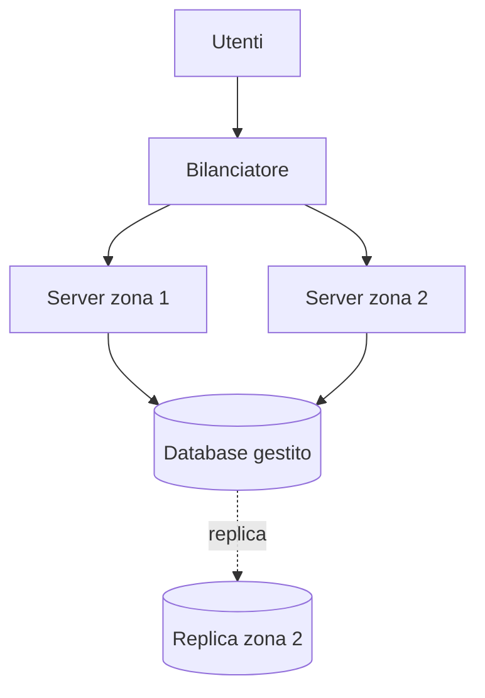

## Lezione 6.5: Architettura cloud

Modulo 6: Cloud computing. Reti, Cloud e Gestione dei Dati

---

## Scalabilità

- Verticale: macchina più grande
- Orizzontale: più macchine uguali, scalabilità automatica
- Server senza stato: database condiviso, file in archiviazione a oggetti

---

## Bilanciamento e disponibilità

- Bilanciatore: round robin, controllo dello stato
- 99%: 3,7 giorni; 99,9%: 8,8 ore; 99,99%: 53 minuti all'anno
- Serie: prodotto delle disponibilità; parallelo: prodotto delle indisponibilità

---

## Architettura della biblioteca

---

## Laboratorio

1. `python disponibilita.py`: un server contro due; 10 test
2. Schema con Draw.io per 20 000 utenti
3. Disponibilità e costi nello schema

---

## Aspetti orientativi

- Cloud architect, site reliability engineer
- Le reti dei moduli 1-3 nelle reti virtuali
- Chi decide quanta disponibilità serve?
