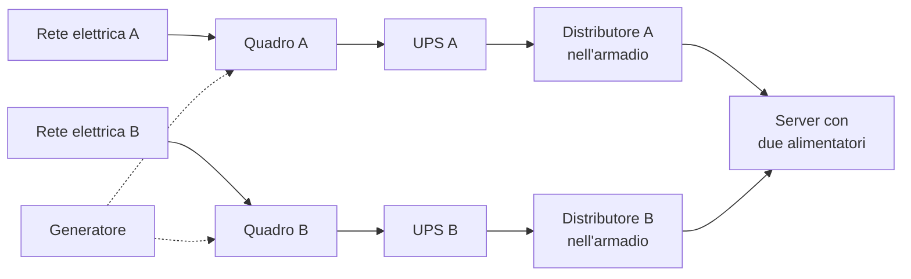

# Lezione 7.1: Data center e affidabilità

> Contenuto originale. Riferimenti: Uptime Institute, "Tier Classification System", https://uptimeinstitute.com/tiers ; Wikipedia, "Power usage effectiveness", https://it.wikipedia.org/wiki/Power_usage_effectiveness . Gli script sono nella cartella `laboratorio`; i calcoli di disponibilità di componenti in serie e in parallelo sono quelli della lezione 6.5 (`disponibilita.py`).

Obiettivo: descrivere come è fatto un data center, come si misura e si migliora l'affidabilità di un servizio, e quanto conta l'energia.

## 7.1.1 Dentro un data center

Un **data center** è un edificio, o una sua parte, progettato per ospitare server, sistemi di archiviazione e apparati di rete e per farli funzionare senza interruzioni. I servizi cloud dei moduli precedenti girano in data center di questo tipo.

- **Sale dati**: file di **armadi** (rack) con server, archiviazione e switch; i cavi arrivano dall'alto o sotto un pavimento sopraelevato.
- **Energia**: due alimentazioni dalla rete elettrica quando possibile, **gruppi di continuità** (UPS) a batterie per i primi minuti di un'interruzione, **generatori** che partono entro pochi secondi, distributori di corrente negli armadi.
- **Raffreddamento**: i server trasformano quasi tutta l'energia in calore. Gli armadi sono disposti a **corridoi caldi e freddi** alternati; l'aria fredda entra dal fronte dei server e quella calda viene raccolta ed espulsa. Dove il clima lo permette si usa l'aria esterna (**free cooling**).
- **Rete**: collegamenti con più fornitori, per percorsi fisici diversi.
- **Sicurezza fisica**: accessi controllati, videosorveglianza, rilevazione e spegnimento degli incendi con gas che non danneggiano gli apparati.

Diagramma: la catena di alimentazione di un armadio con ridondanza.



## 7.1.2 Ridondanza e livelli dei data center

La **ridondanza** si indica con sigle che confrontano il numero di componenti installati con quelli necessari (N):

- **N**: esattamente quelli necessari; un guasto riduce la capacità;
- **N+1**: uno in più; un guasto o una manutenzione non causano interruzioni;
- **2N**: tutto duplicato, con percorsi indipendenti.

L'Uptime Institute classifica i data center in quattro livelli (Tier):

| Livello | Caratteristiche principali |
|---|---|
| Tier I | infrastruttura di base (UPS, generatore), senza ridondanza: la manutenzione richiede di fermare tutto |
| Tier II | componenti ridondanti per energia e raffreddamento |
| Tier III | manutenibile senza interruzioni: ogni componente può essere spento senza fermare i sistemi informatici |
| Tier IV | tollerante ai guasti: sistemi indipendenti e fisicamente separati; un singolo guasto non ha effetti sui servizi |

## 7.1.3 Misurare l'affidabilità

- **MTBF** (Mean Time Between Failures): tempo medio di funzionamento tra due guasti.
- **MTTR** (Mean Time To Repair): tempo medio per ripristinare il servizio dopo un guasto.
- **Disponibilità** = MTBF / (MTBF + MTTR). Si può migliorare in due modi: guastarsi meno spesso (componenti migliori, ridondanza) o ripartire più in fretta (monitoraggio, procedure, automazione).
- **SLA** (Service Level Agreement): livello di servizio garantito da contratto; **SLO** (Service Level Objective): obiettivo interno, di solito più severo.

Le combinazioni di componenti in serie e in parallelo si calcolano come nella lezione 6.5.

### Monitoraggio

Non si può migliorare ciò che non si misura. Un sistema di **monitoraggio** raccoglie:

- **metriche**: uso di CPU, memoria, dischi, rete; numero di richieste, errori, tempi di risposta;
- **registri** (log) degli eventi di sistemi e applicazioni;
- **controlli dall'esterno**: una sonda che interroga periodicamente il servizio come farebbe un utente, e misura se risponde e in quanto tempo;
- **avvisi**: messaggi ai tecnici di turno quando un valore supera una soglia.

Per i tempi di risposta si usano i **percentili**, non solo la media: il 95° percentile è il tempo entro cui arriva il 95% delle risposte, e mostra l'esperienza degli utenti più sfortunati.

### Copie di sicurezza e ripristino dopo un disastro

- **RPO** (Recovery Point Objective): quanti dati, in termini di tempo, si accetta di perdere (per esempio le ultime 24 ore, se la copia è notturna).
- **RTO** (Recovery Time Objective): entro quanto tempo il servizio deve ripartire.
- Regola **3-2-1**: tre copie dei dati, su due supporti diversi, di cui una in un luogo diverso (per esempio un'altra regione del cloud). Una copia di sicurezza vale solo se il **ripristino** è stato provato.

## 7.1.4 Energia

I data center consumano una quota rilevante dell'elettricità mondiale, in crescita con l'intelligenza artificiale. L'indicatore più usato è il **PUE** (Power Usage Effectiveness):

PUE = energia totale del data center / energia dei soli apparati informatici

Un PUE di 1,0 significherebbe che tutta l'energia va ai server; i valori reali sono più alti per raffreddamento, perdite dell'alimentazione, illuminazione. Per ridurre l'impatto: raffreddamento più efficiente, energia da fonti rinnovabili, recupero del calore (per esempio per il teleriscaldamento), server usati meglio grazie alla virtualizzazione (lezione 6.2).

## 7.1.5 Laboratorio

Tempo indicativo: 50 minuti. Cartella di lavoro `C:\corso-reti\lab71`, con i file della cartella `laboratorio` e la cartella della lezione 5.3 (servizio della biblioteca).

### Parte 1: analisi di un registro

Il file `registro_controlli_esempio.csv` contiene i controlli di una sonda sul servizio della biblioteca per un giorno, uno al minuto (dati di esempio).

```powershell
python monitoraggio.py analizza registro_controlli_esempio.csv
```

```text
Controlli:               1440
Disponibilità misurata:  98.89%
Interruzioni:            2  (fermo totale 16.0 minuti)
MTTR:                    8.0 minuti
MTBF:                    11.9 ore
Tempo di risposta:       mediana 48.0 ms, 95° percentile 130 ms
```

Domande: a che ora sono avvenute le interruzioni, e di che tipo (servizio che non risponde o che risponde con un errore)? Perché il 95° percentile è molto più alto della mediana? In quali ore il servizio è più lento? (Aprire il file CSV in VS Code o in un foglio di calcolo.)

### Parte 2: monitoraggio del servizio della biblioteca

1. In un terminale avviare il servizio della lezione 5.3: `python servizio_biblioteca.py`.
2. In un secondo terminale avviare la sonda: `python monitoraggio.py registra http://127.0.0.1:8000/api/generi 60 2 registro.csv` (60 controlli, uno ogni 2 secondi).
3. Durante la registrazione fermare il servizio (`Ctrl+C` nel primo terminale), attendere una ventina di secondi e riavviarlo: è un guasto simulato con il suo ripristino.
4. Al termine: `python monitoraggio.py analizza registro.csv`. Confrontare disponibilità, MTTR e tipo di errore con il registro di esempio.

Punti principali del codice:

```python
for i, (istante, ok, _) in enumerate(righe):
    if not ok and inizio is None:
        inizio = istante                              # inizia un'interruzione
    if ok and inizio is not None:
        interruzioni.append((inizio, istante))        # termina al primo controllo riuscito
        inizio = None
```

- un'interruzione è una sequenza di controlli falliti consecutivi; la sua durata va dal primo controllo fallito al primo di nuovo riuscito
- `time.perf_counter()` misura il tempo di risposta con alta precisione
- `f.flush()` scrive subito ogni riga nel file, così il registro si può leggere mentre la sonda lavora
- la sonda ignora il proxy del sistema (`ProxyHandler({})`), perché interroga un servizio sul proprio PC

Test: `python test_monitoraggio.py` (13 test).

### Parte 3: calcoli

1. Un server ha MTBF di 2000 ore e MTTR di 4 ore. Qual è la sua disponibilità (`disponibilita_attesa`)? E se con procedure migliori l'MTTR scende a 30 minuti?
2. Un data center assorbe 1,2 MW, di cui 800 kW per gli apparati informatici. Calcolare il PUE. Quanta energia in un anno va a raffreddamento e perdite?
3. Il servizio della biblioteca fa una copia del database ogni notte e, in caso di disastro, impiega 4 ore a ripartire. Quali sono RPO e RTO? Sono adeguati per una biblioteca scolastica? E per il registro elettronico?

## 7.1.6 Aspetti orientativi (discussione)

- Nei data center lavorano tecnici elettrici e della climatizzazione accanto ai sistemisti e ai tecnici di rete: è un settore in forte crescita anche in Italia.
- Le figure che garantiscono il funzionamento continuo dei servizi (operatori dei centri di controllo, site reliability engineer) lavorano spesso su turni, con reperibilità.
- Domanda: la crescita dei servizi digitali e dell'intelligenza artificiale aumenta i consumi di energia. Quali scelte possono fare i fornitori, e quali gli utenti?
