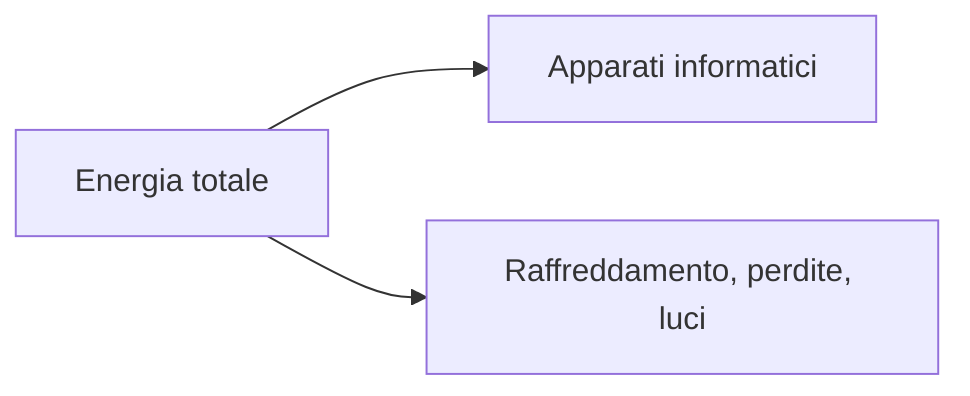

## Contenuti

- Dentro un data center
- Ridondanza e livelli
- Misurare
- Energia
- Laboratorio
- Aspetti orientativi

## Dentro un data center

- Sale dati, armadi, cablaggio
- Energia: due linee, UPS, generatori
- Raffreddamento: corridoi caldi e freddi, free cooling
- Sicurezza fisica

## Ridondanza e livelli

- N, N+1, 2N
- Tier I: base; II: componenti ridondanti
- Tier III: manutenibile senza interruzioni; IV: tollerante ai guasti

## Misurare

- Disponibilità = MTBF / (MTBF + MTTR)
- SLA e SLO
- Monitoraggio: metriche, registri, sonde, avvisi; percentili
- RPO, RTO, regola 3-2-1

## Energia

- PUE = energia totale / energia informatica
- Raffreddamento efficiente, rinnovabili, recupero del calore

## Laboratorio

1. `python monitoraggio.py analizza registro_controlli_esempio.csv`
2. Sonda sul servizio della biblioteca, guasto simulato
3. MTBF, MTTR, PUE, RPO e RTO; 13 test

## Aspetti orientativi

- Data center: tecnici elettrici, climatizzazione, sistemisti, rete
- Turni e reperibilità per i servizi sempre attivi
- Servizi digitali ed energia: quali scelte?
