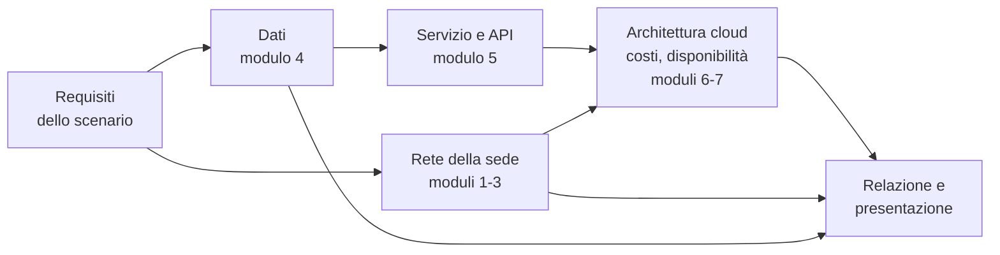

# Lezione 7.2: Progetto finale

> Contenuto originale. Gli scenari sono inventati. Strumenti: gli script dei moduli precedenti, l'estensione Draw.io Integration di VS Code e Marp per la presentazione. I file sono nella cartella `laboratorio`.

Obiettivo: progettare e presentare in gruppo un'infrastruttura completa, rete, dati e cloud, motivando le scelte e riconoscendone limiti e rischi.

## 7.2.1 Il progetto

Il progetto finale non parte da zero: si costruisce durante il corso. Ogni gruppo (3-4 persone) conserva i file prodotti nei laboratori che riguardano la biblioteca della scuola e, alla fine, li riunisce in un'unica proposta di infrastruttura. A casa si preparano solo una relazione breve e le slide; in questa lezione si completano i file (15 minuti) e si presentano i progetti (45 minuti).

Diagramma: come si collegano le parti del progetto ai moduli del corso.



### Lo scenario

**Rete delle biblioteche scolastiche.** Le 25 scuole superiori di una provincia vogliono un catalogo comune dei loro libri, con prestiti tra scuole diverse. Ogni scuola ha una propria rete; il catalogo è un servizio web usato da circa 20 000 utenti tra studenti e docenti (lo stesso dato della lezione 6.5), con picchi a settembre. Il gruppo descrive la rete di una scuola e l'infrastruttura cloud del catalogo comune.

Da quali laboratori vengono le parti del progetto:

| Parte | Laboratorio | File prodotto | File del progetto |
|---|---|---|---|
| Piano di indirizzamento della scuola | 2.4 | `piano_calcolato.csv` | `piano_indirizzi.csv` |
| Schema della rete della scuola | 2.4 (parte 4) e 3.4 (parte 4) | `rete_scuola.drawio`, `piano_primo.drawio` | `rete.drawio` |
| Schema del database della biblioteca | 4.2 e 4.4 (parte 3) | `schema_gruppo.sql` | `schema.sql` |
| Servizio e API | 5.3 | `servizio_biblioteca.py`, `richieste_biblioteca.http` | descrizione nella relazione |
| Costi | 6.4 e 6.5 (parte 2, punto 5) | scenario aggiunto a `scenari.json` | valori nella relazione |
| Architettura cloud e disponibilità | 6.5 (parte 2) | `architettura_biblioteca.drawio` | `architettura.drawio` |

Conviene che ogni gruppo tenga, fin dal modulo 2, una cartella `C:\corso-reti\progetto_gruppo` in cui copiare i file man mano che vengono prodotti.

### Scenari facoltativi

Per i gruppi che vogliono un progetto più ampio, da svolgere fuori dall'orario del corso, due scenari alternativi con le stesse parti richieste:

- **Meccanica Esempio S.r.l.** L'azienda della lezione 3.5 vuole un gestionale di magazzino: articoli, fornitori, movimenti di carico e scarico, consultabile dai terminali di reparto e da tablet in Wi-Fi. I disegni tecnici della progettazione (file di grandi dimensioni) devono essere conservati con copie di sicurezza fuori sede.
- **Museo civico.** Un museo con due sedi in città vende biglietti online, gestisce le prenotazioni delle scolaresche e pubblica un catalogo delle opere con immagini ad alta risoluzione. Nelle sedi ci sono biglietteria, uffici, Wi-Fi per i visitatori e telecamere.

### Parti richieste

| Parte | Contenuto | Strumenti |
|---|---|---|
| Requisiti | utenti, sedi, dati, numeri, ipotesi dichiarate (per lo scenario principale: adattamento dei requisiti dei laboratori alle 25 scuole) | |
| Rete | schema di una sede, sottoreti e VLAN, piano di indirizzamento, servizi (DHCP, DNS, NAT, Wi-Fi) | Draw.io, `piano_vlsm.py` (lezione 2.4), `verifica_progetto.py` (lezione 3.5) |
| Dati | diagramma E-R, schema SQL con vincoli, dati personali trattati | Draw.io, `controlla_schema.py` (lezione 4.4) |
| Servizio | risorse dell'API con metodi e codici di stato, esempio di risposta JSON | REST Client (facoltativo: un prototipo sul modello della lezione 5.3) |
| Cloud | architettura, modello di servizio per ogni componente, costo mensile, disponibilità, RPO e RTO | Draw.io, `costi_cloud.py` (lezione 6.4), `disponibilita.py` (lezione 6.5) |
| Responsabilità | divisione tra fornitore e cliente, dove si trovano i dati, rischi e punti singoli di guasto | |

### Consegna

Una cartella per gruppo con i file:

- `relazione.md`, con le sezioni **Requisiti**, **Rete**, **Dati**, **Servizio**, **Cloud**, **Responsabilità**, che contenga anche il costo stimato in euro e la disponibilità stimata in percentuale
- `presentazione.md`, presentazione Marp di 5 minuti, sul modello `modello_presentazione_marp.md`
- `rete.drawio` e `architettura.drawio`
- `schema.sql`
- `piano_indirizzi.csv`, con almeno la colonna `rete`: il file `piano_calcolato.csv` della lezione 2.4 ha già questo formato

Prima della consegna:

```powershell
python controlla_consegna.py C:\corso-reti\progetto_gruppo1
```

```text
DA SISTEMARE: relazione.md: non è indicata una disponibilità in percentuale
DA SISTEMARE: schema.sql: la tabella prenotazioni non ha chiave primaria

Problemi trovati: 2
```

Lo script controlla la presenza dei file e che siano utilizzabili: sezioni della relazione, numero di slide, file Draw.io leggibili, schema SQL eseguibile con chiavi primarie, reti del piano valide e senza sovrapposizioni. Non valuta la qualità delle scelte, che è oggetto della presentazione. Test: `python test_controlla_consegna.py` (11 test).

## 7.2.2 Presentazione e discussione

Tempo indicativo: 15 minuti per completare i file e controllarli con `controlla_consegna.py`, poi 45 minuti di presentazioni per sei gruppi.

- Ogni gruppo presenta in **5 minuti**; seguono **2 minuti** di domande.
- Gli altri gruppi hanno un ruolo a turno: **cliente** (chiede se i requisiti sono rispettati e quanto costa), **responsabile della sicurezza** (chiede dove sono i dati e chi può accedervi), **tecnico di turno** (chiede che cosa succede se si guasta un componente).
- Alla fine ogni gruppo annota una domanda ricevuta a cui non ha saputo rispondere e come la affronterebbe.

## 7.2.3 Griglia di valutazione

| Criterio | Peso | Livello pieno |
|---|---|---|
| Requisiti | 10% | completi, con numeri e ipotesi dichiarate |
| Rete | 20% | piano di indirizzamento corretto e verificato; segmentazione motivata; servizi descritti |
| Dati | 20% | modello E-R coerente con i requisiti; schema SQL con chiavi e vincoli; dati personali individuati |
| Servizio | 10% | risorse e metodi coerenti con REST; codici di stato appropriati |
| Cloud | 20% | architettura senza punti singoli di guasto evitabili; costi e disponibilità calcolati e discussi |
| Responsabilità e rischi | 10% | divisione delle responsabilità corretta; rischi riconosciuti |
| Presentazione | 10% | chiara, nei tempi, risposte motivate alle domande |

## 7.2.4 Aspetti orientativi (discussione)

- Un progetto che unisce rete, dati e cloud richiede figure diverse: nel lavoro reale queste competenze sono distribuite tra più persone, che devono capirsi.
- Presentare scelte tecniche a chi non è tecnico (il cliente, la direzione) è una competenza richiesta quanto quelle tecniche.
- Domanda: quale parte del progetto è stata la più difficile per il gruppo? Quale la più interessante?
