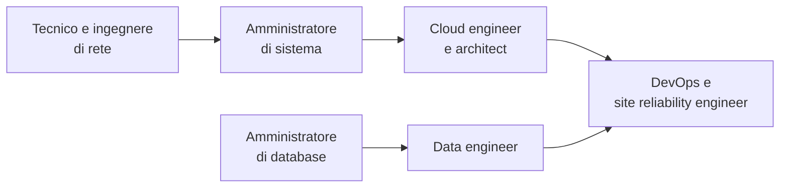

# Lezione 7.3: Professioni e percorsi

> Contenuto originale. Riferimenti: ESCO, classificazione europea di abilità, competenze e occupazioni, https://esco.ec.europa.eu/en ; European e-Competence Framework (EN 16234-1), https://itprofessionalism.org/about-it-professionalism/competences/the-e-competence-framework/ ; Sistema informativo Excelsior (Unioncamere), https://excelsior.unioncamere.net/ ; ITS Academy, aree tecnologiche, https://www.orizzontescuola.it/its-academy-10-aree-tecnologiche-requisiti-di-accesso-diplomi-decreto-in-gazzetta-ufficiale/ ; Universitaly, https://www.universitaly.it/ . Gli script sono nella cartella `laboratorio`.

Obiettivo: conoscere le principali professioni delle reti, dei dati e del cloud, i percorsi di studio che vi portano, e riflettere sulle proprie preferenze.

## 7.3.1 Le professioni

Le professioni del corso si collocano lungo la catena che va dai cavi ai servizi usati dalle persone.



| Professione | Che cosa fa | Competenze principali | Moduli del corso |
|---|---|---|---|
| Tecnico e ingegnere di rete (network engineer) | progetta, installa e mantiene reti locali e geografiche, Wi-Fi, apparati; risolve guasti | modello a livelli, indirizzamento, instradamento, VLAN, sicurezza del perimetro | 1, 2, 3 |
| Amministratore di sistema | gestisce server, sistemi operativi, servizi (DHCP, DNS, posta), utenti, copie di sicurezza | sistemi operativi, script, rete, virtualizzazione | 1, 3, 6, 7 |
| Amministratore di database (DBA) | progetta e mantiene database: prestazioni, sicurezza, copie, ripristino | modello relazionale, SQL, transazioni, affidabilità | 4 |
| Data engineer | costruisce i flussi che raccolgono, puliscono e rendono disponibili i dati per l'analisi | SQL, Python, formati dei dati, API, archiviazione a oggetti | 4, 5, 6 |
| Cloud engineer e cloud architect | progetta e gestisce infrastrutture nel cloud, controlla costi e sicurezza | modelli di servizio, reti virtuali, archiviazione, architetture ridondanti | 6, 7 |
| DevOps e site reliability engineer | automatizza costruzione, prova e rilascio del software; misura e garantisce l'affidabilità | container, orchestrazione, programmazione, monitoraggio | 5, 6, 7 |

A queste si affiancano figure vicine: il tecnico di assistenza (help desk), spesso il primo impiego; l'analista di sicurezza (Corso 2); lo sviluppatore back-end; l'analista di dati.

Due quadri di riferimento europei descrivono queste professioni in modo uniforme:

- **ESCO** elenca occupazioni, abilità e competenze in tutte le lingue dell'Unione: utile per leggere gli annunci di lavoro e confrontare le professioni;
- l'**e-Competence Framework** (norma europea EN 16234-1) definisce 41 competenze informatiche in cinque aree (pianificare, costruire, gestire, abilitare, dirigere), con livelli di padronanza crescenti.

Le competenze **trasversali** contano quanto quelle tecniche: metodo nella diagnosi dei problemi (lezione 1.3), documentazione (lezione 3.5), lavoro in gruppo e presentazione delle scelte (lezione 7.2), disponibilità ad aggiornarsi continuamente.

## 7.3.2 I percorsi dopo il diploma

- **ITS Academy**: percorsi post-diploma di alta specializzazione tecnologica, progettati con le imprese, con molte ore di stage in azienda. L'area tecnologica "Tecnologia dell'informazione, della comunicazione e dei dati" comprende corsi su reti, cloud, sviluppo software, dati e sicurezza. I percorsi biennali rilasciano un diploma di livello EQF 5, quelli triennali di livello EQF 6.
- **Università**: lauree triennali in informatica e in ingegneria informatica o dell'informazione, lauree professionalizzanti con tirocini, poi lauree magistrali e dottorato. L'offerta si consulta su Universitaly.
- **Lavoro dopo il diploma**: assistenza tecnica, installazione di reti, supporto ai sistemi, con formazione continua in azienda.
- **Certificazioni professionali**: attestano competenze su tecnologie specifiche e sono diffuse nel settore. Alcuni esempi: indipendenti dai produttori (CompTIA Network+, certificazioni del Linux Professional Institute), dei produttori di apparati di rete (Cisco CCNA), dei fornitori cloud (certificazioni di base di AWS, Microsoft Azure, Google Cloud), per i container (certificazioni della Cloud Native Computing Foundation su Kubernetes). Richiedono in genere la registrazione e un esame a pagamento: si valutano dopo il diploma, o con la scuola se partecipa a programmi dedicati.

Per capire quali figure cercano le imprese si possono consultare i rapporti del Sistema informativo Excelsior di Unioncamere, che pubblica le previsioni di assunzione per professione e titolo di studio.

## 7.3.3 Laboratorio

Tempo indicativo: 50 minuti. Cartella di lavoro `C:\corso-reti\lab73`, con i file della cartella `laboratorio`.

### Parte 1: questionario

```powershell
python profilo_orientamento.py
```

Il programma chiede quanto è piaciuta ciascuna delle 12 attività svolte nel corso (da 1 a 5) e calcola la vicinanza a ciascuna professione. Con le risposte di esempio:

```powershell
python profilo_orientamento.py risposte_esempio.csv
```

```text
Vicinanza alle professioni:
   90%  ##################    Data engineer  (moduli 4 e 5)
   83%  ################      Amministratore di database (DBA)  (modulo 4)
   60%  ############          DevOps e site reliability engineer  (moduli 5, 6, 7)
...
```

Come funziona:

```python
ottenuti = sum(voti[a] * pesi.get(p, 0) for a, (_, pesi) in ATTIVITA.items())
massimo = sum(5 * pesi.get(p, 0) for _, pesi in ATTIVITA.values())
risultato[p] = round(100 * ottenuti / massimo)
```

- ogni attività ha un peso da 0 a 2 per ogni professione, scritto nel dizionario `ATTIVITA`: sono scelte discutibili, e fa parte dell'attività discuterle
- il punteggio è la somma dei voti moltiplicati per i pesi, rapportata al massimo possibile
- le risposte non vengono salvate né inviate: il programma lavora solo sul proprio PC

Test: `python test_profilo_orientamento.py` (9 test).

Il risultato è un punto di partenza per la riflessione, non un giudizio né una previsione.

### Parte 2: una professione da vicino

A coppie, per una delle due professioni risultate più vicine:

1. cercare la professione nella classificazione ESCO e leggerne descrizione e competenze essenziali;
2. trovare due annunci di lavoro reali (siti di annunci, pagine "lavora con noi" di aziende del territorio) e confrontare le competenze richieste con quelle del corso;
3. individuare un corso ITS o di laurea della propria regione che prepari a quella professione.

### Parte 3: scheda personale

Compilare `scheda_orientamento.md` (aprirla in VS Code e salvarla con il proprio nome). La scheda raccoglie le attività preferite, il risultato del questionario, la professione approfondita e i possibili passi successivi, anche già durante la scuola: progetti personali, gare, stage.

### Attività per la classe

1. Confrontare i pesi di `ATTIVITA` con le descrizioni ESCO delle professioni: quali pesi andrebbero cambiati? Modificarli e osservare come cambia il risultato.
2. Aggiungere al questionario la professione "analista di sicurezza" (Corso 2), con i pesi delle attività collegate.

## 7.3.4 Aspetti orientativi (discussione)

- Le professioni informatiche cambiano velocemente: più che una tecnologia specifica, conta la capacità di impararne di nuove partendo dalle basi (livelli di rete, dati, HTTP), che restano stabili.
- I rapporti Excelsior indicano, per ogni professione, quante assunzioni le imprese prevedono e quanto è difficile trovare i candidati: un dato utile per scegliere il percorso.
- Domanda conclusiva del corso: quale argomento è stato il più utile per capire come funzionano i servizi digitali usati ogni giorno?
