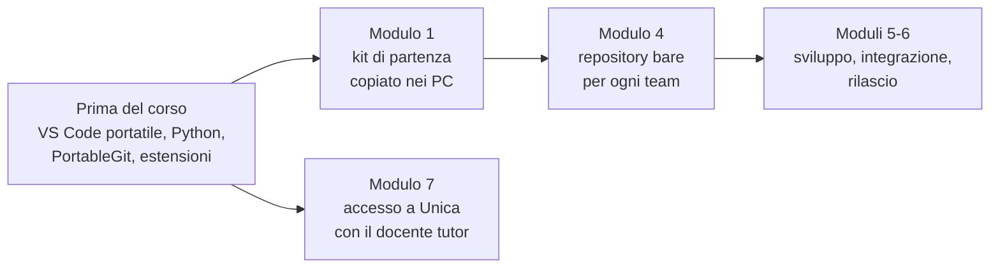

# Informazioni e avvertenze per il docente

Versione del 30/09/2026, ore 21:25. Prima versione, collegata al syllabus `corso04_00_syllabus_2026-09-30_2125.md`.

Contenuto:

- preparazione dei PC e degli strumenti
- repository condiviso del team
- dati personali e account
- Piattaforma Unica, E-Portfolio e capolavoro
- licenze dei materiali riusati
- organizzazione delle lezioni e ruolo del docente

## 1. Preparazione dei PC

Diagramma: che cosa va preparato e quando.



Tutti gli strumenti si installano senza diritti di amministratore e occupano poco spazio; conviene raccoglierli in una cartella unica (per esempio `C:\strumenti`) o su una chiavetta USB.

| Strumento | Preparazione | Avvertenze |
|---|---|---|
| Visual Studio Code | estrarre lo ZIP e creare la cartella `data` accanto all'eseguibile: le impostazioni e le estensioni restano nella cartella | la modalità portatile non si aggiorna da sola: scaricare la stessa versione per tutti i PC |
| Python | installazione "per l'utente corrente"; spuntare l'aggiunta al PATH | in alternativa WinPython, che non richiede installazione |
| PortableGit | eseguire l'archivio autoestraente e aggiungere al PATH dell'utente la cartella `cmd` | se VS Code non trova Git, impostare `git.path` nelle impostazioni con il percorso di `git.exe` |
| Estensioni | Python, Draw.io Integration, Marp for VS Code | sui PC senza accesso a Internet si installano da file `.vsix` scaricati in precedenza |
| Mermaid | l'anteprima Markdown delle versioni recenti di VS Code mostra i diagrammi | il tipo `kanban` è relativamente recente: se l'anteprima non lo mostra, aggiornare VS Code o usare la tabella Markdown equivalente prevista nel kit |

### Identità Git

Git registra in ogni commit un nome e un indirizzo di posta. Nel corso non serve una posta reale:

```powershell
git config --global user.name "Anna R."
git config --global user.email "anna.r@classe.invalid"
```

- `git config --global` salva l'impostazione per l'utente del PC, non per un singolo repository
- `user.name` è il nome che compare nella storia del progetto: basta nome e iniziale del cognome
- `user.email` può essere un indirizzo fittizio; il dominio `.invalid` è riservato proprio a questo uso e non corrisponde a nessun indirizzo reale

Sui PC condivisi da più studenti l'identità va impostata a livello di repository (senza `--global`), altrimenti i commit risultano di chi ha usato il PC per ultimo.

## 2. Repository condiviso del team

### Soluzione di base: repository bare in una cartella condivisa

Un repository **bare** contiene solo la storia del progetto, senza file di lavoro: serve come punto d'incontro in cui i membri del team inviano (`push`) e da cui ricevono (`pull`) le modifiche.

Il docente crea un repository per team nella cartella condivisa e vi carica il kit di partenza:

```powershell
git init --bare \\server-scuola\progetti\team1.git
cd C:\kit_prenotazioni
git init
git add .
git commit -m "Kit di partenza"
git push \\server-scuola\progetti\team1.git HEAD:main
```

- `git init --bare` crea il repository vuoto senza cartella di lavoro
- `git add .` e `git commit` registrano il kit come primo commit
- `git push <percorso> HEAD:main` invia il commit corrente al ramo `main` del repository condiviso

Ogni studente poi lo clona:

```powershell
git clone \\server-scuola\progetti\team1.git
```

Avvertenze:

- **proprietà della cartella**: Git rifiuta di lavorare con repository che appartengono a un altro utente del sistema e mostra l'errore "detected dubious ownership". Accade spesso con le cartelle di rete. Il messaggio d'errore stesso indica il comando da eseguire, del tipo `git config --global --add safe.directory "<percorso>"`; conviene provarlo su un PC prima della lezione 4.3
- se non è disponibile una cartella di rete, il repository bare può stare su una chiavetta USB passata tra i membri del team, oppure in una cartella del PC del docente condivisa in sola rete locale
- conviene conservare una copia dei repository al termine di ogni lezione dei moduli 5 e 6

### Alternativa facoltativa: Gitea sul PC del docente

Gitea (licenza MIT) è un servizio di hosting di repository Git che funziona con un solo eseguibile e un database SQLite, senza installazione. Offre via browser repository, segnalazioni, revisioni del codice (pull request) e board di progetto, come le piattaforme professionali. Documentazione: https://docs.gitea.com/

- lo gestisce il docente, sul proprio PC, raggiungibile solo dalla rete della scuola
- gli account sono **locali**, creati dal docente con nomi di fantasia o iniziali; la registrazione libera va disattivata (impostazione `DISABLE_REGISTRATION = true` nella sezione `[service]` del file `app.ini`, documentata in https://docs.gitea.com/administration/config-cheat-sheet)
- nessun dato esce dalla scuola; alla fine del corso si può cancellare tutto eliminando la cartella di Gitea
- richiede che la rete della scuola permetta la connessione verso il PC del docente: va verificato con il tecnico di laboratorio

**In assenza di questa verifica, il corso si svolge con la soluzione di base, che copre tutte le attività previste.**

## 3. Dati personali e account

- Gli studenti sono trattati come minorenni: il corso non richiede la creazione di account su servizi esterni.
- Nel progetto si usano solo **dati di fantasia**: nomi di docenti, aule e prenotazioni inventati. Nel repository non si inseriscono dati reali di studenti o docenti.
- I nomi nei commit sono nomi e iniziali, con indirizzi fittizi (sezione 1).
- Gli strumenti professionali online (piattaforme di sviluppo, board, sistemi di segnalazione) si mostrano solo con l'account del docente, alla lavagna.
- **CV Europass**: l'editor si usa in modalità ospite, senza registrazione; il CV si scarica in PDF e i dati non vengono conservati sul sito. Pagina del servizio: https://europass.europa.eu/it
- Per le lezioni 7.3 e 7.4 i documenti personali (CV, piano orientativo) restano nel PC dello studente o nella sua chiavetta, non nel repository del team.

## 4. Piattaforma Unica, E-Portfolio e capolavoro

- La Piattaforma Unica del Ministero dell'Istruzione e del Merito (https://unica.istruzione.gov.it/it) si usa con le credenziali che lo studente già possiede: SPID, CIE, CNS o eIDAS. Per gli studenti minorenni l'accesso segue le regole della piattaforma e le indicazioni della scuola.
- Le sezioni dell'E-Portfolio indicate dalla circolare DGSIP n. 1616 del 17/05/2024 sono: percorso di studi, sviluppo delle competenze, capolavoro, autovalutazione, documenti.
- Il **capolavoro** è scelto dallo studente, con il docente tutor. Il progetto del corso, con la riflessione personale sul proprio ruolo nel team, può essere una candidatura; la scelta resta dello studente.
- L'attività della lezione 7.4 va concordata con il docente tutor, che segue lo studente nella compilazione. Il corso fornisce una scheda in Markdown per preparare i contenuti prima di inserirli in piattaforma.

## 5. Licenze dei materiali riusati

| Materiale | Licenza | Uso nel corso | Obblighi |
|---|---|---|---|
| La Guida a Scrum (2020) | CC BY-SA 4.0 | adattamento nella lezione 3.2 | attribuzione agli autori; le parti adattate restano sotto CC BY-SA 4.0 e lo si dichiara nel testo |
| Manifesto per lo Sviluppo Agile di Software | copia libera con la nota che lo accompagna | citazione integrale nella lezione 3.2 | riportare la nota di copyright |
| Pro Git | CC BY-NC-SA 3.0 | riferimento per il modulo 4 | uso non commerciale; la traduzione italiana è parziale, alcuni capitoli sono solo in inglese |
| Semantic Versioning 2.0.0 | CC BY 3.0 | riferimento per la lezione 6.1 | attribuzione |
| Keep a Changelog | licenza MIT (sito del progetto) | riferimento per la lezione 6.1 | attribuzione |

I materiali prodotti nel corso sono originali salvo dove indicato nel blocco delle fonti di ogni lezione.

## 6. Organizzazione delle lezioni

- **Modulo 5**: le otto lezioni vanno svolte a coppie (due ore consecutive), perché le attività di sviluppo richiedono tempo continuo. Tra uno sprint e l'altro è utile una settimana di distanza.
- **Ruolo del docente**: il docente è il cliente del progetto. Accetta le storie utente, risponde alle domande dei team (lezione 2.1) e partecipa alle revisioni degli sprint. Conviene preparare in anticipo le risposte alle domande più probabili, per dare a tutti i team le stesse informazioni.
- **Lezione 3.4** ("Come lavorano le aziende ICT"): è una lezione del docente, che racconta ruoli, contratti, metodi e strumenti reali. La lezione fornirà una traccia e dati di riferimento; gli esempi dall'esperienza del docente la rendono più efficace.
- **Kit di partenza**: sarà consegnato con il modulo 1 (applicazione, test, README, backlog iniziale, modelli di documenti). Va provato su un PC della scuola prima della lezione 1.3.
- **Squadre e ruoli**: team di 4-5 studenti; i ruoli di Product Owner e Scrum Master ruotano a ogni sprint, in modo che ciascuno ne ricopra almeno uno.
- **Docente tutor**: coinvolto soprattutto nel modulo 7; conviene condividere con lui il calendario delle lezioni 7.2-7.4.
