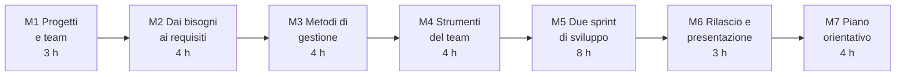

# Informatica per l'Impresa e Soft Skills Digitale

Versione del 30/09/2026, ore 21:25. Prima versione, da confermare.

## Dati generali

- Tipo di percorso: percorso di orientamento per le classi terze, quarte e quinte della scuola secondaria di secondo grado, con il coordinamento del docente tutor.
- Durata: 30 ore, suddivise in unità didattiche di circa un'ora, componibili in sessioni da 2 o 3 ore.
- Destinatari: studenti del triennio di istituto tecnico a indirizzo informatico e di liceo scientifico (16-18 anni).
- Prerequisiti: comprensione di programmi brevi (10-20 righe) in un qualsiasi linguaggio; uso di base del PC (file, cartelle, browser).
- Approccio: simulazione di un progetto informatico completo, svolto in squadra. Gli studenti, divisi in team di 4-5 persone, ricevono da un "cliente" (il docente) la richiesta di un piccolo software, ne raccolgono i requisiti, pianificano il lavoro, sviluppano in due sprint con i metodi e gli strumenti usati nelle aziende ICT, e rilasciano e presentano il prodotto. Le competenze trasversali (lavoro di squadra, comunicazione, problem solving, gestione del tempo) si esercitano durante il progetto e si riprendono in modo esplicito nelle retrospettive.
- Ruolo del docente: cliente del progetto, facilitatore dei team e, nella lezione 3.4, testimone di come le aziende ICT gestiscono i progetti.
- Rapporto con gli altri corsi: il corso è autosufficiente. Il software da sviluppare è piccolo e fornito come "kit di partenza" funzionante: l'attenzione è sul processo, non sulla difficoltà della programmazione.

## Obiettivi di apprendimento

Al termine del percorso lo studente:

- descrive il ciclo di vita di un progetto informatico e i vincoli di tempo, costi, qualità e ambito
- raccoglie i bisogni di un cliente e li traduce in requisiti, storie utente con criteri di accettazione e prototipi
- confronta i metodi a cascata e agili, e applica Scrum e Kanban in un progetto simulato
- stima, pianifica e ordina per priorità il lavoro di un team
- usa Git per lavorare in squadra sullo stesso codice: commit, branch, integrazione, risoluzione dei conflitti
- verifica il software con test automatici e una definizione condivisa di "fatto", e rilascia versioni documentate
- presenta un prodotto a un cliente e riceve e dà un riscontro costruttivo
- applica tecniche di problem solving e di collaborazione, e riflette sul proprio contributo al team
- conosce le professioni del progetto informatico e i percorsi post-diploma, e definisce un proprio piano orientativo

## Strumenti software

Tutti gli strumenti sono gratuiti, con licenza open source o gratuita senza limiti di tempo, funzionano su un laptop Windows con 8 GB di RAM e non richiedono account né carte di credito. Dove un'estensione di Visual Studio Code è equivalente a un programma separato, si usa l'estensione.

| Tipologia | Strumento consigliato | Alternative | Note |
|---|---|---|---|
| Editor e ambiente di lavoro | Visual Studio Code, versione ZIP in modalità portatile: https://code.visualstudio.com/docs/setup/portable | VSCodium | Anteprima Markdown con diagrammi Mermaid integrata nelle versioni recenti |
| Programmazione | Python, installazione per utente senza diritti di amministratore, con l'estensione Python per VS Code; test con il modulo `unittest` della libreria standard | WinPython (portatile) | Il kit di partenza usa solo la libreria standard |
| Controllo di versione | Git per Windows, versione portatile (PortableGit): https://github.com/git-for-windows/git/releases ; interfaccia di VS Code (Controllo del codice sorgente, editor dei conflitti a tre vie) | Git per Windows con installatore | Nessun account: Git funziona in locale |
| Repository condiviso del team | repository "bare" in una cartella condivisa (rete della scuola, cartella del PC del docente o chiavetta USB), protocollo locale di Git | Gitea (licenza MIT), un solo eseguibile sul PC del docente, con utenti locali creati dal docente: repository, segnalazioni, revisioni e board Kanban via browser | Nessun servizio esterno; nessun dato degli studenti fuori dalla scuola |
| Board Kanban e pianificazione | file Markdown nel repository, con diagrammi Mermaid `kanban` e `gantt`; lavagna fisica con foglietti adesivi | board di Gitea | La board versionata nel repository fa parte del prodotto |
| Prototipi e diagrammi | estensione Draw.io Integration: https://marketplace.visualstudio.com/items?itemName=hediet.vscode-drawio | estensione Excalidraw per VS Code | Forme per wireframe e diagrammi di flusso |
| Presentazioni | estensione Marp for VS Code (licenza MIT): https://marketplace.visualstudio.com/items?itemName=marp-team.marp-vscode | qualunque programma di presentazione già disponibile a scuola | Esportazione in PDF e PPTX |
| Curriculum | editor online del CV Europass, in modalità ospite (senza registrazione, con scaricamento del CV) | modello in Markdown fornito nel corso | |
| Piano orientativo | E-Portfolio della Piattaforma Unica del Ministero, con le credenziali che lo studente già usa (SPID, CIE) e con il docente tutor | scheda in Markdown fornita nel corso | Il corso non crea nuovi account |

Non si usano GitHub, servizi di gestione dei progetti online o altre piattaforme che richiedano registrazione. Il docente può mostrare facoltativamente, con il proprio account, strumenti professionali online (board, sistemi di segnalazione, piattaforme di sviluppo).

## Il progetto simulato

- **Prodotto**: "Prenotazioni dei laboratori", un'applicazione Python a riga di comando con cui docenti e tecnici prenotano aule e laboratori della scuola, con archivio in un file JSON. Il kit di partenza contiene un'applicazione funzionante con due funzioni già realizzate (elenco delle aule, nuova prenotazione), i test automatici, un README e un backlog iniziale di circa 15 storie utente (conflitti tra prenotazioni, cancellazione, ricerca per giorno, esportazione CSV, riepilogo settimanale, ruoli, ecc.).
- **Team**: 4-5 studenti con ruoli a rotazione (Product Owner, Scrum Master, sviluppatori); il docente è il cliente e approva le storie.
- **Cadenza**: due sprint, ciascuno con pianificazione, sviluppo, revisione e retrospettiva.
- **Prodotti del team** (nel repository): requisiti e backlog, prototipi, board, codice e test, CHANGELOG, manuale utente, versione rilasciata, presentazione finale.
- **Capolavoro**: il progetto, con la riflessione personale sul proprio ruolo, può essere scelto dallo studente come "capolavoro" dell'E-Portfolio, con il docente tutor.

## Struttura del corso

Struttura a tre livelli: modulo, lezione (circa un'ora), sezione. Ogni lezione ha tre file: la lezione (`.md`), la presentazione Marp (`_marp.md`) e la presentazione pandoc reveal.js (`_prezpdoc.md`).



Struttura delle directory:

```text
corso04_informatica_impresa/
    000_syllabus_info/
        corso04_00_syllabus_AAAA-MM-GG_hhmm.md (data e ora della versione)
        corso04_00_info_avvertenze_AAAA-MM-GG_hhmm.md
    mod01_progetti_e_team/
        lez01_che_cos_e_un_progetto_informatico/
        lez02_lavorare_in_team/
        lez03_kit_di_progetto_e_squadre/
    mod02_dai_bisogni_ai_requisiti/
        lez01_ascoltare_il_cliente/
        lez02_storie_utente_e_criteri_di_accettazione/
        lez03_priorita_e_backlog/
        lez04_prototipi_e_problem_solving/
    mod03_metodi_di_gestione/
        lez01_ciclo_di_vita_e_modello_a_cascata/
        lez02_agile_e_scrum/
        lez03_kanban_stime_e_pianificazione/
        lez04_come_lavorano_le_aziende_ict/
    mod04_strumenti_del_team/
        lez01_git_repository_e_commit/
        lez02_branch_merge_e_conflitti/
        lez03_repository_condiviso_e_revisione/
        lez04_documentazione_e_board/
    mod05_sprint_di_sviluppo/
        lez01_pianificazione_sprint_1/
        lez02_sviluppo_con_branch_e_test/
        lez03_integrazione_e_daily_scrum/
        lez04_revisione_e_retrospettiva_1/
        lez05_qualita_test_e_debugging/
        lez06_pianificazione_sprint_2/
        lez07_sviluppo_e_integrazione_sprint_2/
        lez08_revisione_e_retrospettiva_2/
    mod06_rilascio_e_presentazione/
        lez01_preparare_il_rilascio/
        lez02_presentare_il_prodotto/
        lez03_retrospettiva_di_progetto/
    mod07_piano_orientativo/
        lez01_professioni_del_progetto_ict/
        lez02_percorsi_dopo_il_diploma/
        lez03_candidarsi_cv_e_colloquio/
        lez04_il_mio_piano_orientativo/
```

### Modulo 1: Progetti e team (3 ore)

Directory: `mod01_progetti_e_team/`

| Lezione | Contenuti | Attività pratica |
|---|---|---|
| 1.1 Che cos'è un progetto informatico | Progetto e attività ripetitive; obiettivi, vincoli (ambito, tempo, costi, qualità); portatori di interesse; perché i progetti falliscono; casi reali | Analisi di due casi: che cosa è andato storto, che cosa si poteva fare |
| 1.2 Lavorare in team | Ruoli, comunicazione, fiducia, regole condivise; riunioni efficaci; ascolto attivo; conflitti e come gestirli; lavoro a distanza | Accordo di team (regole, canali, orari, decisioni) scritto in Markdown |
| 1.3 Kit di progetto e squadre | Il prodotto da realizzare; installazione degli strumenti; struttura del kit di partenza; ruoli a rotazione | Formazione dei team; installazione di VS Code, Python e Git; avvio dell'applicazione e dei test del kit |

### Modulo 2: Dai bisogni ai requisiti (4 ore)

Directory: `mod02_dai_bisogni_ai_requisiti/`

| Lezione | Contenuti | Attività pratica |
|---|---|---|
| 2.1 Ascoltare il cliente | Tecniche di raccolta dei requisiti: intervista, osservazione, questionario; requisiti funzionali e non funzionali; vincoli; domande aperte e chiuse | Intervista al cliente (docente) sul sistema di prenotazione; verbale dell'intervista |
| 2.2 Storie utente e criteri di accettazione | Formato "Come ... voglio ... per ..."; criteri INVEST; criteri di accettazione nella forma Dato, Quando, Allora; casi limite | Scrittura e revisione tra team delle storie del proprio backlog |
| 2.3 Priorità e backlog | Valore e sforzo; metodo MoSCoW; obiettivo del prodotto; prodotto minimo funzionante | Ordinamento del backlog con il cliente; obiettivo del prodotto |
| 2.4 Prototipi e problem solving | Wireframe e flussi; prototipi a bassa fedeltà; tecniche di problem solving e creatività: brainstorming, 5 perché, diagramma causa-effetto, matrice di decisione | Prototipo dei comandi e delle schermate con Draw.io; scelta motivata tra due alternative con una matrice di decisione |

### Modulo 3: Metodi di gestione (4 ore)

Directory: `mod03_metodi_di_gestione/`

| Lezione | Contenuti | Attività pratica |
|---|---|---|
| 3.1 Ciclo di vita e modello a cascata | Fasi del ciclo di vita del software; modello a cascata; documenti di progetto; vantaggi e limiti; quando si usa ancora | Diagramma di Gantt in Mermaid di un piano a cascata e confronto con un cambiamento imprevisto |
| 3.2 Agile e Scrum | Manifesto Agile; Scrum: ruoli, eventi, artefatti, impegni (Guida a Scrum, licenza CC BY-SA 4.0) | Simulazione breve di uno sprint con un compito non informatico (costruzione di un oggetto di carta) |
| 3.3 Kanban, stime e pianificazione | Kanban: flusso, colonne, limiti al lavoro in corso; stime relative e planning poker; velocità del team; rischi e loro gestione | Board Kanban in Mermaid; stima del backlog con il planning poker; registro dei rischi |
| 3.4 Come lavorano le aziende ICT | Tipi di aziende ICT; ruoli nei progetti; contratti e preventivi; qualità e norme; strumenti professionali; lavoro in team distribuiti | Lezione illustrata dal docente, con domande preparate dai team |

### Modulo 4: Strumenti del team (4 ore)

Directory: `mod04_strumenti_del_team/`

| Lezione | Contenuti | Attività pratica |
|---|---|---|
| 4.1 Git: repository e commit | Controllo di versione; repository, area di preparazione, commit, storia; messaggi di commit; `.gitignore` | Primo repository con il kit di partenza: commit da terminale e da VS Code |
| 4.2 Branch, merge e conflitti | Rami di sviluppo; integrazione; conflitti e loro risoluzione; flusso di lavoro con un ramo per storia | Conflitto provocato e risolto con l'editor a tre vie di VS Code |
| 4.3 Repository condiviso e revisione | Repository remoto; `clone`, `pull`, `push`; revisione del codice tra compagni; regole del team per l'integrazione | Repository del team in una cartella condivisa; revisione di una modifica di un compagno |
| 4.4 Documentazione e board | README, manuale, CHANGELOG in Markdown; board Kanban e diagrammi nel repository; segnalazione dei difetti | Board del team in Mermaid; modello di segnalazione di un difetto |

### Modulo 5: Due sprint di sviluppo (8 ore)

Directory: `mod05_sprint_di_sviluppo/`

| Lezione | Contenuti | Attività pratica |
|---|---|---|
| 5.1 Pianificazione dello sprint 1 | Obiettivo dello sprint; scelta e scomposizione delle storie in compiti; definizione di "fatto" | Sprint backlog e definizione di "fatto" del team |
| 5.2 Sviluppo con branch e test | Scrivere prima i criteri come test; test automatici con `unittest`; piccoli commit | Sviluppo delle prime storie, un ramo per storia |
| 5.3 Integrazione e daily scrum | Riunione quotidiana; ostacoli e come segnalarli; integrazione frequente; aggiornamento della board | Daily scrum a tempo; integrazione delle storie completate |
| 5.4 Revisione e retrospettiva 1 | Revisione con il cliente; riscontro costruttivo; retrospettiva: che cosa ha funzionato, che cosa cambiare | Demo al cliente; retrospettiva con azioni di miglioramento |
| 5.5 Qualità: test e debugging | Tipi di test; copertura; debugging con metodo (riprodurre, isolare, correggere, verificare); revisione del codice | Caccia ai difetti inseriti nel kit; debugger di VS Code |
| 5.6 Pianificazione dello sprint 2 | Velocità dello sprint 1; nuove richieste del cliente e cambiamenti; ripianificazione | Sprint backlog 2 con una richiesta di modifica del cliente |
| 5.7 Sviluppo e integrazione dello sprint 2 | Lavoro autonomo del team; gestione degli imprevisti; debito tecnico | Sviluppo e integrazione delle storie dello sprint 2 |
| 5.8 Revisione e retrospettiva 2 | Revisione finale delle storie; confronto tra i due sprint; misura dei miglioramenti | Demo al cliente; retrospettiva con confronto rispetto allo sprint 1 |

### Modulo 6: Rilascio e presentazione (3 ore)

Directory: `mod06_rilascio_e_presentazione/`

| Lezione | Contenuti | Attività pratica |
|---|---|---|
| 6.1 Preparare il rilascio | Versioni semantiche; etichette (tag) di Git; CHANGELOG; pacchetto di distribuzione; manuale utente; controllo finale | Versione 1.0.0 del prodotto con pacchetto, CHANGELOG e manuale |
| 6.2 Presentare il prodotto | Struttura di una presentazione per il cliente; demo; gestione delle domande; comunicazione efficace | Presentazione di ciascun team con Marp, con domande del cliente e degli altri team |
| 6.3 Retrospettiva di progetto | Lezioni apprese; autovalutazione e valutazione tra pari; riconoscere le proprie competenze trasversali | Autovalutazione con griglia; riflessione personale per il capolavoro dell'E-Portfolio |

### Modulo 7: Piano orientativo (4 ore)

Directory: `mod07_piano_orientativo/`

| Lezione | Contenuti | Attività pratica |
|---|---|---|
| 7.1 Professioni del progetto ICT | Project manager, Product Owner, Scrum Master, analista, sviluppatore, tester, UX designer, DevOps; competenze tecniche e trasversali; quadri europei (ESCO, e-CF) | Collegamento tra i ruoli svolti nel progetto e le professioni reali |
| 7.2 Percorsi dopo il diploma | ITS Academy, università, lavoro e apprendistato; come informarsi (Guida alla scelta della Piattaforma Unica, Universitaly, rapporti Excelsior) | Ricerca guidata di due percorsi di interesse e confronto |
| 7.3 Candidarsi: CV e colloquio | Curriculum Europass; lettera di presentazione; annunci di lavoro; colloquio e domande frequenti; presenza online | CV Europass in modalità ospite; simulazione di colloquio a coppie |
| 7.4 Il mio piano orientativo | Obiettivi SMART; il piano personale come un progetto (backlog, priorità, scadenze); E-Portfolio e capolavoro con il docente tutor | Piano orientativo personale, con obiettivi e primi passi |

## Composizione delle sessioni

Le lezioni sono unità da circa un'ora. Sessioni da 2 ore: 15 sessioni. Sessioni da 3 ore: 10 sessioni. Le lezioni del modulo 5 sono pensate per essere unite a coppie o a terne nella stessa sessione, perché il lavoro di sviluppo si interrompe male dopo un'ora. Il corso va svolto nell'ordine previsto: ogni modulo usa i prodotti del precedente.

## Verifica degli apprendimenti

- Osservazione del lavoro dei team e dei prodotti nel repository: requisiti, backlog, board, codice, test, documentazione, versione rilasciata.
- Revisioni degli sprint e presentazione finale al cliente.
- Autovalutazione e valutazione tra pari (lezione 6.3), con griglie fornite nel corso.
- Piano orientativo personale (lezione 7.4).

## Fonti, licenze e attribuzioni

- Ken Schwaber e Jeff Sutherland, "La Guida a Scrum" (2020), licenza CC BY-SA 4.0: https://scrumguides.org/scrum-guide.html , traduzione italiana: https://scrumguides.org/docs/scrumguide/v2020/2020-Scrum-Guide-Italian.pdf . Candidata all'adattamento per la lezione 3.2, con attribuzione; le parti adattate restano sotto la stessa licenza.
- "Manifesto per lo Sviluppo Agile di Software", https://agilemanifesto.org/iso/it/manifesto.html : si può copiare liberamente purché si riporti anche la nota che lo accompagna.
- Scott Chacon e Ben Straub, "Pro Git", licenza CC BY-NC-SA 3.0, https://git-scm.com/book/it/v2 : riferimento per il modulo 4 (la traduzione italiana è parziale).
- "Semantic Versioning 2.0.0", traduzione italiana, licenza CC BY 3.0: https://semver.org/lang/it/ ; "Keep a Changelog", versione italiana: https://keepachangelog.com/it-IT/1.1.0/ : riferimenti per la lezione 6.1.
- Ministero dell'Istruzione e del Merito, Piattaforma Unica: https://unica.istruzione.gov.it/it ; circolare DGSIP n. 1616 del 17/05/2024 sulle sezioni dell'E-Portfolio e sul capolavoro.
- Le fonti di ciascuna lezione sono indicate nella lezione stessa; per ogni lezione viene verificata l'esistenza di materiali open source riutilizzabili.

Verifica sull'esistenza di corsi open source molto simili: non sono stati trovati corsi aperti per la scuola secondaria che simulino un progetto informatico completo con questa impostazione. Esistono corsi universitari di laboratorio di progetto agile (per esempio il corso AMOS della Friedrich-Alexander-Universität, https://oss.cs.fau.de/teaching/amos ), rivolti a studenti universitari e basati su progetti reali con aziende: non adatti a essere riusati direttamente.
