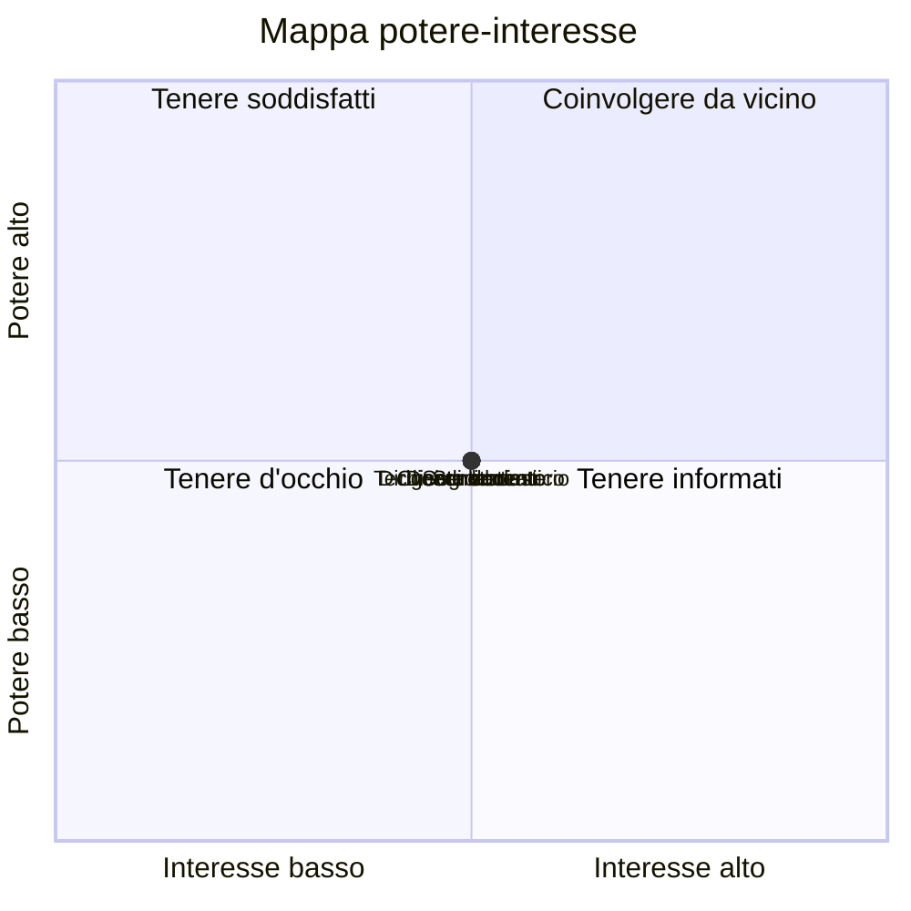

# Mappa dei portatori di interesse

Progetto: Prenotazioni dei laboratori. Gruppo: ...

Modificare le coordinate secondo l'opinione del gruppo (primo numero: interesse, secondo: potere, da 0 a 1) e aggiungere almeno un portatore di interesse. Le etichette non devono contenere virgole né parentesi.

## Come coinvolgere i due portatori di interesse più importanti

1. ...: ...
2. ...: ...
