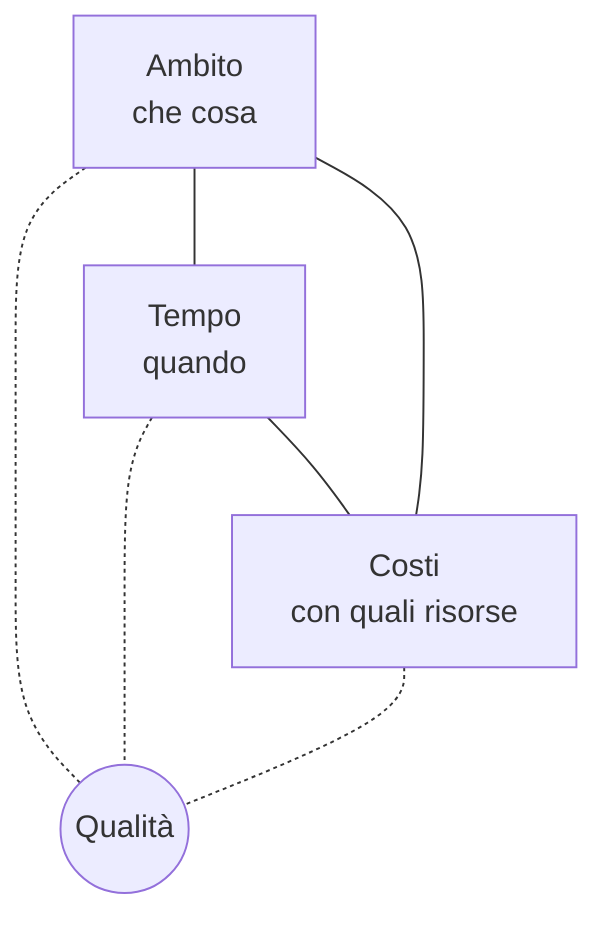
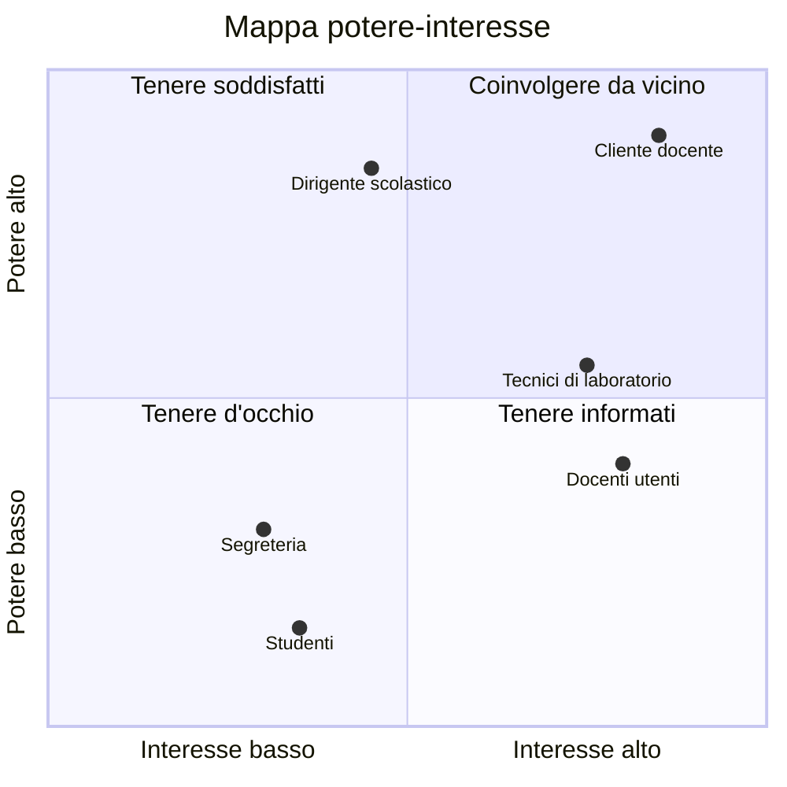
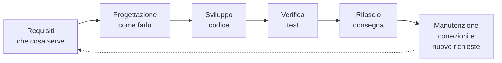

# Lezione 1.1: Che cos'è un progetto informatico

> Contenuto originale. Riferimenti: Wikipedia, "Project management", https://it.wikipedia.org/wiki/Project_management ; Wikipedia, "Mars Climate Orbiter", https://it.wikipedia.org/wiki/Mars_Climate_Orbiter e https://en.wikipedia.org/wiki/Mars_Climate_Orbiter ; Wikipedia, "HealthCare.gov", https://en.wikipedia.org/wiki/HealthCare.gov . I materiali del laboratorio sono nella cartella `laboratorio`.

Obiettivo: distinguere un progetto da un'attività ripetitiva, riconoscerne obiettivi, vincoli e portatori di interesse, e individuare le cause più comuni di fallimento a partire da casi reali.

## 1.1.1 Progetto e attività ripetitiva

- **Progetto**
  insieme di attività coordinate, con un inizio e una fine, svolte per ottenere un risultato unico: un prodotto, un servizio, un cambiamento.
- **Attività ripetitiva** (o operativa)
  lavoro che si ripete in modo simile nel tempo, senza una fine prevista: gestire le iscrizioni ogni anno, rispondere alle richieste di assistenza, fare le copie di sicurezza ogni notte.
- **Project management** (gestione dei progetti)
  applicazione di conoscenze, capacità, strumenti e tecniche alle attività di un progetto per raggiungerne gli obiettivi.

Le due caratteristiche che distinguono un progetto sono quindi la **temporaneità** (una data di inizio e una di fine) e l'**unicità** del risultato: anche un'applicazione simile a molte altre è diversa per cliente, dati, vincoli e persone coinvolte.

| Esempio | Progetto o attività ripetitiva | Perché |
|---|---|---|
| Realizzare il nuovo sito della scuola entro gennaio | progetto | risultato unico, data di fine |
| Pubblicare ogni settimana le circolari sul sito | attività ripetitiva | si ripete senza fine prevista |
| Passare il registro elettronico a un nuovo fornitore | progetto | cambiamento con inizio e fine |
| Assistenza ai docenti che non riescono ad accedere al registro | attività ripetitiva | servizio continuo |

Un progetto spesso termina avviando un'attività ripetitiva: il sito realizzato va poi aggiornato e mantenuto. Nelle aziende informatiche le due forme convivono: gruppi di progetto sviluppano nuovi prodotti, gruppi operativi li fanno funzionare ogni giorno.

## 1.1.2 Obiettivi e vincoli

Un progetto ha un **obiettivo**: che cosa deve esistere alla fine, per chi e perché. Un obiettivo utile è verificabile: "un'applicazione con cui i docenti prenotano i laboratori, usata da tutti i docenti dal secondo quadrimestre" si può verificare, "migliorare la gestione dei laboratori" no.

Ogni progetto si svolge dentro quattro **vincoli** collegati tra loro:

- **Ambito** (scope)
  che cosa si realizza: funzioni, documenti, attività comprese e escluse.
- **Tempo**
  scadenze e durata.
- **Costi**
  denaro e persone disponibili; nei progetti informatici il costo principale è il tempo di lavoro delle persone.
- **Qualità**
  quanto bene il risultato soddisfa i requisiti: correttezza, affidabilità, facilità d'uso, sicurezza.

Diagramma: il triangolo dei vincoli, con la qualità al centro.



I vincoli si influenzano: se il cliente chiede più funzioni (ambito) con la stessa scadenza e le stesse persone, qualcosa deve cambiare. Le scelte possibili sono aumentare il tempo, aumentare le risorse, ridurre l'ambito oppure, in modo spesso nascosto, ridurre la qualità (meno test, meno documentazione). Una parte importante della gestione di un progetto consiste nel rendere esplicite queste scelte e concordarle con il cliente.

Aggiungere persone a un progetto in ritardo non riduce il tempo in proporzione: i nuovi arrivati devono imparare, e più persone significa più comunicazione. È la "legge di Brooks", formulata da Fred Brooks nel 1975: "aggiungere persone a un progetto software in ritardo lo fa ritardare ancora di più" (Wikipedia, "Legge di Brooks", https://it.wikipedia.org/wiki/Legge_di_Brooks ).

## 1.1.3 Portatori di interesse

- **Portatori di interesse** (stakeholder)
  persone o gruppi che influenzano il progetto o ne sono influenzati.

| Portatore di interesse | Ruolo nel progetto |
|---|---|
| Cliente o committente | chiede il prodotto e lo paga; approva i risultati |
| Utenti | usano il prodotto; possono essere diversi dal cliente |
| Sponsor | sostiene il progetto nell'organizzazione e decide le risorse |
| Team di progetto | realizza il prodotto |
| Fornitori | forniscono componenti, servizi, persone |
| Chi gestirà il prodotto | lo farà funzionare dopo il rilascio (assistenza, sistemisti) |
| Enti e norme | impongono regole: protezione dei dati personali, accessibilità, sicurezza |

Nel progetto del corso, "Prenotazioni dei laboratori", il cliente è la scuola (rappresentata dal docente), gli utenti sono docenti e tecnici di laboratorio, la dirigenza e la segreteria usano i dati, e le prenotazioni contengono nomi di persone, quindi valgono le regole sulla protezione dei dati personali.

Uno strumento semplice è la **mappa potere-interesse**: si collocano i portatori di interesse secondo quanto possono influenzare il progetto e quanto ne sono interessati, e si decide come coinvolgerli.

Diagramma: esempio di mappa per il progetto del corso (posizioni indicative).



## 1.1.4 Le fasi di un progetto informatico

Ogni progetto informatico attraversa le stesse attività, anche se i metodi le organizzano in modo diverso (modulo 3).

Diagramma: le attività principali.



- Nel **modello a cascata** le attività si svolgono una dopo l'altra, una sola volta, per tutto il prodotto.
- Nei **metodi agili** si ripetono in cicli brevi, ciascuno dei quali produce una parte funzionante del prodotto: il cliente la vede presto e può correggere la direzione.

## 1.1.5 Perché i progetti falliscono

Un progetto fallisce quando non raggiunge l'obiettivo, o lo raggiunge con ritardi e costi molto superiori al previsto, o produce qualcosa che gli utenti non usano. Le cause ricorrenti riguardano più spesso le persone e l'organizzazione che la tecnologia:

- **requisiti poco chiari o incompleti**: si costruisce la cosa sbagliata
- **scarso coinvolgimento degli utenti**: le loro esigenze reali emergono tardi
- **comunicazione carente** tra cliente e team, o tra gruppi diversi del team
- **stime ottimistiche** e scadenze fissate senza considerare il lavoro necessario
- **cambiamenti non gestiti**: nuove richieste accettate senza rivedere tempi e costi
- **verifiche insufficienti**: test ridotti o saltati per recuperare tempo
- **rischi non considerati**: nessuno si chiede che cosa potrebbe andare storto

## 1.1.6 Due casi reali

### Mars Climate Orbiter (1999)

Sonda della NASA lanciata l'11 dicembre 1998 per studiare il clima di Marte. Il 23 settembre 1999, durante la manovra di ingresso in orbita, passò a circa 57 km dalla superficie invece dei 140-150 previsti e andò distrutta. Il costo complessivo della missione, insieme al lander collegato, era di circa 328 milioni di dollari.

- **Che cosa successe**: un programma a terra realizzato da un'azienda fornitrice produceva i dati sulla spinta dei motori in unità del sistema imperiale (libbre-forza per secondo), mentre il software di navigazione si aspettava unità del Sistema internazionale (newton per secondo). I valori erano sbagliati di un fattore 4,45 e la traiettoria calcolata era errata.
- **Che cosa emerse dall'indagine**: il flusso di quei dati non era stato provato da un capo all'altro prima del lancio; alcuni navigatori avevano notato discrepanze nella posizione della sonda, ma i loro dubbi non seguirono le procedure formali di segnalazione e non furono affrontati; controlli usati nelle missioni precedenti erano stati eliminati per ridurre i costi.
- **Lezione per i progetti**: l'errore tecnico era banale; il fallimento nacque da un accordo tra gruppi (il formato dei dati) non verificato, da comunicazione carente e da verifiche tagliate.

### HealthCare.gov (2013)

Sito del governo degli Stati Uniti per scegliere e sottoscrivere un'assicurazione sanitaria, aperto il 1° ottobre 2013 con una scadenza fissata per legge.

- **Che cosa successe**: nei primi giorni milioni di persone visitarono il sito, ma solo una piccola parte riuscì a completare l'iscrizione. Il sito era lento o bloccato; al 13 novembre gli iscritti erano meno di 27 000. Dopo settimane di correzioni straordinarie, a fine novembre il sito funzionava in modo più regolare.
- **Cause indicate**: più accessi contemporanei del previsto, ma anche problemi di progettazione del software e dei sistemi, per esempio l'obbligo di creare un account prima di poter confrontare le offerte; le prove di carico svolte il giorno prima dell'apertura avevano mostrato che il sito diventava troppo lento già con 1100 utenti contemporanei, contro i 50 000-60 000 attesi; il lavoro era diviso tra molte aziende fornitrici, coordinate da un ente pubblico ritenuto da diversi commentatori poco adatto al ruolo di integratore dei sistemi.
- **Costi**: il contratto iniziale del fornitore principale era di circa 94 milioni di dollari; secondo l'Ufficio dell'Ispettore generale, ad agosto 2014 i costi complessivi stimati avevano raggiunto circa 1,7 miliardi.
- **Lezione per i progetti**: con una data di consegna non modificabile, ambito e qualità non erano stati adattati; i risultati negativi dei test non avevano cambiato i piani.

## 1.1.7 Laboratorio

Tempo indicativo: 35 minuti. Cartella di lavoro `C:\corso-impresa\lab11`, con i file della cartella `laboratorio`. I file Markdown si aprono con VS Code; l'anteprima si apre con `Ctrl+Shift+V`.

### Parte 1: progetto o attività ripetitiva (5 minuti)

Nel file `casi_di_studio.md`, sezione "Parte 1", classificare le otto situazioni indicate e motivare ogni risposta in una riga.

### Parte 2: analisi di un caso (20 minuti)

A gruppi di 4-5, ciascun gruppo analizza uno dei due casi con la scheda del file `casi_di_studio.md`:

1. qual era l'obiettivo del progetto, e quali vincoli erano più rigidi;
2. chi erano i portatori di interesse;
3. che cosa è andato storto, distinguendo le cause tecniche da quelle organizzative e di comunicazione;
4. quali due azioni, in quale fase, avrebbero potuto evitare o ridurre il danno;
5. quale insegnamento vale anche per un piccolo progetto come quello del corso.

Ogni gruppo presenta le risposte ai punti 3 e 4 in 2 minuti.

### Parte 3: portatori di interesse del progetto del corso (10 minuti)

Il file `mappa_portatori.md` contiene la mappa potere-interesse del progetto "Prenotazioni dei laboratori" in forma di diagramma Mermaid. Modificare le coordinate (valori da 0 a 1) secondo l'opinione del gruppo, aggiungere almeno un portatore di interesse mancante e scrivere, sotto il diagramma, come coinvolgere i due più importanti. L'anteprima di VS Code aggiorna il diagramma a ogni salvataggio.

Sintassi di una riga del diagramma:

```text
    Segreteria: [0.3, 0.3]
```

- il testo prima dei due punti è l'etichetta del punto
- il primo numero è la posizione orizzontale (interesse), il secondo quella verticale (potere), da 0 a 1

## 1.1.8 Aspetti orientativi (discussione)

- La figura che coordina un progetto è il **project manager**: pianifica, segue avanzamento, costi e rischi, tiene i rapporti con il cliente. Nei metodi agili parte di questi compiti è distribuita nel team (modulo 3).
- I casi analizzati mostrano che capacità come comunicare, verificare, segnalare un dubbio contano quanto le competenze tecniche: sono richieste in tutte le professioni informatiche.
- Domanda: in un'attività scolastica svolta in gruppo, quale dei vincoli (ambito, tempo, costi, qualità) è stato sacrificato per primo quando il tempo stringeva?
