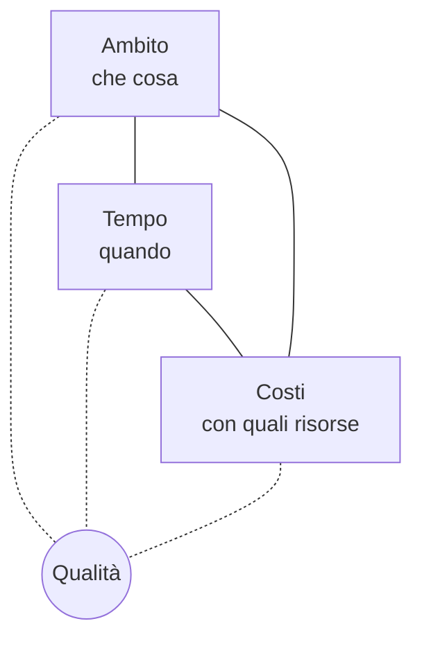

## Contenuti

- Progetto e attività ripetitiva
- Obiettivi e vincoli
- Portatori di interesse
- Le fasi
- Perché i progetti falliscono
- Mars Climate Orbiter (1999)
- HealthCare.gov (2013)
- Laboratorio
- Aspetti orientativi

## Progetto e attività ripetitiva

- **Progetto**: attività coordinate, con inizio e fine, per un risultato unico
- **Attività ripetitiva**: lavoro che si ripete senza fine prevista
- **Project management**: conoscenze, strumenti e tecniche per raggiungere gli obiettivi di un progetto
- Un progetto spesso termina avviando un'attività ripetitiva

## Obiettivi e vincoli

- Obiettivo verificabile: che cosa, per chi, entro quando
- Più ambito a parità di tempo e costi: qualcosa deve cambiare
- Legge di Brooks: più persone su un progetto in ritardo, più ritardo

## Portatori di interesse

- Cliente, utenti, sponsor, team, fornitori
- Chi gestirà il prodotto dopo il rilascio
- Enti e norme: dati personali, accessibilità, sicurezza
- Mappa potere-interesse: come coinvolgere ciascuno

## Le fasi

- A cascata: una volta sola, in sequenza
- Agile: cicli brevi, ciascuno con una parte funzionante

## Perché i progetti falliscono

- Requisiti poco chiari; utenti poco coinvolti
- Comunicazione carente
- Stime ottimistiche; cambiamenti non gestiti
- Verifiche ridotte; rischi non considerati

## Mars Climate Orbiter (1999)

- Sonda NASA distrutta entrando nell'atmosfera di Marte
- Due programmi con unità diverse: libbre-forza per secondo contro newton per secondo (fattore 4,45)
- Flusso dei dati non provato; dubbi dei navigatori non affrontati; controlli tagliati
- Circa 328 milioni di dollari con il lander collegato

## HealthCare.gov (2013)

- Sito per le assicurazioni sanitarie, data di apertura fissata per legge
- Al 13 novembre meno di 27 000 iscritti
- Prove di carico: troppo lento già con 1100 utenti contemporanei
- Molti fornitori, integrazione debole; costi stimati a 1,7 miliardi (2014)

## Laboratorio

1. Progetto o attività ripetitiva: otto situazioni
2. Analisi di un caso a gruppi: cause e azioni correttive
3. Mappa dei portatori di interesse del progetto del corso, in Mermaid

## Aspetti orientativi

- Project manager: pianificazione, avanzamento, costi, rischi, cliente
- Comunicare, verificare, segnalare un dubbio: competenze di ogni professione informatica
- Quale vincolo si sacrifica per primo quando il tempo stringe?
