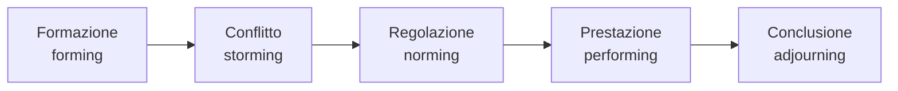
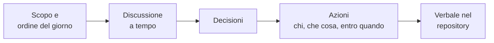

# Lezione 1.2: Lavorare in team

> Contenuto originale. Riferimenti: Wikipedia, "Tuckman's stages of group development", https://en.wikipedia.org/wiki/Tuckman%27s_stages_of_group_development ; Wikipedia, "Psychological safety", https://en.wikipedia.org/wiki/Psychological_safety ; Wikipedia, "Thomas-Kilmann Conflict Mode Instrument", https://en.wikipedia.org/wiki/Thomas%E2%80%93Kilmann_Conflict_Mode_Instrument . I materiali del laboratorio sono nella cartella `laboratorio`.

Obiettivo: conoscere le condizioni che rendono efficace un team, le regole della comunicazione e delle riunioni, i modi di prendere decisioni e di gestire i conflitti, e scrivere l'accordo del proprio team.

## 1.2.1 Gruppo e team

- **Gruppo**
  persone che lavorano nello stesso luogo o sullo stesso tema, ciascuna con obiettivi propri.
- **Team**
  gruppo con un obiettivo comune, compiti che dipendono gli uni dagli altri e una responsabilità condivisa sul risultato.

Nei progetti informatici quasi nessun prodotto è opera di una sola persona: codice, test, documentazione e rapporti con il cliente sono svolti da persone diverse che devono coordinarsi.

Il modello di Bruce Tuckman (1965, con una quinta fase aggiunta nel 1977) descrive le fasi che un team attraversa:



- **Formazione**: i membri si conoscono, sono cortesi e prudenti, ognuno pensa soprattutto al proprio compito.
- **Conflitto**: emergono differenze di metodo, di idee e di ruolo; possono nascere tensioni.
- **Regolazione**: il team stabilisce regole e ruoli, i disaccordi si risolvono, cresce la collaborazione.
- **Prestazione**: il team lavora in modo autonomo ed efficace verso l'obiettivo comune.
- **Conclusione**: il lavoro termina, si riflette su risultati ed esperienza.

Le fasi non sono rigide: un team può tornare indietro, per esempio quando arriva un nuovo membro. La fase di conflitto è normale e non va evitata: va attraversata con regole chiare. L'accordo di team scritto in questa lezione serve proprio a questo.

## 1.2.2 Che cosa rende efficace un team

- **Obiettivo comune chiaro**: tutti sanno che cosa si deve ottenere e perché.
- **Ruoli e responsabilità chiari**: si sa chi fa che cosa e chi decide su che cosa.
- **Affidabilità**: ciascuno porta a termine ciò che si è impegnato a fare, o avvisa in tempo se non ci riesce.
- **Sicurezza psicologica**: la convinzione di non essere puniti o umiliati se si propone un'idea, si fa una domanda, si esprime un dubbio o si ammette un errore. Il concetto è stato studiato in particolare da Amy Edmondson (1999). Dove manca, i problemi restano nascosti finché diventano gravi, come nel caso del Mars Climate Orbiter (lezione 1.1).
- **Comunicazione aperta e regolare**: le informazioni arrivano a chi servono, al momento giusto.

## 1.2.3 Comunicazione

### Canali

| Tipo | Esempi | Adatto per |
|---|---|---|
| Sincrono (tutti presenti nello stesso momento) | riunione, telefonata, videochiamata | decisioni, chiarimenti, problemi urgenti o delicati |
| Asincrono (ognuno legge quando può) | messaggi, posta, commenti nel repository, board | aggiornamenti, richieste non urgenti, informazioni da conservare |

Le informazioni che devono restare (decisioni, requisiti, accordi) si scrivono in un posto condiviso: nel progetto del corso, i file del repository.

### Messaggi chiari

Un messaggio di lavoro efficace contiene contesto, richiesta e scadenza.

- Poco efficace: "Il programma non va, guardate."
- Efficace: "Eseguendo `python prenotazioni.py aule --tipo laboratorio` il programma si ferma con un errore (copio il messaggio sotto). Qualcuno può controllare entro domani? Io intanto continuo con la storia US-02."

### Ascolto attivo

- non interrompere; lasciare finire l'altro prima di rispondere
- fare domande di chiarimento ("Intendi che...?", "Puoi fare un esempio?")
- riformulare con parole proprie ciò che si è capito, per verificarlo ("Quindi ti serve che...")
- distinguere i fatti dalle interpretazioni

### Riscontro costruttivo (feedback)

Un riscontro utile riguarda il lavoro, non la persona, ed è concreto:

1. **fatto**: che cosa si è osservato ("nella funzione di ricerca mancano i test");
2. **effetto**: perché è importante ("se qualcuno la modifica non ce ne accorgiamo");
3. **proposta**: che cosa si potrebbe fare ("aggiungiamo due test per i casi principali?").

Il riscontro positivo segue la stessa forma ed è altrettanto importante: dice che cosa continuare a fare.

## 1.2.4 Riunioni efficaci

- **Scopo**: ogni riunione ha uno scopo chiaro (decidere, aggiornarsi, risolvere un problema); se lo scopo si raggiunge con un messaggio, la riunione non serve.
- **Ordine del giorno**: pochi punti, noti prima.
- **Tempo**: una durata stabilita, controllata da chi tiene il tempo.
- **Ruoli**: chi conduce (facilitatore), chi tiene il tempo, chi scrive il verbale.
- **Esito**: decisioni prese e azioni, ciascuna con **un responsabile e una scadenza**, scritte nel verbale.

Diagramma: struttura di una riunione breve.



## 1.2.5 Prendere decisioni

| Metodo | Come funziona | Quando usarlo |
|---|---|---|
| Decide il responsabile | chi ha la responsabilità di quell'aspetto decide, dopo aver ascoltato il team | decisioni frequenti o urgenti; nel progetto, il Product Owner per le priorità del prodotto |
| Consenso | si discute finché nessuno si oppone, anche se non tutti la pensano allo stesso modo | decisioni importanti che tutti dovranno applicare |
| Maggioranza | si vota | quando il consenso non arriva nel tempo stabilito |

Un modo rapido per verificare il consenso è il voto con le dita: ciascuno mostra da 0 a 5 dita secondo quanto è d'accordo; chi mostra 0-2 spiega le proprie obiezioni prima di decidere.

Una volta presa, una decisione si applica anche da chi era contrario; se non funziona, si riapre nel momento stabilito (nel progetto, la retrospettiva).

## 1.2.6 Conflitti

Nel lavoro di squadra i disaccordi sono inevitabili e possono essere utili: fanno emergere problemi e alternative.

- **Conflitto sul compito**: riguarda il lavoro (quale soluzione, quale priorità). Gestito bene, migliora le decisioni.
- **Conflitto personale**: riguarda le persone (antipatie, mancanza di rispetto). Danneggia il team e va affrontato presto.

Il modello di Thomas e Kilmann (1974) descrive cinque modi di affrontare un conflitto, secondo quanto si cerca di ottenere ciò che si vuole (assertività) e quanto si tiene conto dell'altro (cooperazione):

| Modo | Assertività | Cooperazione | Quando può servire |
|---|---|---|---|
| Competere | alta | bassa | decisioni urgenti, questioni di sicurezza |
| Collaborare | alta | alta | problemi importanti, quando c'è tempo per cercare una soluzione che vada bene a tutti |
| Trovare un compromesso | media | media | quando serve una soluzione rapida e accettabile |
| Evitare | bassa | bassa | questioni poco importanti, o per lasciar calmare gli animi prima di riprendere |
| Accomodare | bassa | alta | quando la questione è più importante per l'altro |

Passi per affrontare un conflitto sul compito:

1. parlarne presto, direttamente con le persone coinvolte;
2. descrivere i fatti e le esigenze di ciascuno, non le intenzioni attribuite agli altri;
3. cercare insieme almeno due soluzioni possibili;
4. scegliere con un criterio concordato (lezione 2.4: matrice di decisione);
5. se non si trova un accordo, applicare la regola dell'accordo di team, e coinvolgere il docente quando serve.

## 1.2.7 Lavoro a distanza

Nelle aziende ICT è frequente lavorare con colleghi in altre sedi o da casa, anche in altri paesi e fusi orari.

- più comunicazione scritta, più chiara e completa
- informazioni e decisioni in luoghi condivisi (repository, board, documenti), non in conversazioni private
- orari di disponibilità concordati; riunioni brevi e regolari
- strumenti comuni per codice, compiti e comunicazione

## 1.2.8 Laboratorio

Tempo indicativo: 35 minuti. Cartella di lavoro `C:\corso-impresa\lab12`, con i file della cartella `laboratorio`.

### Parte 1: formazione dei team (5 minuti)

Il docente forma i team di 4-5 studenti che lavoreranno insieme per tutto il corso. Ogni team sceglie un nome.

### Parte 2: accordo di team (25 minuti)

1. Aprire `accordo_di_team.md` in VS Code e salvarlo con il nome del team, per esempio `accordo_orione.md`.
2. Discutere ogni sezione e scrivere le regole al posto dei `...`. Il file `accordo_esempio.md` mostra un accordo compilato: serve come esempio, non come modello da copiare.
3. Nella sezione "Membri" scrivere solo nome e iniziale del cognome.
4. Verificare la completezza:

```powershell
python controlla_accordo.py accordo_orione.md
```

```text
DA SISTEMARE: la sezione "Decisioni" contiene ancora "..." da sostituire
ATTENZIONE: membri indicati: 3; i team sono di 4 o 5 persone

Problemi trovati: 1 da sistemare, 1 di attenzione
```

Come funziona:

```python
def dividi_sezioni(testo):
    sezioni, corrente = {}, None
    for riga in testo.splitlines():
        if riga.startswith("## "):
            corrente = riga[3:].strip()
            sezioni[corrente] = []
        elif corrente is not None:
            sezioni[corrente].append(riga)
    return sezioni
```

- `testo.splitlines()` divide il file in righe
- una riga che inizia con `## ` è il titolo di una sezione: diventa una nuova chiave del dizionario `sezioni`
- le righe successive si aggiungono all'elenco della sezione corrente, finché non arriva un nuovo titolo
- la funzione `controlla` verifica poi che ogni sezione richiesta esista e non contenga più `...`, conta i membri e cerca con le espressioni regolari (modulo `re`) indirizzi di posta e numeri di telefono, che nell'accordo non vanno inseriti
- il programma controlla la forma, non la qualità delle regole: quella la valuta il team

Test: `python test_controlla_accordo.py` (12 test).

### Parte 3: confronto (5 minuti)

Ogni team legge alla classe una regola sulle decisioni e una sui conflitti. Il docente annota le regole più diverse tra loro: si riprenderanno nella prima retrospettiva (lezione 5.4) per vedere quali hanno funzionato.

L'accordo si conserva: nella lezione 4.3 entrerà nel repository del team.

## 1.2.9 Aspetti orientativi (discussione)

- Negli annunci di lavoro del settore informatico compaiono quasi sempre, accanto alle competenze tecniche, "capacità di lavorare in team", "comunicazione efficace", "problem solving": sono le competenze esercitate in questo corso.
- Figure come lo Scrum Master e il team leader hanno il compito principale di far lavorare bene il team: facilitare le riunioni, rimuovere gli ostacoli, aiutare a gestire i conflitti.
- Domanda: in quale fase del modello di Tuckman si trova il proprio team oggi? Che cosa servirebbe per passare alla successiva?
