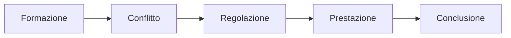
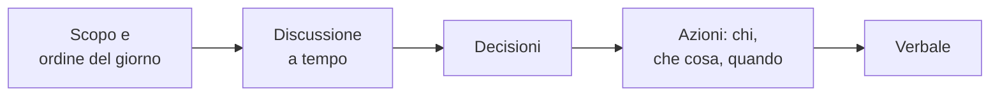

## Lezione 1.2: Lavorare in team

Modulo 1: Progetti e team. Informatica per l'Impresa e Soft Skills Digitale

---

## Gruppo e team

- **Team**: obiettivo comune, compiti interdipendenti, responsabilità condivisa

- Modello di Tuckman (1965, 1977): il conflitto è una fase normale

---

## Che cosa rende efficace un team

- Obiettivo comune chiaro
- Ruoli e responsabilità chiari
- Affidabilità
- Sicurezza psicologica: si può fare una domanda o ammettere un errore senza essere umiliati
- Comunicazione aperta e regolare

---

## Comunicazione

- Sincrona per decidere e chiarire; asincrona per aggiornare e conservare
- Messaggio chiaro: contesto, richiesta, scadenza
- Ascolto attivo: non interrompere, chiedere, riformulare
- Riscontro costruttivo: fatto, effetto, proposta

---

## Riunioni efficaci

---

## Decisioni

| Metodo | Quando |
|---|---|
| Decide il responsabile | decisioni frequenti o urgenti |
| Consenso | decisioni importanti per tutti |
| Maggioranza | se il consenso non arriva in tempo |

- Voto con le dita da 0 a 5
- Una decisione presa si applica; si riapre alla retrospettiva

---

## Conflitti

- Sul compito: utile se gestito bene; personale: da affrontare presto
- Thomas e Kilmann: competere, collaborare, compromesso, evitare, accomodare
- Passi: parlarne presto, fatti ed esigenze, due soluzioni, criterio concordato, regola del team

---

## Lavoro a distanza

- Più comunicazione scritta, chiara e completa
- Decisioni in luoghi condivisi, non in conversazioni private
- Orari di disponibilità concordati

---

## Laboratorio

1. Formazione dei team (4-5 studenti)
2. Accordo di team in Markdown: `python controlla_accordo.py accordo_orione.md`; 12 test
3. Confronto tra team: una regola sulle decisioni, una sui conflitti

---

## Aspetti orientativi

- Lavoro in team e comunicazione: presenti in quasi tutti gli annunci del settore
- Scrum Master e team leader: far lavorare bene il team
- In quale fase di Tuckman si trova il team oggi?
