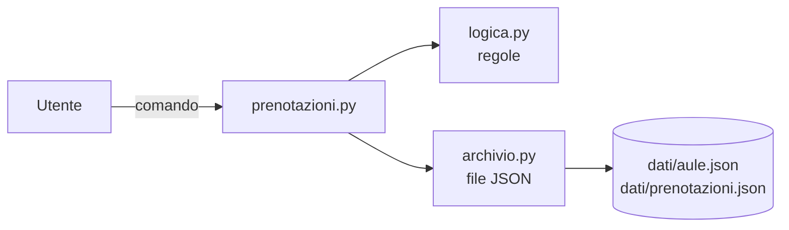

# Prenotazioni dei laboratori

Applicazione a riga di comando con cui docenti e tecnici prenotano le aule e i laboratori della scuola. Le aule e le prenotazioni sono conservate in file JSON nella cartella `dati`.

Questo è il kit di partenza del progetto: funzionano l'elenco delle aule e la registrazione di una nuova prenotazione. Le altre funzioni richieste dal cliente sono descritte nel backlog (`docs/backlog.md`).

Tutti i nomi e i dati presenti nel kit sono di fantasia.

## Requisiti

- Python 3.10 o successivo, solo libreria standard: non serve installare altri pacchetti.

## Uso

I comandi si danno da un terminale aperto nella cartella del progetto (in VS Code: menu Terminale, Nuovo terminale).

Elenco delle aule, tutte o di un tipo:

```text
python prenotazioni.py aule
python prenotazioni.py aule --tipo laboratorio
```

Nuova prenotazione: aula, giorno, ora di inizio, ora di fine, chi prenota e, facoltativo, il motivo.

```text
python prenotazioni.py prenota LAB-INF1 2026-10-12 9:00 11:00 "M. Bianchi" --motivo "Esercitazione 3A"
```

- il giorno si scrive nel formato AAAA-MM-GG, gli orari nel formato HH:MM
- i testi che contengono spazi vanno tra virgolette
- la scuola è aperta dalle 8:00 alle 18:00

Aiuto sui comandi:

```text
python prenotazioni.py -h
python prenotazioni.py prenota -h
```

## Test

```text
python -m unittest
```

Il comando cerca ed esegue tutti i test nella cartella `tests`. Con l'opzione `-v` mostra il nome di ogni test.

## Struttura

```text
kit_prenotazioni/
    prenotazioni.py     interfaccia a riga di comando: legge i comandi e stampa i risultati
    logica.py           regole: controllo dei dati, elenco delle aule, nuova prenotazione
    archivio.py         lettura e scrittura dei file JSON
    dati/
        aule.json           le aule della scuola
        prenotazioni.json   le prenotazioni registrate
    tests/              test automatici, uno per ogni modulo
    docs/
        backlog.md      richieste del cliente, come storie utente
        board.md        stato del lavoro del team
    CHANGELOG.md        modifiche di ogni versione
```



Le regole sono separate dall'interfaccia e dall'archivio: si possono provare con i test senza file e senza terminale, e si possono cambiare l'interfaccia o il formato dei file senza toccare le regole.

## Limiti noti

- Il programma non controlla se un'aula è già prenotata nello stesso orario: nei dati di esempio le prenotazioni 3 e 4 si sovrappongono (storia US-01 del backlog).
- I messaggi di aiuto generati automaticamente sono in parte in inglese (storia US-14).
