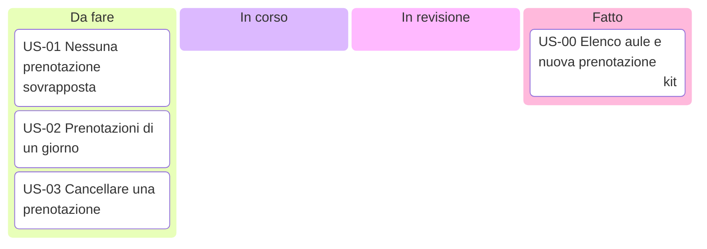

# Board del team

Stato del lavoro, aggiornato dal team a ogni modifica. Ogni scheda riporta il codice della storia; `assigned` indica chi ci lavora. La board si usa dallo sprint 1 (lezione 5.1); il suo uso è spiegato nelle lezioni 3.3 e 4.4.

Se l'anteprima di VS Code non mostra il diagramma, la stessa board si tiene in forma di tabella:

| Da fare | In corso | In revisione | Fatto |
|---|---|---|---|
| US-01, US-02, US-03 | | | US-00 |
