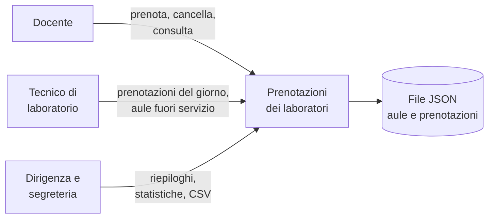
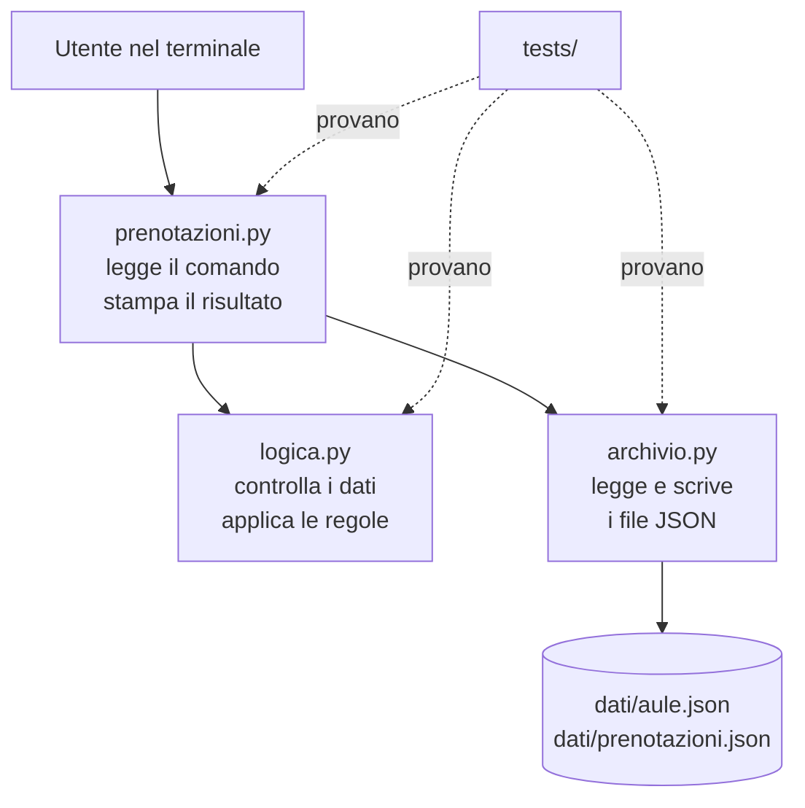

# Lezione 1.3: Kit di progetto e squadre

> Contenuto originale. Riferimenti: Visual Studio Code, modalità portatile, https://code.visualstudio.com/docs/setup/portable ; Pro Git, "First-Time Git Setup", licenza CC BY-NC-SA 3.0, https://git-scm.com/book/it/v2/Per-Iniziare-First-Time-Git-Setup ; documentazione di Python, modulo unittest, https://docs.python.org/3/library/unittest.html . Il kit di partenza e lo script di verifica sono nella cartella `laboratorio`.

Obiettivo: conoscere il prodotto da realizzare e il kit di partenza, verificare che gli strumenti funzionino, avviare l'applicazione e i test, e assegnare i ruoli del team per il primo sprint.

## 1.3.1 Il prodotto

Il cliente (il docente, in rappresentanza della scuola) chiede un programma per gestire le prenotazioni delle aule e dei laboratori, oggi fatte su un foglio appeso alla porta del laboratorio o con messaggi ai tecnici. I problemi segnalati: due classi nello stesso laboratorio alla stessa ora, tecnici che non sanno quali laboratori preparare, nessun dato su quanto sono usati i laboratori.

- **Prodotto**: "Prenotazioni dei laboratori", applicazione a riga di comando in Python.
- **Utenti**: docenti (prenotano), tecnici di laboratorio (preparano le aule, gestiscono i guasti), dirigenza e segreteria (consultano riepiloghi e statistiche).
- **Punto di partenza**: un kit funzionante con due funzioni, l'elenco delle aule e la registrazione di una prenotazione. Le altre richieste sono nel backlog.

Diagramma: chi usa il programma e per che cosa.



## 1.3.2 Gli strumenti

| Strumento | A che cosa serve nel progetto |
|---|---|
| Visual Studio Code | scrivere codice e documenti Markdown, vedere l'anteprima dei diagrammi, usare il terminale e Git da un'unica finestra |
| Python | linguaggio del prodotto; il modulo `unittest` della libreria standard esegue i test |
| Git | registra la storia delle modifiche e permette a più persone di lavorare sullo stesso codice (modulo 4) |

Gli strumenti sono in versione portatile o installati per l'utente, senza diritti di amministratore, e non richiedono account.

Comandi di verifica, da un terminale (in VS Code: menu Terminale, Nuovo terminale):

```powershell
python --version
git --version
```

- `python --version` stampa la versione di Python, per esempio `Python 3.12.7`; serve la 3.10 o successiva
- `git --version` stampa la versione di Git; se il comando non viene trovato, la cartella di Git non è nel PATH, cioè nell'elenco delle cartelle in cui il sistema cerca i programmi

### Identità Git

Git scrive in ogni modifica registrata (commit) il nome e l'indirizzo di posta di chi l'ha fatta. Si impostano una volta per PC:

```powershell
git config --global user.name "Anna R."
git config --global user.email "anna.r@classe.invalid"
```

- `--global` salva l'impostazione per l'utente del PC, valida per tutti i progetti
- basta nome e iniziale del cognome
- l'indirizzo può essere fittizio: il dominio `.invalid` è riservato a questo uso e non appartiene a nessuno

Sui PC usati da più studenti l'identità si imposta nella cartella del progetto, senza `--global` (lezione 4.1).

## 1.3.3 Il kit di partenza

```text
kit_prenotazioni/
    prenotazioni.py     interfaccia a riga di comando
    logica.py           regole: controllo dei dati, elenco aule, nuova prenotazione
    archivio.py         lettura e scrittura dei file JSON
    dati/               aule.json, prenotazioni.json
    tests/              test automatici
    docs/               backlog.md, board.md
    README.md           descrizione e istruzioni
    CHANGELOG.md        registro delle modifiche
    .gitignore          file che Git deve ignorare
```

Diagramma: come si chiamano i moduli.



La separazione in tre moduli è una scelta di progettazione: le regole (`logica.py`) non leggono file e non stampano nulla, quindi si provano facilmente con i test; l'interfaccia si potrebbe sostituire, per esempio con una pagina web, senza riscrivere le regole.

### I dati

Una prenotazione in `dati/prenotazioni.json`:

```json
{
  "id": 1,
  "aula": "LAB-INF1",
  "giorno": "2026-10-12",
  "inizio": "09:00",
  "fine": "11:00",
  "richiedente": "M. Bianchi",
  "motivo": "Esercitazione 3A"
}
```

- JSON è un formato di testo per dati strutturati: le parentesi graffe racchiudono un oggetto con coppie nome-valore, le quadre (all'inizio e alla fine del file) un elenco
- il giorno è nel formato AAAA-MM-GG e gli orari in HH:MM: formati standard, che si ordinano correttamente anche come testo
- tutti i nomi presenti nel kit sono di fantasia

### La funzione principale

Parte di `nuova_prenotazione` in `logica.py`:

```python
aula = cerca_aula(aule, codice_aula)
g = leggi_data(giorno)
ora_inizio = leggi_ora(inizio)
ora_fine = leggi_ora(fine)
if ora_inizio >= ora_fine:
    raise ErrorePrenotazione("l'orario di fine deve essere successivo a quello di inizio")
...
nuovo_id = max((p["id"] for p in prenotazioni), default=0) + 1
```

- `cerca_aula`, `leggi_data`, `leggi_ora` controllano ciascuno un dato; se il dato non è valido sollevano (`raise`) un `ErrorePrenotazione` con un messaggio per l'utente
- `prenotazioni.py` intercetta l'errore, stampa `Errore: ...` e termina con codice di uscita 1; senza errori il codice è 0
- il numero della nuova prenotazione è il più alto già usato più uno; `default=0` vale quando l'elenco è vuoto

Il programma **non** controlla ancora se l'aula è già occupata: nei dati di esempio le prenotazioni 3 e 4 dell'aula magna si sovrappongono. È la prima storia del backlog (US-01).

### I test

Un test automatico è un piccolo programma che esegue una parte del codice e controlla che il risultato sia quello atteso. Esempio da `tests/test_logica.py`:

```python
def test_aula_inesistente(self):
    with self.assertRaisesRegex(logica.ErrorePrenotazione, "non esiste"):
        self.prenota(aula="LAB-XYZ")
```

- ogni metodo il cui nome inizia con `test_` è un test
- `assertRaisesRegex` verifica che il codice nel blocco `with` sollevi l'errore indicato, con un messaggio che contiene "non esiste"
- se il controllo non è soddisfatto, il test fallisce e `unittest` indica quale e perché

Il kit contiene 27 test. Nel progetto ogni nuova funzione arriverà con i suoi test (modulo 5).

## 1.3.4 I ruoli nel team

Il progetto segue il metodo Scrum, spiegato nella lezione 3.2. Per ora bastano i tre ruoli:

- **Product Owner**
  rappresenta il cliente nel team: tiene in ordine il backlog, decide le priorità, chiarisce i requisiti con il cliente, accetta le storie completate.
- **Scrum Master**
  aiuta il team a lavorare bene: fa rispettare tempi e regole delle riunioni, aiuta a rimuovere gli ostacoli, controlla che la board sia aggiornata.
- **Sviluppatori**
  realizzano le storie: codice, test, documentazione. Nel corso anche Product Owner e Scrum Master sviluppano.

I ruoli **ruotano**: nello sprint 2 Product Owner e Scrum Master cambiano, in modo che più persone provino ruoli diversi. Il ruolo si registra nell'accordo di team.

| Ruolo | Sprint 1 | Sprint 2 |
|---|---|---|
| Product Owner | ... | ... |
| Scrum Master | ... | ... |
| Sviluppatori | tutti | tutti |

## 1.3.5 Laboratorio

Tempo indicativo: 40 minuti. Cartella di lavoro `C:\corso-impresa\lab13`, con i file della cartella `laboratorio`: lo script `verifica_ambiente.py` e la cartella `kit_prenotazioni`.

### Parte 1: verifica del PC (10 minuti)

1. Aprire la cartella `lab13` in VS Code (menu File, Apri cartella) e un terminale.
2. Impostare l'identità Git (sezione 1.3.2), se non è già impostata.
3. Eseguire:

```powershell
python verifica_ambiente.py
```

```text
OK           Python 3.12
OK           git version 2.55.0.windows.3
OK           identità Git impostata
ATTENZIONE   comando code non trovato: VS Code portatile va aperto dalla sua cartella (non è un errore)
OK           test del kit superati: 27

Il PC è pronto.
```

Lo script esegue i comandi di controllo con `subprocess.run`, che avvia un altro programma e ne raccoglie l'output, e interpreta i risultati:

```python
codice, testo = esegui([sys.executable, "-m", "unittest"], cartella)
trovato = re.search(r"Ran (\d+) tests?", testo)
```

- `sys.executable` è il percorso del Python in uso: i test del kit vengono eseguiti con lo stesso interprete
- `unittest` stampa alla fine una riga come `Ran 27 tests`; l'espressione regolare ne estrae il numero
- ogni riga che inizia con `DA SISTEMARE` indica un problema da risolvere prima di proseguire

Test dello script: `python test_verifica_ambiente.py` (14 test).

### Parte 2: il programma in funzione (15 minuti)

Nel terminale, entrare nella cartella del kit e provare i comandi:

```powershell
cd kit_prenotazioni
python prenotazioni.py aule
python prenotazioni.py aule --tipo laboratorio
python prenotazioni.py prenota LAB-FIS 2026-10-16 10:00 12:00 "Anna R." --motivo "Moto rettilineo"
python prenotazioni.py prenota LAB-FIS 2026-10-16 17:00 19:00 "Anna R."
python prenotazioni.py prenota -h
python -m unittest -v
```

- `cd kit_prenotazioni` entra nella cartella del kit
- il terzo comando registra una prenotazione; aprire `dati/prenotazioni.json` e trovarla
- il quarto comando viene rifiutato: la scuola chiude alle 18:00
- `-h` mostra l'aiuto del comando
- `-v` mostra il nome di ogni test

Poi, a coppie:

1. registrare una prenotazione che si sovrappone a una esistente e verificare che il programma la accetta: è il difetto descritto da US-01;
2. provare almeno tre dati sbagliati diversi (aula, data, orario) e annotare i messaggi di errore: sono chiari per un docente?
3. leggere `docs/backlog.md` e scegliere le tre storie che, secondo la coppia, il cliente considererà più urgenti.

### Parte 3: ruoli (10 minuti)

Ogni team decide chi sarà Product Owner e Scrum Master nello sprint 1 e nello sprint 2 e completa la tabella dei ruoli, aggiungendola al proprio accordo di team in una nuova sezione "Ruoli". Per l'accordo si usa `controlla_accordo.py` della lezione 1.2.

### Parte 4: ripristino dei dati (5 minuti)

Le prove hanno aggiunto prenotazioni al file dei dati. Il kit originale resta nella cartella del docente: prima della lezione 4.1, in cui il kit entra in un repository Git, ogni team riparte da una copia pulita.

## 1.3.6 Aspetti orientativi (discussione)

- Nelle aziende i nuovi assunti ricevono spesso un progetto esistente da capire prima di modificarlo, esattamente come il kit: leggere codice scritto da altri è un'abilità quotidiana degli sviluppatori.
- Product Owner e Scrum Master sono professioni reali nelle aziende che usano metodi agili (lezione 7.1).
- Domanda: quale ruolo si preferirebbe ricoprire, e perché? Quale si pensa di trovare più difficile?
