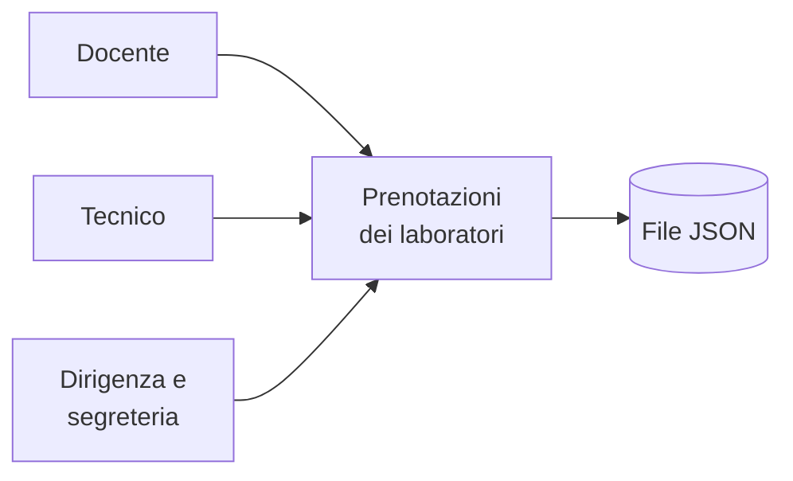
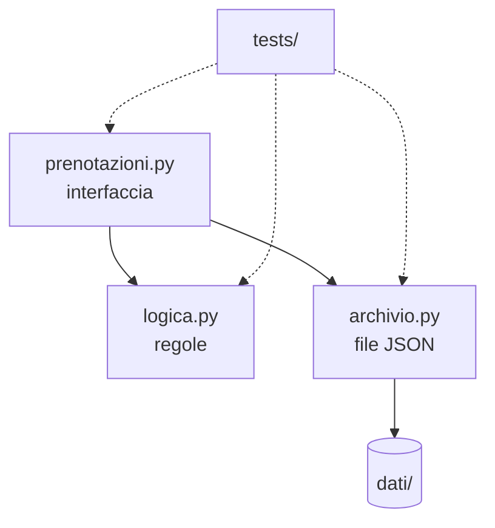

## Contenuti

- Il prodotto
- Gli strumenti
- Il kit
- I test
- I ruoli
- Laboratorio
- Aspetti orientativi

## Il prodotto



- Problemi: laboratori occupati due volte, tecnici non informati, nessun dato sull'uso
- Kit: elenco delle aule e nuova prenotazione; il resto è nel backlog

## Gli strumenti

- VS Code: codice, Markdown, terminale, Git
- Python 3.10 o successivo, `unittest` per i test
- Git: `git config --global user.name "Anna R."` e indirizzo fittizio `.invalid`
- Nessun account, nessun diritto di amministratore

## Il kit



- Regole separate da interfaccia e archivio: si provano con i test
- Limite noto: prenotazioni sovrapposte accettate (US-01)

## I test

```python
def test_aula_inesistente(self):
    with self.assertRaisesRegex(logica.ErrorePrenotazione, "non esiste"):
        self.prenota(aula="LAB-XYZ")
```

- `python -m unittest`: 27 test
- Ogni nuova funzione arriverà con i suoi test

## I ruoli

- **Product Owner**: backlog, priorità, rapporto con il cliente
- **Scrum Master**: tempi, regole, ostacoli, board
- **Sviluppatori**: codice, test, documentazione
- Rotazione tra sprint 1 e sprint 2

## Laboratorio

1. `python verifica_ambiente.py`: Python, Git, identità, VS Code, test del kit; 14 test
2. Il programma in funzione: prenotazioni, errori, difetto US-01, backlog
3. Ruoli per i due sprint nell'accordo di team

## Aspetti orientativi

- Capire codice scritto da altri: abilità quotidiana degli sviluppatori
- Product Owner e Scrum Master: professioni reali
- Quale ruolo si preferisce ricoprire?
