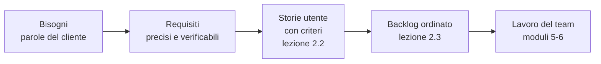
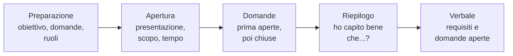

# Lezione 2.1: Ascoltare il cliente

> Contenuto originale. Riferimenti: Wikipedia, "Requirements elicitation", https://en.wikipedia.org/wiki/Requirements_elicitation ; Wikipedia, "Non-functional requirement", https://en.wikipedia.org/wiki/Non-functional_requirement . I materiali del laboratorio sono nella cartella `laboratorio`.

Obiettivo: conoscere le tecniche per raccogliere i requisiti, distinguere requisiti funzionali, non funzionali e vincoli, scrivere requisiti verificabili, e condurre un'intervista al cliente.

## 2.1.1 Dal bisogno al requisito

- **Bisogno**
  problema o desiderio del cliente, espresso con le sue parole: "non voglio più trovare due classi nello stesso laboratorio".
- **Requisito**
  descrizione precisa di una capacità o di una caratteristica che il sistema deve avere per soddisfare un bisogno: "il programma rifiuta una prenotazione se l'aula è già prenotata in un orario che si sovrappone".
- **Raccolta dei requisiti** (elicitation)
  attività con cui si scoprono i bisogni dei portatori di interesse e li si trasforma in requisiti.

Diagramma: dai bisogni al lavoro del team.



Il cliente raramente sa descrivere in modo completo che cosa gli serve: conosce il problema, non la soluzione, e dà per scontate cose che per lui sono ovvie. Per questo raccogliere requisiti è un lavoro di ascolto e di domande, non di trascrizione.

Difficoltà ricorrenti:

- **confini poco chiari**: non si sa che cosa è compreso nel progetto e che cosa no
- **comprensione**: il cliente non sa che cosa è possibile, usa parole diverse da quelle del team, dimentica dettagli; portatori di interesse diversi chiedono cose in contrasto
- **volatilità**: i requisiti cambiano durante il progetto

## 2.1.2 Tipi di requisiti

| Tipo | Che cosa descrive | Esempio nel progetto |
|---|---|---|
| **Funzionale** (RF) | che cosa fa il sistema: funzioni, dati, comportamenti | "Il tecnico vede le prenotazioni di un giorno, ordinate per aula e ora" |
| **Non funzionale** (RNF) | come deve essere il sistema: prestazioni, affidabilità, sicurezza, facilità d'uso, manutenibilità | "L'elenco del giorno compare in meno di 2 secondi con 5000 prenotazioni in archivio" |
| **Vincolo** (V) | limite imposto alla soluzione: tecnologie, norme, tempi, costi | "Il programma funziona sui PC dei laboratori con Python, senza installare altri pacchetti" |

I requisiti non funzionali sono spesso dimenticati perché il cliente li dà per scontati ("ovviamente deve essere veloce"), ma decidono se un prodotto è usabile: un programma corretto che impiega un minuto per rispondere non viene usato.

## 2.1.3 Requisiti verificabili

Un requisito utile è:

- **verificabile**: si può controllare in modo oggettivo se il sistema lo soddisfa
- **non ambiguo**: ha una sola interpretazione
- **atomico**: descrive una sola cosa
- **necessario**: risponde a un bisogno reale di un portatore di interesse

| Da riscrivere | Perché | Versione verificabile |
|---|---|---|
| Il programma deve essere veloce | "veloce" non si misura | L'elenco del giorno compare in meno di 2 secondi con 5000 prenotazioni |
| I messaggi devono essere facili da capire | "facile" dipende da chi legge | Ogni messaggio di errore indica il dato sbagliato e il formato corretto |
| Il docente può cancellare e modificare le prenotazioni e vedere quelle degli altri | tre requisiti in uno | tre requisiti separati |
| Esporta i dati in un formato comodo | "comodo" per chi? | Esporta le prenotazioni di una settimana in un file CSV apribile con un foglio di calcolo |

Parole come veloce, facile, intuitivo, moderno, adeguato, circa, eccetera sono segnali di un requisito da precisare con una domanda al cliente: "che cosa intende per veloce? Quanti secondi sono accettabili?".

## 2.1.4 Tecniche di raccolta

| Tecnica | Come funziona | Quando è utile | Limiti |
|---|---|---|---|
| Intervista | domande a un portatore di interesse, a voce | all'inizio, per capire problemi e obiettivi | dipende dalla qualità delle domande; il cliente dimentica ciò che dà per scontato |
| Osservazione | si osservano gli utenti mentre lavorano | per scoprire abitudini e problemi non detti | richiede tempo; le persone osservate cambiano comportamento |
| Questionario | domande scritte a molte persone | per raccogliere opinioni e numeri da molti utenti | poche possibilità di approfondire |
| Analisi dei documenti | si studiano moduli, registri, norme esistenti | per capire dati e regole già in uso | i documenti possono essere superati |
| Laboratorio di gruppo (workshop) | incontro con più portatori di interesse | per trovare accordi tra esigenze diverse | difficile da organizzare |
| Prototipo | si mostra una bozza della soluzione | per verificare di aver capito (lezione 2.4) | il cliente può scambiarlo per il prodotto finito |

Nel progetto del corso l'osservazione corrisponde a guardare come funziona oggi il foglio delle prenotazioni appeso alla porta di un laboratorio; l'analisi dei documenti al foglio stesso.

### Domande aperte e chiuse

- **Domanda aperta**: lascia libertà di risposta e fa emergere informazioni nuove. "Come si organizzano oggi le prenotazioni?", "Che cosa succede quando un laboratorio è già occupato?"
- **Domanda chiusa**: chiede una risposta precisa, sì/no o un dato. "Si prenota anche il sabato?", "Quante prenotazioni ci sono in una settimana?"

Un'intervista efficace parte con domande aperte per capire il contesto e usa domande chiuse per precisare i dettagli. Da evitare:

- le domande che suggeriscono la risposta ("Vorrà sicuramente anche le statistiche, vero?")
- le domande tecniche che il cliente non può capire ("Preferisce JSON o SQLite?")
- più domande in una

## 2.1.5 Condurre un'intervista

Diagramma: le fasi di un'intervista.



- **Preparazione**: si stabilisce che cosa si vuole sapere, si scrivono le domande, si dividono i ruoli (chi conduce, chi scrive, chi tiene il tempo).
- **Durante**: ascolto attivo (lezione 1.2); si chiedono esempi concreti ("mi racconta l'ultima volta che è successo?"); si annotano le parole del cliente; se una risposta è vaga, si chiede di precisarla.
- **Riepilogo**: alla fine si riassume ciò che si è capito e si chiede conferma; è il momento in cui emergono gli equivoci.
- **Verbale**: si scrive subito, con i requisiti emersi e le domande rimaste aperte, e si condivide con il team.

## 2.1.6 Laboratorio

Tempo indicativo: 45 minuti. Cartella di lavoro `C:\corso-impresa\lab21`, con i file della cartella `laboratorio`.

### Parte 1: preparazione (10 minuti)

Ogni team copia `modello_verbale_intervista.md` con il proprio nome (per esempio `verbale_orione.md`), sceglie chi conduce, chi scrive e chi tiene il tempo, e prepara almeno sei domande, sia aperte sia chiuse. Conviene partire dal backlog del kit (`docs/backlog.md`) e chiedersi che cosa manca o non è chiaro.

### Parte 2: intervista (3 minuti per team, circa 18 minuti in tutto)

Il docente interpreta il cliente, il responsabile dei laboratori della scuola. Ogni team ha 3 minuti; gli altri team ascoltano e prendono appunti: le informazioni valgono per tutti. Il cliente risponde solo a ciò che gli viene chiesto.

### Parte 3: requisiti (12 minuti)

1. Nella sezione "Requisiti emersi" del verbale, scrivere i requisiti con i codici RF-NN, RNF-NN e V-NN, uno per riga.
2. Controllarli:

```powershell
python requisiti_ambigui.py verbale_orione.md
```

```text
Requisiti: 10 (funzionali 4, non funzionali 4, vincoli 2)
  RF-03: parole vaghe: ecc; sostituirle con qualcosa di verificabile
  RF-03: unisce più azioni con "e" (2 volte): forse sono più requisiti
  RNF-01: parole vaghe: veloce; sostituirle con qualcosa di verificabile
  RNF-01: requisito non funzionale senza un numero: verificare che si possa controllare in modo oggettivo
...
Segnalazioni: 8
```

3. Riscrivere i requisiti segnalati, o motivare perché la segnalazione non è pertinente. Il file `requisiti_esempio.md` contiene un primo elenco di un team di fantasia su cui esercitarsi.

Come funziona il controllo delle parole vaghe:

```python
for parola in PAROLE_VAGHE:
    if re.search(r"(?<!\w)" + re.escape(parola) + r"(?!\w)", testo, re.IGNORECASE):
        trovate.append(parola)
```

- `PAROLE_VAGHE` è l'elenco delle parole da segnalare; si può ampliare
- `re.escape` tratta la parola come testo semplice anche se contiene caratteri speciali, come il punto di "ecc."
- `(?<!\w)` e `(?!\w)` impongono che prima e dopo non ci siano lettere: "efficiente" viene trovata, "efficienza" no
- `re.IGNORECASE` ignora la differenza tra maiuscole e minuscole
- gli altri controlli contano le frasi, le congiunzioni "e", le parole, e cercano un numero nei requisiti non funzionali

Il programma segnala, il team decide: un requisito come "i dati personali conservati sono solo nome e iniziale del cognome" non contiene numeri ma è verificabile.

Test: `python test_requisiti_ambigui.py` (17 test).

### Parte 4: domande aperte (5 minuti)

Ogni team legge le domande rimaste aperte; il cliente risponde a quelle che non ha già chiarito. Il verbale va conservato: nella lezione 2.2 i requisiti diventano storie utente.

## 2.1.7 Aspetti orientativi (discussione)

- Raccogliere e analizzare i requisiti è il lavoro dell'**analista** (business analyst, analista funzionale): una figura che fa da ponte tra il cliente e i tecnici, e richiede sia competenze informatiche sia capacità di ascolto e di scrittura.
- Molti progetti falliscono per requisiti sbagliati o incompleti (lezione 1.1): correggere un requisito in fase di intervista costa pochi minuti, correggerlo dopo il rilascio può costare settimane.
- Domanda: quale informazione del cliente ha sorpreso di più il team? Quale domanda si sarebbe dovuta fare e nessuno ha fatto?
