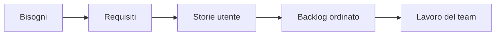
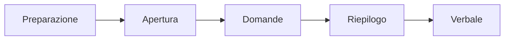

## Contenuti

- Dal bisogno al requisito
- Tipi di requisiti
- Requisiti verificabili
- Tecniche di raccolta
- L'intervista
- Laboratorio
- Aspetti orientativi

## Dal bisogno al requisito

- Il cliente conosce il problema, non la soluzione
- Difficoltà: confini, comprensione, requisiti che cambiano

## Tipi di requisiti

| Tipo | Descrive |
|---|---|
| Funzionale (RF) | che cosa fa il sistema |
| Non funzionale (RNF) | come deve essere: tempi, sicurezza, facilità d'uso |
| Vincolo (V) | limiti imposti: tecnologie, norme, costi |

## Requisiti verificabili

- Verificabile, non ambiguo, atomico, necessario
- "Deve essere veloce" diventa "l'elenco compare in meno di 2 secondi con 5000 prenotazioni"
- Parole da precisare: veloce, facile, intuitivo, adeguato, circa, eccetera

## Tecniche di raccolta

- Intervista, osservazione, questionario
- Analisi dei documenti, laboratorio di gruppo, prototipo
- Domande aperte per capire, chiuse per precisare
- Da evitare: domande che suggeriscono la risposta, domande tecniche

## L'intervista

- Esempi concreti; ascolto attivo; riepilogo finale per scoprire gli equivoci

## Laboratorio

1. Preparazione: ruoli e almeno sei domande
2. Intervista al cliente: 3 minuti per team
3. Requisiti nel verbale: `python requisiti_ambigui.py verbale_orione.md`; 17 test
4. Domande rimaste aperte

## Aspetti orientativi

- Analista: ponte tra cliente e tecnici
- Un requisito corretto in intervista costa minuti, dopo il rilascio settimane
- Quale domanda nessuno ha fatto?
