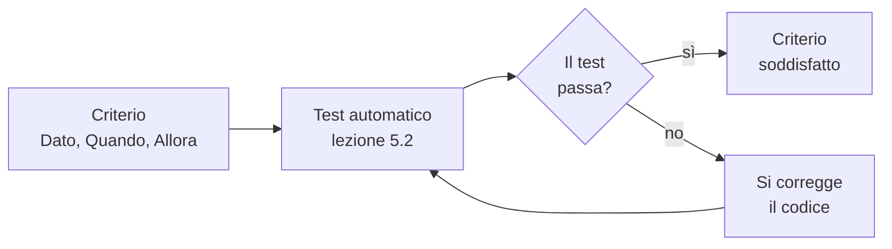

# Lezione 2.2: Storie utente e criteri di accettazione

> Contenuto originale. Riferimenti: Wikipedia, "User story", https://en.wikipedia.org/wiki/User_story ; Bill Wake, "INVEST in Good Stories, and SMART Tasks" (2003), https://xp123.com/invest-in-good-stories-and-smart-tasks/ ; Cucumber, parole chiave di Gherkin nelle diverse lingue, https://cucumber.io/docs/gherkin/languages/ . I materiali del laboratorio sono nella cartella `laboratorio`.

Obiettivo: scrivere storie utente nel formato standard, valutarle con i criteri INVEST, scrivere criteri di accettazione verificabili nella forma Dato, Quando, Allora, e rivedere il backlog di un altro team.

## 2.2.1 Le storie utente

- **Storia utente** (user story)
  descrizione breve di una funzione dal punto di vista di chi la userà, scritta nel linguaggio del cliente.

Il formato più diffuso, nato nel 2001 in un team di sviluppo dell'azienda londinese Connextra, è:

> Come **ruolo** voglio **funzione**, per **beneficio**.

Esempio dal backlog del progetto:

> Come tecnico di laboratorio voglio vedere tutte le prenotazioni di un giorno, ordinate per aula e per orario, per preparare i laboratori prima dell'arrivo delle classi.

- il **ruolo** dice chi ha il bisogno: docente, tecnico, dirigente, non "l'utente" in generale
- la **funzione** dice che cosa vuole fare, non come il programma lo realizza
- il **beneficio** dice perché: aiuta a decidere la priorità e a scegliere la soluzione giusta

Una storia non è una specifica completa. Secondo Ron Jeffries una storia ha tre parti, le "tre C":

- **Card** (scheda): la frase scritta, breve;
- **Conversation** (conversazione): i dettagli si chiariscono parlando con il cliente;
- **Confirmation** (conferma): i criteri di accettazione dicono quando la storia è realizzata.

Rispetto ai requisiti della lezione 2.1, le storie descrivono le funzioni da realizzare in un formato adatto a pianificare il lavoro; i requisiti non funzionali e i vincoli restano validi per tutte le storie e si controllano, per esempio, con la definizione di "fatto" (lezione 5.1).

## 2.2.2 Criteri INVEST

Bill Wake (2003) ha riassunto le caratteristiche di una buona storia nella sigla INVEST:

| Lettera | Criterio | Significato | Segnale di problema |
|---|---|---|---|
| I | Indipendente | si può realizzare senza aspettare altre storie | "dopo che è stata fatta US-07..." |
| N | Negoziabile | descrive un bisogno; i dettagli si decidono insieme | la storia impone una soluzione tecnica: "usare un database SQLite" |
| V | di Valore | porta un vantaggio a un utente o al cliente | nessun utente trae beneficio: "creare la tabella" |
| E | Stimabile (Estimable) | il team capisce abbastanza da stimare il lavoro | nessuno sa da dove cominciare |
| S | Piccola (Small) | si completa in pochi giorni, sicuramente in uno sprint | "gestire tutta la biblioteca" |
| T | Verificabile (Testable) | si può controllare in modo oggettivo se è completata | "deve funzionare bene" |

Una storia troppo grande si chiama spesso **epica** e va divisa in storie più piccole, ciascuna con un proprio valore. Criteri utili per dividere:

- per caso d'uso: prima il caso normale, poi i casi particolari
- per operazione: inserire, modificare, cancellare
- per tipo di utente o di dato
- per regola: prima senza, poi con un controllo aggiuntivo

Esempio: "prenotazioni ricorrenti" (US-11) si può dividere in "prenotare ogni settimana fino a una data se tutto è libero", "prenotare solo le settimane libere e mostrare le altre", "cancellare una serie".

## 2.2.3 Criteri di accettazione

- **Criterio di accettazione**
  condizione che la storia deve soddisfare perché il cliente la accetti come completata.

La forma Dato, Quando, Allora (in inglese Given, When, Then) descrive un esempio concreto:

- **Dato**: la situazione di partenza
- **Quando**: l'azione dell'utente
- **Allora**: il risultato atteso, osservabile

Questa forma viene dal linguaggio Gherkin, usato da strumenti come Cucumber per trasformare i criteri in test automatici; Gherkin prevede parole chiave in molte lingue, e in italiano sono proprio "Dato", "Quando", "Allora".

Esempio (US-01):

- Dato che LAB-INF1 è prenotato il 12/10 dalle 9:00 alle 11:00, quando prenoto LAB-INF1 il 12/10 dalle 10:00 alle 12:00, allora la prenotazione è rifiutata con un messaggio che indica la prenotazione già presente.
- Dato che LAB-INF1 è prenotato il 12/10 dalle 9:00 alle 11:00, quando prenoto LAB-INF1 il 12/10 dalle 11:00 alle 12:00, allora la prenotazione è accettata.

Regole pratiche:

- valori concreti (aula, giorno, orario, nomi), non "un'aula", "un orario"
- un risultato osservabile: che cosa si vede, che cosa cambia nell'archivio
- oltre al caso normale, i **casi limite** (un'ora che finisce quando l'altra comincia, un elenco vuoto) e i **casi di errore** (aula inesistente, prenotazione di un altro)
- da 2 a 5 criteri per storia; se ne servono di più, forse la storia va divisa

Diagramma: dai criteri ai test.



Nel modulo 5 ogni criterio diventerà un test: il Dato prepara i dati, il Quando chiama la funzione, l'Allora controlla il risultato.

## 2.2.4 Laboratorio

Tempo indicativo: 45 minuti. Cartella di lavoro `C:\corso-impresa\lab22`, con i file della cartella `laboratorio`.

Da questa lezione ogni team tiene una **copia di riferimento del progetto**, `C:\corso-impresa\progetto_<nome del team>`, copiata dal kit della lezione 1.3, sul PC del Product Owner o su una chiavetta. I documenti del modulo 2 vanno nella sua cartella `docs`. Nel modulo 4 questa copia diventerà il repository Git del team.

### Parte 1: backlog da correggere (10 minuti)

Il file `backlog_da_correggere.md` è il backlog di un progetto di fantasia con storie scritte male. A coppie, trovare per ciascuna storia il criterio INVEST non rispettato. Poi controllare la forma:

```powershell
python controlla_storie.py backlog_da_correggere.md
```

```text
US-02  ATTENZIONE: titolo diverso tra tabella e sezione
US-02  ATTENZIONE: un solo criterio: manca un caso limite o di errore?
US-02  DA SISTEMARE: criterio 1: manca "allora"
US-02  DA SISTEMARE: criterio 1: non inizia con "Dato"
US-02  DA SISTEMARE: criterio 1: parole vaghe: correttamente
US-03  ATTENZIONE: un solo criterio: manca un caso limite o di errore?
US-03  DA SISTEMARE: manca il testo nella forma "Come ... voglio ... per ..."
...
Storie: 6; pronte: 2; da sistemare: 4
```

Confrontare: quali problemi trova il programma e quali solo le persone? Per esempio il criterio "dato un libro, quando lo gestisco, allora è gestito" è formalmente corretto, ma non dice nulla.

### Parte 2: criteri del proprio backlog (20 minuti)

1. Aprire `docs\backlog.md` nella copia di riferimento del progetto.
2. Aggiornare le storie con le informazioni dell'intervista (lezione 2.1): correggere il testo, aggiungere le storie emerse, dividere quelle troppo grandi.
3. Dividere le storie tra i membri del team e scrivere per ciascuna da 2 a 5 criteri di accettazione, uno per riga, nella forma `- Dato ..., quando ..., allora ...`, al posto di "Criteri di accettazione: da scrivere".
4. Controllare:

```powershell
python controlla_storie.py C:\corso-impresa\progetto_orione\docs\backlog.md
```

Come funziona la lettura del backlog:

```python
titolo = TITOLO_STORIA.match(riga)
if titolo:
    codice = titolo.group(1)
    corrente = storie[codice] = {"titolo": titolo.group(2), "testo": "",
                                 "criteri": [], "da_scrivere": False}
```

- il programma legge il file riga per riga; `TITOLO_STORIA` è un'espressione regolare che riconosce i titoli come `### US-03 Cancellare una prenotazione`
- ogni titolo apre una nuova storia, un dizionario in cui si raccolgono testo e criteri
- le righe che iniziano con `-` sono i criteri; la prima riga di testo è la storia
- le righe della tabella di riepilogo si leggono con un'altra espressione regolare, e i due elenchi si confrontano per trovare storie mancanti o con titoli diversi
- ogni criterio si controlla con `controlla_criterio`: deve iniziare con "Dato" (o "Data", "Dati", "Date") e contenere "quando" e "allora"

Test: `python test_controlla_storie.py` (16 test).

### Parte 3: revisione tra team (15 minuti)

I team si scambiano il backlog a coppie. Con `scheda_revisione_storie.md`, ogni team ne rivede almeno quattro storie, segna i criteri INVEST non rispettati e scrive un riscontro nella forma fatto, effetto, proposta (lezione 1.2). Poi ciascun team corregge il proprio backlog con i riscontri ricevuti.

## 2.2.5 Aspetti orientativi (discussione)

- Scrivere storie e criteri è compito del **Product Owner** con il team; nelle aziende contribuiscono analisti e **tester** (in inglese anche QA, quality assurance), che partono dai criteri per progettare le prove.
- Saper scrivere in modo preciso, per persone diverse (cliente, colleghi, tester), è una competenza richiesta in tutte le professioni informatiche.
- Domanda: nella revisione tra team, è stato più facile dare riscontri o riceverli? Perché?
