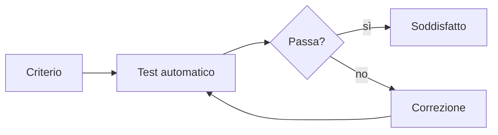

## Lezione 2.2: Storie utente e criteri di accettazione

Modulo 2: Dai bisogni ai requisiti. Informatica per l'Impresa e Soft Skills Digitale

---

## Storie utente

- "Come **ruolo** voglio **funzione**, per **beneficio**" (Connextra, 2001)
- Ruolo preciso, funzione senza soluzione tecnica, beneficio esplicito
- Tre C: scheda, conversazione, conferma

---

## INVEST

| | Criterio |
|---|---|
| I | Indipendente |
| N | Negoziabile |
| V | di Valore |
| E | Stimabile |
| S | Piccola |
| T | Verificabile |

- Storia troppo grande (epica): dividerla, ogni parte con un valore

---

## Criteri di accettazione

- **Dato** la situazione, **quando** l'azione, **allora** il risultato osservabile
- Valori concreti; caso normale, casi limite, casi di errore
- Da 2 a 5 criteri per storia

---

## Dai criteri ai test

---

## Laboratorio

1. Backlog da correggere: `python controlla_storie.py backlog_da_correggere.md`; 16 test
2. Criteri del proprio backlog nella copia di riferimento del progetto
3. Revisione tra team con la scheda INVEST e riscontri costruttivi

---

## Aspetti orientativi

- Product Owner, analisti e tester lavorano sui criteri
- Scrivere in modo preciso per lettori diversi
- È più facile dare o ricevere riscontri?
