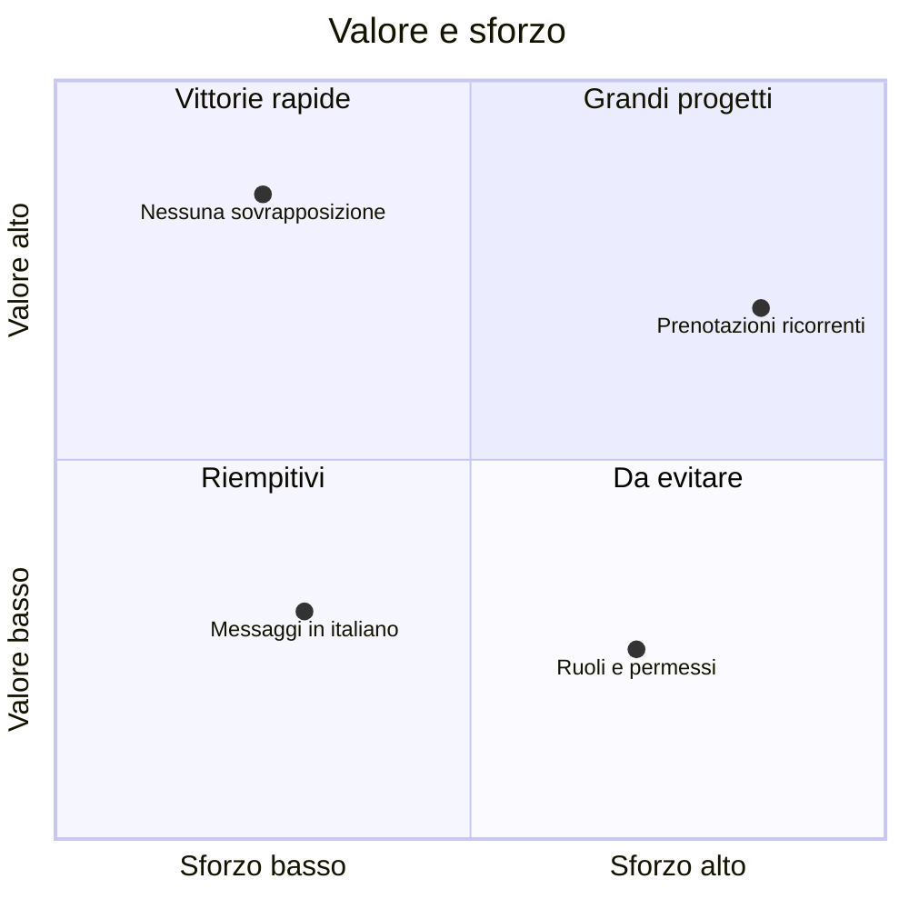
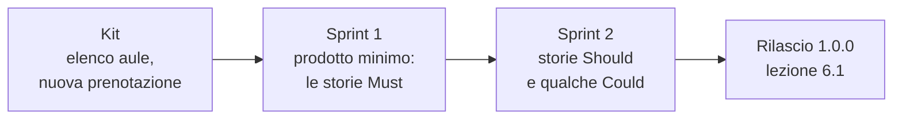

# Lezione 2.3: Priorità e backlog

> Contenuto originale. Riferimenti: Agile Business Consortium, DSDM Project Framework, "MoSCoW Prioritisation", https://www.agilebusiness.org/dsdm-project-framework/moscow-prioririsation.html ; Ken Schwaber e Jeff Sutherland, "La Guida a Scrum" (2020), licenza CC BY-SA 4.0, https://scrumguides.org/scrum-guide.html . I materiali del laboratorio sono nella cartella `laboratorio`.

Obiettivo: ordinare il backlog in base a valore e sforzo, usare il metodo MoSCoW, definire l'obiettivo del prodotto e il prodotto minimo funzionante insieme al cliente.

## 2.3.1 Perché ordinare il backlog

Il tempo di un progetto è sempre inferiore a ciò che il cliente vorrebbe: il backlog del corso contiene 15 storie, e due sprint non bastano per tutte. Ordinare il backlog significa decidere **che cosa fare prima** e, di conseguenza, **che cosa resterà fuori** se il tempo finisce.

- **Backlog del prodotto** (product backlog)
  elenco ordinato di ciò che serve per migliorare il prodotto; nella Guida a Scrum è l'unica fonte del lavoro svolto dal team. Il responsabile del suo ordine è il **Product Owner**.
- Le storie in cima sono piccole, chiare, con i criteri di accettazione, pronte per essere realizzate; quelle in fondo possono restare vaghe finché non si avvicina il momento di realizzarle.

## 2.3.2 Valore e sforzo

Due domande guidano l'ordine:

- **Valore**: quanto conta per il cliente e per gli utenti? Lo decide il cliente con il Product Owner.
- **Sforzo**: quanto lavoro richiede? Lo stima il team. In questa lezione basta una stima approssimativa da 1 a 5; nella lezione 3.3 si userà un metodo più preciso.

Diagramma: la matrice valore-sforzo.



- **Vittorie rapide**: molto valore, poco sforzo; si fanno per prime
- **Grandi progetti**: molto valore, molto sforzo; si pianificano, spesso dividendoli
- **Riempitivi**: poco valore, poco sforzo; si fanno se avanza tempo
- **Da evitare**: poco valore, molto sforzo; si rimandano o si scartano

Un criterio semplice per ordinare storie della stessa importanza è il rapporto valore/sforzo: a parità di sforzo, prima le storie con più valore.

## 2.3.3 Il metodo MoSCoW

Il metodo MoSCoW, del framework DSDM, divide i requisiti in quattro categorie:

| Categoria | Significato | Nel progetto |
|---|---|---|
| **Must** (deve esserci) | senza, il prodotto non serve o non è accettabile (anche per norme o sicurezza) | evitare le sovrapposizioni |
| **Should** (dovrebbe esserci) | importante, ma il prodotto è utilizzabile anche senza, magari con un'alternativa scomoda | aule libere in una fascia oraria |
| **Could** (potrebbe esserci) | desiderabile, meno importante; è il margine se il tempo non basta | statistiche di utilizzo |
| **Won't** (non questa volta) | concordato come escluso da questo progetto o da questa versione | ruoli con autorizzazioni |

Le categorie Must, nel linguaggio DSDM, formano il **Minimum Usable SubseT**: l'insieme minimo che il progetto garantisce di consegnare.

La categoria Won't è importante quanto le altre: rende esplicito ciò che non si farà, ed evita che il cliente se lo aspetti.

DSDM consiglia che le storie Must non superino il **60% dello sforzo** totale e che le Could siano circa il 20%: così, se qualcosa va storto, si rinuncia a qualche Could e le Must restano garantite. Se tutto è Must, niente è davvero prioritario.

## 2.3.4 Obiettivo del prodotto e prodotto minimo funzionante

- **Obiettivo del prodotto** (product goal)
  stato futuro del prodotto verso cui lavora il team; nella Guida a Scrum è l'impegno legato al backlog del prodotto. Serve a decidere che cosa entra nel backlog e che cosa no.
- **Prodotto minimo funzionante** (minimum viable product, MVP)
  la versione più piccola del prodotto che si può già usare e che permette di verificare se si sta andando nella direzione giusta.

Esempio di obiettivo: "Per i docenti e i tecnici della scuola che oggi trovano i laboratori occupati o non preparati, Prenotazioni dei laboratori permette di prenotare senza sovrapposizioni e di sapere ogni mattina che cosa preparare. L'obiettivo è raggiunto quando nessuna prenotazione si sovrappone e i tecnici usano l'elenco del giorno."

Diagramma: il prodotto cresce per versioni utilizzabili.



## 2.3.5 Laboratorio

Tempo indicativo: 45 minuti. Cartella di lavoro `C:\corso-impresa\lab23`, con i file della cartella `laboratorio`, e la copia di riferimento del progetto del team.

### Parte 1: valutazione (15 minuti)

1. Copiare `valutazioni_esempio.csv` come `valutazioni.csv` e aggiornarlo con le storie del proprio backlog, comprese quelle aggiunte o divise nella lezione 2.2.
2. Il team assegna a ogni storia lo **sforzo** (1-5).
3. Il Product Owner propone **valore** (1-5) e categoria **MoSCoW** (M, S, C, W).

### Parte 2: incontro con il cliente (15 minuti)

Il Product Owner, con un altro membro del team, presenta al cliente le priorità proposte (circa 2 minuti per team, mentre gli altri team continuano il lavoro). Il cliente può spostare storie tra le categorie e chiedere spiegazioni; il team può spiegare quando una richiesta costa molto. Le decisioni si riportano nel CSV.

### Parte 3: ordinamento e controllo (10 minuti)

```powershell
python priorita.py valutazioni.csv --backlog C:\corso-impresa\progetto_orione\docs\backlog.md
```

```text
 N.  ID     MoSCoW  Val Sfo  Titolo
  1  US-01  Must      5   2  Nessuna prenotazione sovrapposta
  2  US-02  Must      5   2  Prenotazioni di un giorno
  3  US-03  Must      4   2  Cancellare una prenotazione
  4  US-10  Should    4   2  Numero di studenti e capienza
...
 15  US-13  Won't     2   4  Ruoli: docente e tecnico

Sforzo: Must 17%, Should 33%, Could 50% (esclusi i Won't)
Diagramma scritto in matrice_valore_sforzo.md
Backlog aggiornato: ...\docs\backlog.md (copia precedente in ...\docs\backlog.md.bak)
```

- il programma ordina per categoria MoSCoW e, all'interno di ogni categoria, per rapporto valore/sforzo
- calcola la quota di sforzo di ciascuna categoria e avvisa se le Must superano il 60%
- scrive `matrice_valore_sforzo.md`, che si apre in VS Code con l'anteprima (`Ctrl+Shift+V`)
- con `--backlog` scrive la priorità nella tabella del backlog e ne riordina le righe; la versione precedente resta nel file `.bak`

Come funziona l'ordinamento:

```python
return sorted(storie, key=lambda s: (ORDINE_MOSCOW.index(s["moscow"]),
                                     -s["valore"] / s["sforzo"], -s["valore"], s["id"]))
```

- `sorted` ordina secondo la chiave restituita dalla funzione `lambda` per ogni storia
- la chiave è una tupla: Python confronta il primo elemento e, solo a parità, il successivo
- `ORDINE_MOSCOW.index` trasforma M, S, C, W in 0, 1, 2, 3
- il segno meno ordina in modo decrescente il rapporto valore/sforzo e poi il valore; l'identificativo decide gli ultimi pareggi, così l'ordine è sempre lo stesso

Test: `python test_priorita.py` (19 test).

Nell'esempio le Must sono solo il 17% dello sforzo: è una scelta prudente, che lascia margine. Nei dati del proprio team, controllare la percentuale e discuterla.

### Parte 4: obiettivo del prodotto (5 minuti)

Completare `obiettivo_prodotto.md`, salvarlo in `docs` nella copia del progetto e farlo approvare dal cliente alla prima occasione.

## 2.3.6 Aspetti orientativi (discussione)

- Decidere le priorità vuol dire dire di no a qualcosa: è il compito più difficile del **Product Owner** e, nelle aziende, del **product manager**, che decide la direzione di un prodotto in base al mercato e agli utenti.
- Il confronto tra valore e costo è alla base di molte decisioni aziendali, non solo informatiche.
- Domanda: il cliente ha cambiato qualche priorità proposta dal team? Con quali argomenti?
