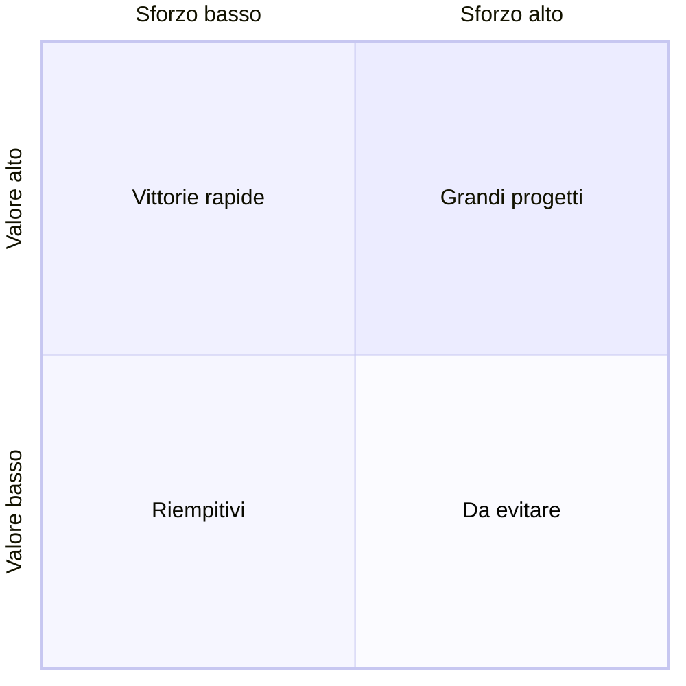
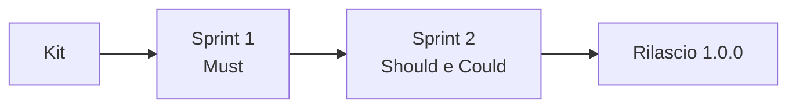

## Lezione 2.3: Priorità e backlog

Modulo 2: Dai bisogni ai requisiti. Informatica per l'Impresa e Soft Skills Digitale

---

## Perché ordinare

- Il tempo non basta mai per tutto
- Backlog del prodotto: elenco ordinato, unica fonte del lavoro del team
- In cima storie piccole e chiare; in fondo possono restare vaghe

---

## Valore e sforzo

---

## MoSCoW

- **Must**: senza, il prodotto non serve
- **Should**: importante, ma c'è un'alternativa
- **Could**: desiderabile, margine se il tempo non basta
- **Won't**: escluso questa volta, in modo esplicito
- DSDM: Must al massimo il 60% dello sforzo, Could circa il 20%

---

## Obiettivo e prodotto minimo

- Obiettivo del prodotto: per chi, quale problema, come si verifica

---

## Laboratorio

1. Valore, sforzo e MoSCoW in `valutazioni.csv`
2. Incontro con il cliente sulle priorità
3. `python priorita.py valutazioni.csv --backlog ...\docs\backlog.md`; 19 test
4. Obiettivo del prodotto

---

## Aspetti orientativi

- Decidere le priorità significa dire di no
- Product Owner e product manager
- Il cliente ha cambiato le priorità? Perché?
