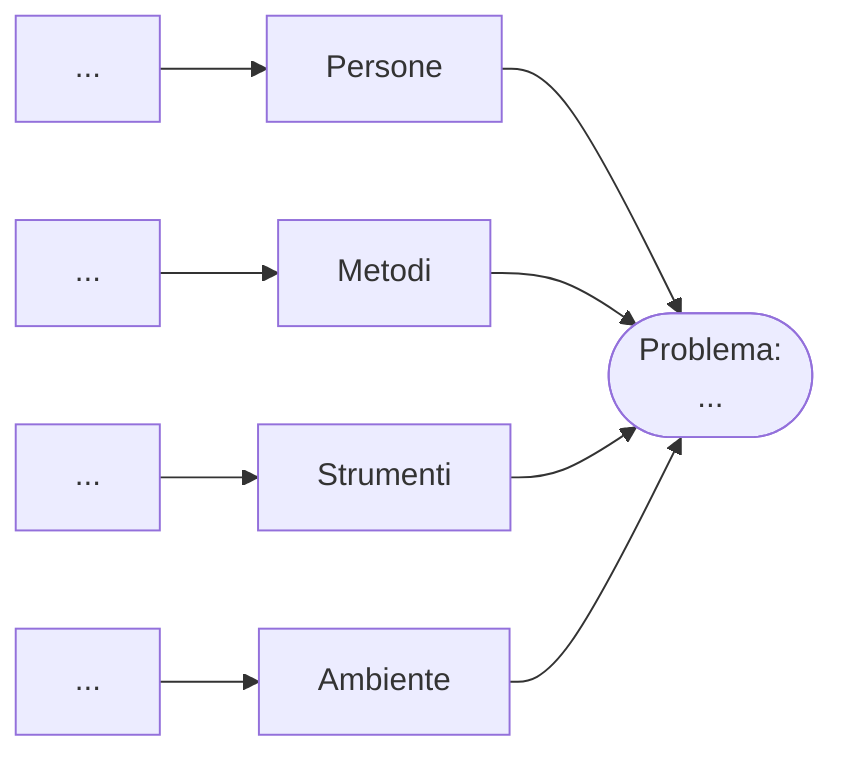

# Analisi di un problema

Team: ...

## Il problema

[Descrizione in una frase, con i fatti: che cosa succede, a chi, quanto spesso.]

...

## 5 perché

| N. | Perché? | Risposta |
|---|---|---|
| 1 | Perché succede il problema? | ... |
| 2 | Perché ...? | ... |
| 3 | Perché ...? | ... |
| 4 | Perché ...? | ... |
| 5 | Perché ...? | ... |

Causa su cui intervenire: ...

## Diagramma causa-effetto

Aggiungere le cause trovate con il brainstorming sotto ciascuna categoria; l'anteprima di VS Code mostra il diagramma.

## Soluzioni possibili

[Almeno tre, dal brainstorming. Le due migliori vanno confrontate con la matrice di decisione.]

1. ...
2. ...
3. ...
