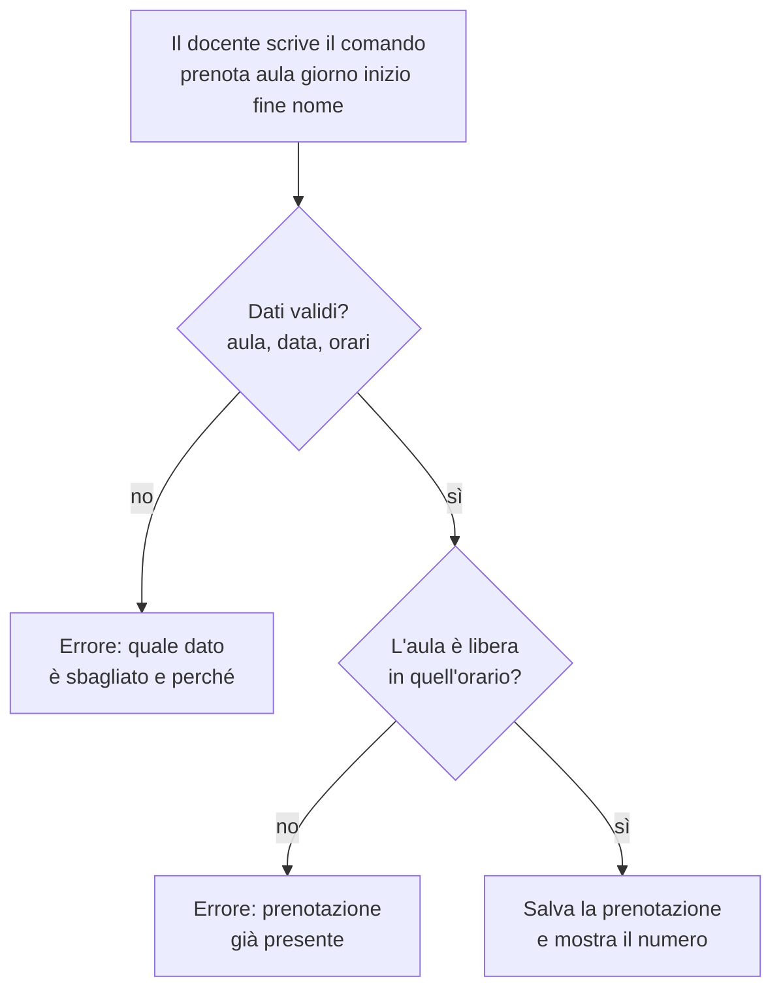
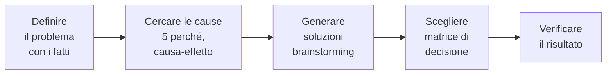
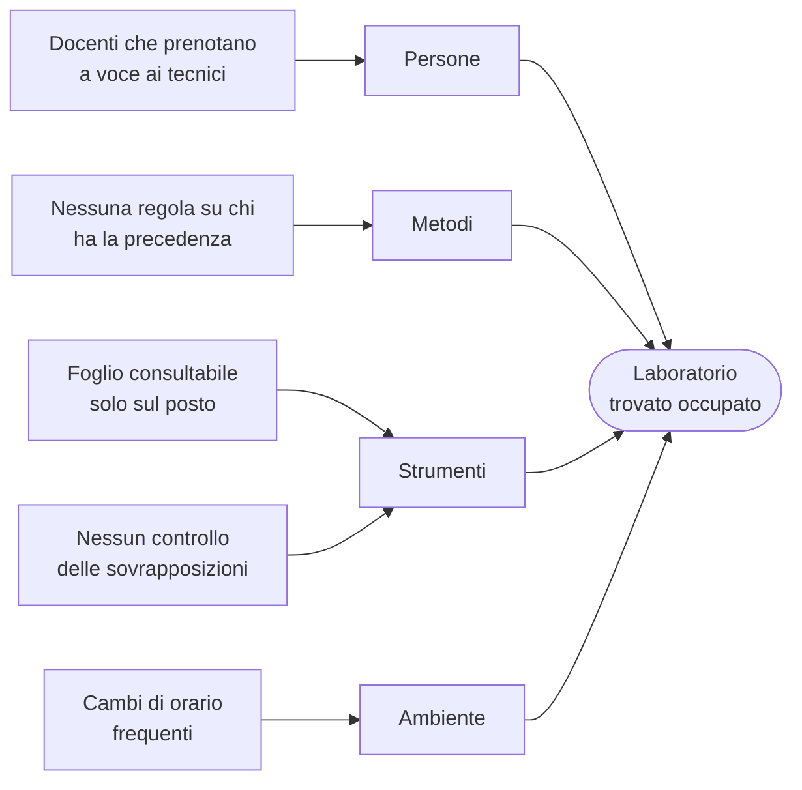

# Lezione 2.4: Prototipi e problem solving

> Contenuto originale. Riferimenti: Wikipedia, "Website wireframe", https://en.wikipedia.org/wiki/Website_wireframe ; Wikipedia, "Brainstorming", https://it.wikipedia.org/wiki/Brainstorming ; Wikipedia, "Five whys", https://en.wikipedia.org/wiki/Five_whys ; Wikipedia, "Diagramma di Ishikawa", https://it.wikipedia.org/wiki/Diagramma_di_Ishikawa ; Wikipedia, "Decision matrix", https://en.wikipedia.org/wiki/Decision_matrix . Estensione Draw.io Integration per VS Code: https://marketplace.visualstudio.com/items?itemName=hediet.vscode-drawio . I materiali del laboratorio sono nella cartella `laboratorio`.

Obiettivo: usare prototipi a bassa fedeltà per verificare i requisiti con il cliente, e applicare tecniche di problem solving: brainstorming, 5 perché, diagramma causa-effetto e matrice di decisione.

## 2.4.1 Prototipi

- **Prototipo**
  versione preliminare e incompleta di un prodotto, costruita per verificare un'idea prima di realizzarla.
- **Wireframe**
  schema di una schermata che mostra disposizione dei contenuti, comandi e navigazione, senza colori né grafica definitiva.

| Fedeltà | Com'è | A che cosa serve |
|---|---|---|
| Bassa | schizzo su carta o con forme semplici; testi di esempio | discutere presto la struttura e il flusso; si cambia in pochi minuti |
| Alta | simile al prodotto finito: testi reali, caratteri, colori | verificare i dettagli prima dello sviluppo; richiede molto più tempo |

Un prototipo a bassa fedeltà ha due vantaggi: costa poco buttarlo, e il cliente non lo scambia per il prodotto finito, quindi commenta la sostanza e non la grafica.

Per un programma a riga di comando come quello del progetto, il "wireframe" è la trascrizione di una sessione nel terminale: che cosa scrive l'utente, che cosa risponde il programma, compresi i messaggi di errore. Mostrarlo al cliente permette di scoprire, per esempio, che i docenti non conoscono i codici delle aule.

### Flusso di un'operazione

Il prototipo si completa con il flusso, cioè i passi dell'utente e le decisioni del programma.

Diagramma: flusso della nuova prenotazione con il controllo della storia US-01.



## 2.4.2 Problem solving

Nel progetto i problemi da risolvere sono di due tipi: capire **perché** succede qualcosa (un difetto, un ritardo, un disaccordo) e **scegliere** tra più soluzioni. Le tecniche seguenti aiutano a farlo con metodo, invece che a intuito.

Diagramma: un percorso di problem solving.



### Brainstorming

Tecnica di gruppo per generare idee, diffusa negli anni Cinquanta da Alex Osborn con il libro "Applied Imagination". Si basa su due principi: il **giudizio rimandato** (durante la raccolta delle idee nessuna viene criticata) e la **quantità** (da molte idee nascono anche quelle migliori). Regole pratiche:

- un tempo fissato, per esempio 5 minuti
- ogni idea si scrive, anche se sembra strana; si possono combinare e migliorare le idee degli altri
- la valutazione avviene dopo, con criteri espliciti

### 5 perché

Tecnica nata alla Toyota: si chiede "perché?" più volte, partendo dal problema, finché si arriva a una causa su cui si può intervenire. Esempio, dalla situazione della scuola:

1. Perché la 3A ha trovato il laboratorio occupato? Perché c'erano due prenotazioni per la stessa ora.
2. Perché due prenotazioni? Perché il secondo docente non ha visto la prima.
3. Perché non l'ha vista? Perché ha prenotato con un messaggio al tecnico, senza guardare il foglio.
4. Perché non ha guardato il foglio? Perché il foglio è appeso alla porta del laboratorio, e lui era a casa.
5. Perché si prenota da casa? Perché i docenti organizzano le lezioni fuori dall'orario scolastico.

Causa su cui intervenire: le prenotazioni devono essere consultabili, e controllate, da un unico archivio, raggiungibile anche fuori dal laboratorio. Il limite della tecnica è che segue una sola catena di cause, e persone diverse possono arrivare a risposte diverse: per questo si affianca al diagramma causa-effetto.

### Diagramma causa-effetto

Detto anche diagramma di Ishikawa o a lisca di pesce, dal nome di Kaoru Ishikawa, pioniere della gestione della qualità. Le possibili cause di un problema si raggruppano in categorie; nell'industria si usano le "5M" (manodopera, macchine, materiali, metodi, ambiente), in un progetto informatico si possono usare persone, metodi, strumenti, ambiente.

Diagramma: cause possibili del problema "laboratorio trovato occupato".



Non tutte le cause si risolvono con il software: la regola sulla precedenza, per esempio, è una decisione organizzativa del cliente. Riconoscerlo evita di aggiungere al backlog storie inutili.

### Matrice di decisione

Strumento per scegliere tra più alternative in modo esplicito:

1. si elencano i **criteri** di scelta;
2. si assegna a ciascun criterio un **peso** (da 1 a 5) secondo la sua importanza;
3. si valuta ogni alternativa su ogni criterio con un **punteggio** (da 1 a 5);
4. per ogni alternativa si calcola la somma di peso per punteggio;
5. si controlla quanto il risultato dipende dai pesi.

Il numero finale non sostituisce la discussione: la rende ordinata. Il valore principale della matrice sta nel dover rendere espliciti criteri e pesi, su cui il team può non essere d'accordo; e se cambiando di poco un peso la scelta si ribalta, le alternative sono quasi equivalenti e conviene raccogliere altre informazioni.

## 2.4.3 Laboratorio

Tempo indicativo: 45 minuti. Cartella di lavoro `C:\corso-impresa\lab24`, con i file della cartella `laboratorio`.

### Parte 1: prototipi dell'interfaccia (20 minuti)

Il file `prototipi_interfaccia.drawio` si apre in VS Code con l'estensione Draw.io Integration e contiene due pagine (schede in basso), due prototipi a bassa fedeltà della stessa funzione:

- **A, comandi con argomenti**: come il kit, ogni operazione è un comando completo;
- **B, menu interattivo**: il programma chiede un dato alla volta.

Ogni team:

1. sceglie due storie Must o Should del proprio backlog;
2. aggiunge ai prototipi, per ciascuna, la sessione nel terminale: comando o scelte dell'utente, risposta normale, almeno un messaggio di errore (si duplica un riquadro con `Ctrl+D` e se ne modifica il testo con un doppio clic);
3. disegna, in una nuova pagina o in Mermaid, il flusso di una delle due storie, sul modello di quello della sezione 2.4.1.

### Parte 2: scelta con la matrice di decisione (15 minuti)

1. Copiare `matrice_esempio.csv` come `matrice.csv`.
2. Discutere nel team criteri e pesi: si possono modificare, aggiungere o togliere criteri; i punteggi si danno guardando i prototipi.
3. Eseguire:

```powershell
python matrice_decisione.py matrice.csv
```

```text
Criterio                                 Peso  Comandi con argomenti       Menu interattivo
Facile per chi lo usa di rado               5             2 x 5 = 10             5 x 5 = 25
Rapido per chi lo usa spesso                3             5 x 3 = 15              2 x 3 = 6
...
Totale                                                     81 su 105              67 su 105

Risultato: Comandi con argomenti, con 14 punti di distacco (13% del massimo).
Sensibilità: cambiando il peso di un solo criterio il risultato non cambia.
```

Come funziona l'analisi della sensibilità:

```python
for i, (nome, peso, punteggi) in enumerate(criteri):
    for nuovo in range(1, 6):
        if nuovo == peso:
            continue
        modificati = list(criteri)
        modificati[i] = (nome, nuovo, punteggi)
        altro = vincente(totali(modificati, len(opzioni)))
        if altro != attuale:
            cambi.append((nome, nuovo, "parità" if altro is None else opzioni[altro]))
```

- per ogni criterio si provano tutti gli altri pesi possibili, da 1 a 5, lasciando invariati gli altri criteri
- `list(criteri)` crea una copia dell'elenco, così la matrice originale non cambia
- se con il nuovo peso vince un'altra opzione, o c'è parità, il cambio viene annotato
- un elenco di cambi vuoto indica una scelta robusta; molti cambi indicano che la decisione dipende da pesi su cui il team dovrebbe confrontarsi

Test: `python test_matrice_decisione.py` (17 test).

4. Scrivere nella copia del progetto, in `docs\decisioni.md`, la scelta fatta con la sua motivazione (una riga per criterio decisivo). Se la scelta è il menu interattivo, aggiungere al backlog la storia corrispondente e discuterne la priorità con il cliente.

### Parte 3: analisi di un problema (10 minuti, anche a casa)

Con `analisi_problema.md`, applicare 5 perché e diagramma causa-effetto a un problema scelto dal team: uno dei problemi del cliente, oppure un problema del team emerso nelle prime lezioni (per esempio "le riunioni finiscono senza decisioni").

## 2.4.4 Aspetti orientativi (discussione)

- Prototipi e flussi sono il lavoro quotidiano di **UX designer** e **UI designer**, che studiano come le persone usano un prodotto e ne progettano l'interazione; collaborano con analisti e sviluppatori.
- Le tecniche di problem solving di questa lezione si usano nella gestione della qualità in tutti i settori, dall'industria alla sanità: sono competenze trasversali.
- Domanda: nella matrice di decisione il team era d'accordo sui pesi? Quale criterio ha fatto discutere di più?
