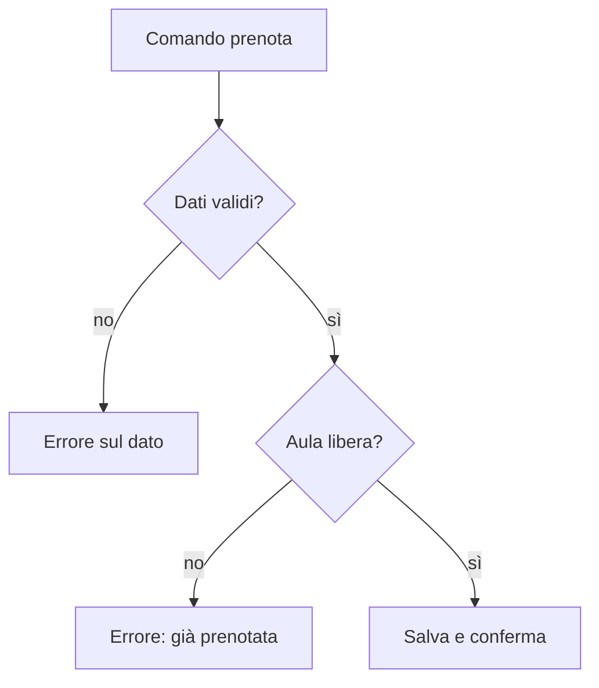
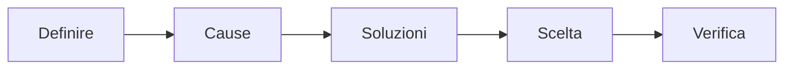

## Contenuti

- Prototipi
- Flusso di un'operazione
- Un percorso di problem solving
- Cercare le cause
- Matrice di decisione
- Laboratorio
- Aspetti orientativi

## Prototipi

- Versione preliminare per verificare un'idea
- Wireframe: struttura senza grafica
- Bassa fedeltà: costa poco, si cambia subito, si commenta la sostanza
- Programma a riga di comando: sessione trascritta nel terminale

## Flusso di un'operazione

## Un percorso di problem solving

- Brainstorming: giudizio rimandato, quantità di idee

## Cercare le cause

- 5 perché: una catena di cause fino a una su cui intervenire
- Diagramma causa-effetto (Ishikawa): persone, metodi, strumenti, ambiente
- Non tutte le cause si risolvono con il software

## Matrice di decisione

- Criteri, pesi da 1 a 5, punteggi da 1 a 5
- Totale: somma di peso per punteggio
- Sensibilità: la scelta cambia se cambia un peso?
- Il valore sta nel rendere espliciti criteri e pesi

## Laboratorio

1. Prototipi A e B in Draw.io per due storie, con messaggi di errore
2. `python matrice_decisione.py matrice.csv`; 17 test; decisione in `docs\decisioni.md`
3. 5 perché e causa-effetto su un problema del cliente o del team

## Aspetti orientativi

- UX e UI designer: come le persone usano un prodotto
- Problem solving: competenza trasversale in tutti i settori
- Quale criterio ha fatto discutere di più?
