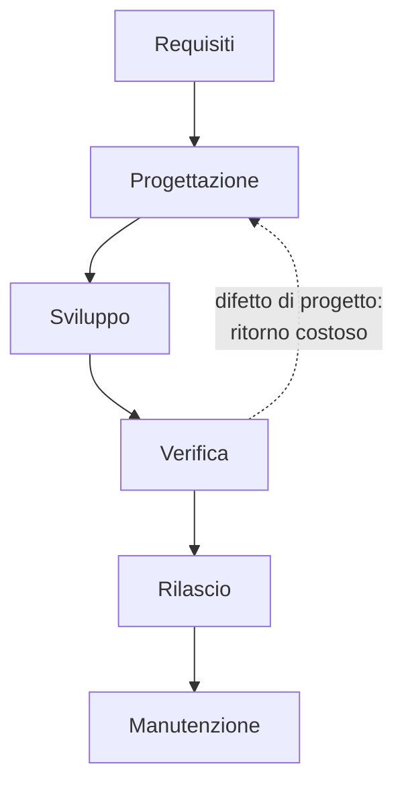

# Lezione 3.1: Ciclo di vita e modello a cascata

> Contenuto originale. Riferimenti: Wikipedia, "Waterfall model", https://en.wikipedia.org/wiki/Waterfall_model ; documentazione di Mermaid, diagrammi di Gantt, https://github.com/mermaid-js/mermaid/blob/develop/packages/mermaid/src/docs/syntax/gantt.md . I materiali del laboratorio sono nella cartella `laboratorio`.

Obiettivo: conoscere le fasi del ciclo di vita del software, il modello a cascata con i suoi documenti, vantaggi e limiti, e pianificare un progetto con un diagramma di Gantt e il percorso critico.

## 3.1.1 Il ciclo di vita del software

- **Ciclo di vita del software**
  insieme delle fasi che un prodotto software attraversa, dall'idea al ritiro dall'uso.
- **Modello di sviluppo** (o processo)
  modo in cui un'organizzazione ordina e ripete queste fasi.

| Fase | Domanda | Prodotto tipico |
|---|---|---|
| Analisi dei requisiti | che cosa serve? | documento dei requisiti |
| Progettazione | come lo realizziamo? | documento di progetto: architettura, dati, interfacce |
| Sviluppo | realizzazione | codice, test delle singole parti |
| Verifica | funziona come richiesto? | piano e rapporto di test, collaudo con il cliente |
| Rilascio | consegna e messa in uso | pacchetto installabile, manuale, formazione |
| Manutenzione | correzioni e miglioramenti nel tempo | nuove versioni |

La manutenzione è spesso la fase più lunga: un programma usato per anni viene corretto, adattato a nuovi sistemi e ampliato molte volte.

## 3.1.2 Il modello a cascata

Nel **modello a cascata** (waterfall) le fasi si svolgono una dopo l'altra: ciascuna inizia quando la precedente è terminata e i suoi documenti sono stati approvati. Tornare indietro è possibile, ma costoso.

Diagramma: il modello a cascata.



Il primo schema formale di questo processo si trova in un articolo di Winston Royce del 1970, "Managing the Development of Large Software Systems". Royce però non lo raccomandava così com'era: lo descriveva come rischioso, perché le prove arrivano solo alla fine, e proponeva correzioni, tra cui cicli di ritorno tra le fasi. Il nome "cascata" compare più tardi, in un articolo di Bell e Thayer del 1976.

### I documenti

Nel modello a cascata ogni fase si chiude con un documento approvato, che diventa il riferimento per la fase successiva:

- **specifica dei requisiti**: che cosa il sistema deve fare, concordato con il cliente
- **documento di progetto**: come è costruito
- **piano di test**: come si verificherà ogni requisito
- **verbale di collaudo**: il cliente dichiara che il prodotto rispetta i requisiti

Il punto di approvazione di un documento si chiama **traguardo** (milestone).

### Vantaggi e limiti

| Vantaggi | Limiti |
|---|---|
| Fasi chiare, facili da spiegare e da controllare | il cliente vede il prodotto solo alla fine |
| Traguardi e documenti precisi, utili per contratti e verifiche | i requisiti cambiano mentre il progetto procede, e ogni cambiamento costa |
| La documentazione riduce la dipendenza dalle singole persone | gli errori dei requisiti si scoprono tardi, quando correggerli costa di più |
| Adatto quando i requisiti sono stabili e ben noti | le prove concentrate alla fine vengono spesso compresse dai ritardi |

### Quando si usa ancora

- progetti con requisiti stabili e fissati da norme o contratti, per esempio molti appalti pubblici
- sistemi in cui la sicurezza richiede documentazione e verifiche formali di ogni fase: dispositivi medici, controllo di impianti, avionica
- progetti in cui hardware e software si sviluppano insieme e l'hardware non si può cambiare facilmente

Molte organizzazioni usano modelli ibridi: pianificazione e contratto per fasi, sviluppo a cicli brevi.

## 3.1.3 Pianificare: diagramma di Gantt e percorso critico

- **Diagramma di Gantt**
  grafico che mostra le attività di un progetto come barre su una linea del tempo; la lunghezza della barra è la durata.
- **Dipendenza**
  vincolo per cui un'attività può iniziare solo quando un'altra è terminata.
- **Percorso critico**
  sequenza di attività dipendenti che determina la durata minima del progetto: un ritardo su una di esse ritarda la consegna.
- **Margine** (slack)
  quanti giorni un'attività può ritardare senza spostare la fine del progetto; le attività critiche hanno margine zero.

Esempio: tre attività di sviluppo partono insieme dopo la progettazione e i test iniziano quando tutte sono finite. Se lo sviluppo delle regole dura 8 giorni e quello dei comandi 5, i comandi hanno 3 giorni di margine; le regole sono critiche.

Il calcolo avviene in due passaggi:

1. **in avanti**: ogni attività inizia appena sono finite quelle da cui dipende; la fine dell'ultima attività è la durata del progetto;
2. **all'indietro**: partendo dalla fine, si calcola l'ultimo momento in cui ogni attività può iniziare senza ritardare la consegna; la differenza tra i due inizi è il margine.

## 3.1.4 Laboratorio

Tempo indicativo: 40 minuti. Cartella di lavoro `C:\corso-impresa\lab31`, con i file della cartella `laboratorio`.

Scenario: il progetto "Prenotazioni dei laboratori" viene realizzato da un'azienda con il modello a cascata. Il file `attivita_cascata.csv` contiene il piano.

### Parte 1: il piano (15 minuti)

```powershell
python piano_cascata.py attivita_cascata.csv
```

```text
ID   Attività                                  Giorni  Inizio     Fine       Margine
R1   Interviste e analisi dei requisiti             5  2026-11-02 2026-11-06       0
R2   Documento dei requisiti approvato              0  2026-11-06 2026-11-06       0
...
S1   Sviluppo archivio                              4  2026-11-12 2026-11-17       4
S2   Sviluppo regole e controlli                    8  2026-11-12 2026-11-23       0
...
Durata del progetto: 25 giorni lavorativi, fine il 2026-12-04
Attività critiche (margine 0): R1, P1, P2, S2, T1, T2, L1
Diagramma scritto in attivita_cascata.gantt.md
```

Aprire `attivita_cascata.gantt.md` in VS Code con l'anteprima (`Ctrl+Shift+V`): le attività critiche sono in rosso, i traguardi sono rombi, i fine settimana sono esclusi.

Come funziona il passaggio in avanti:

```python
for codice in ordine:
    a = attivita[codice]
    a["inizio"] = max((attivita[d]["fine"] for d in a["dipende"]), default=0)
    a["fine"] = a["inizio"] + a["durata"]
```

- `ordine` elenca le attività in modo che ciascuna venga dopo quelle da cui dipende (ordinamento topologico); se due attività dipendono l'una dall'altra, il programma segnala una dipendenza circolare
- l'inizio di un'attività è la fine più tarda tra le attività da cui dipende; senza dipendenze è 0, cioè il primo giorno
- i giorni si contano come giorni lavorativi e si trasformano in date saltando sabato e domenica (funzione `giorno_lavorativo`)

Domande:

1. Perché S1, S3 e S4 hanno margine, e S2 no?
2. Se lo sviluppo archivio (S1) ritarda di 3 giorni, la consegna cambia? E se ritarda di 5?
3. Aggiungere in fondo al file un'attività di 2 giorni "Revisione del manuale" che dipende da S4 e da cui dipende T2: cambia la data di consegna?

### Parte 2: un cambiamento imprevisto (15 minuti)

Durante il collaudo il cliente scopre che i docenti ragionano per ore di lezione (prima ora, seconda ora...) e non per orari liberi: chiede di modificare il programma. Con il modello a cascata la modifica richiede di tornare a requisiti e progettazione, aggiornare i documenti, rifare sviluppo e collaudo. Il file `attivita_modificate.csv` contiene il piano aggiornato.

```powershell
python piano_cascata.py attivita_cascata.csv --confronta attivita_modificate.csv
```

```text
Ritardo sulla consegna: 13 giorni lavorativi (dal 2026-12-04 al 2026-12-23)
Attività spostate: L1, L2
Attività aggiunte: M1, M2, M3, M4, M5
```

Domande:

1. Con quale domanda nell'intervista iniziale il requisito sarebbe emerso subito (lezione 2.1)?
2. Chi paga i 13 giorni in più? Dipende dal contratto: se ne parla nella lezione 3.4.
3. Come sarebbe andata se il cliente avesse visto una prima versione funzionante dopo due settimane?

Test: `python test_piano_cascata.py` (20 test).

### Parte 3: confronto (10 minuti)

Discussione di classe: in quali situazioni il modello a cascata è la scelta giusta? Il progetto del corso lo è?

## 3.1.5 Aspetti orientativi (discussione)

- La pianificazione con diagrammi di Gantt, percorso critico e traguardi è uno strumento quotidiano del **project manager**; le certificazioni di gestione dei progetti, riconosciute a livello internazionale, si ottengono dopo il diploma con studio ed esperienza.
- Nei settori regolati (sanità, trasporti, energia, pubblica amministrazione) sono richieste figure che conoscano sia la tecnica sia le norme e i processi documentali.
- Domanda: in un'attività scolastica lunga, come una ricerca di gruppo, quali erano le attività critiche?
