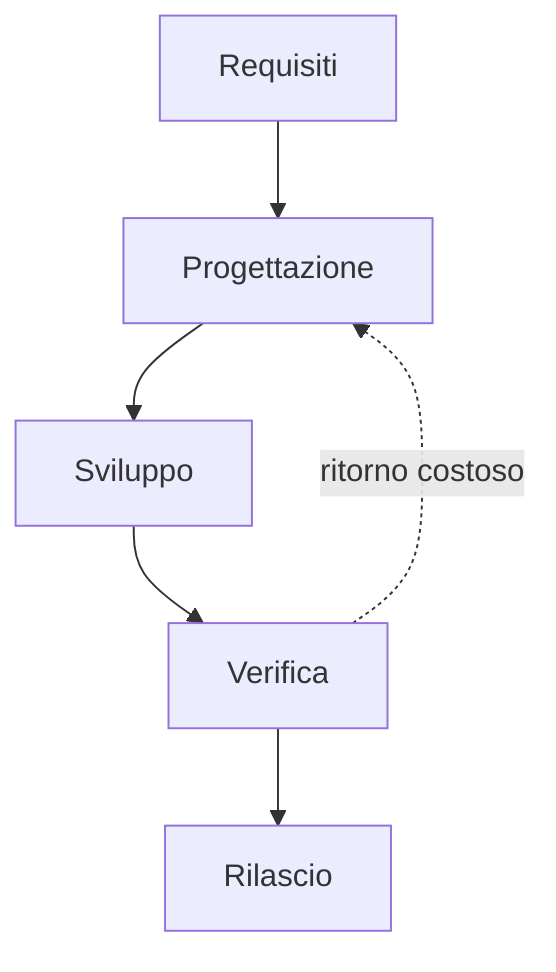

## Contenuti

- Il ciclo di vita del software
- Il modello a cascata
- Vantaggi e limiti
- Gantt e percorso critico
- Laboratorio
- Aspetti orientativi

## Il ciclo di vita del software

- Analisi dei requisiti, progettazione, sviluppo, verifica, rilascio, manutenzione
- La manutenzione è spesso la fase più lunga
- Modello di sviluppo: come si ordinano e si ripetono le fasi

## Il modello a cascata

- Royce (1970) lo descriveva come rischioso; il nome "cascata" arriva nel 1976

## Vantaggi e limiti

- Fasi chiare, documenti e traguardi precisi
- Il cliente vede il prodotto solo alla fine
- I cambiamenti e gli errori dei requisiti costano molto
- Adatto a requisiti stabili, settori regolati, hardware e software insieme

## Gantt e percorso critico

- Barre sulla linea del tempo, dipendenze tra attività
- Percorso critico: le attività che decidono la data di consegna
- Margine: quanto un'attività può ritardare senza spostare la fine

## Laboratorio

1. `python piano_cascata.py attivita_cascata.csv`: 25 giorni, fine il 4/12/2026
2. Cambiamento imprevisto: ore di lezione, 13 giorni di ritardo
3. Confronto: quando conviene la cascata? 20 test

## Aspetti orientativi

- Project manager: pianificazione e controllo
- Settori regolati: tecnica, norme e documentazione
- Quali erano le attività critiche di un lavoro di gruppo?
