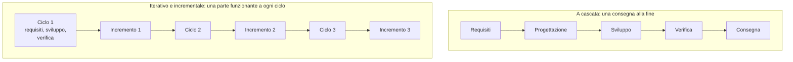
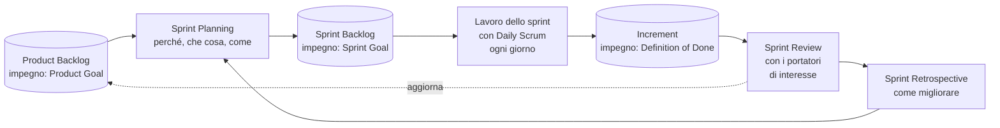

# Lezione 3.2: Agile e Scrum

> Fonti. Sezione 3.2.1: citazioni dal "Manifesto per lo Sviluppo Agile di Software", © 2001 gli autori, traduzione italiana: https://agilemanifesto.org/iso/it/manifesto.html ; principi: https://agilemanifesto.org/iso/it/principles.html . Sezioni 3.2.2-3.2.4: adattamento, con sintesi e riorganizzazione, di Ken Schwaber e Jeff Sutherland, "La Guida a Scrum" (novembre 2020), © 2020 Ken Schwaber e Jeff Sutherland, licenza Creative Commons Attribution Share-Alike 4.0 (https://creativecommons.org/licenses/by-sa/4.0/), https://scrumguides.org/scrum-guide.html , traduzione italiana: https://scrumguides.org/docs/scrumguide/v2020/2020-Scrum-Guide-Italian.pdf . Le sezioni 3.2.2-3.2.4 sono distribuite con la stessa licenza CC BY-SA 4.0. Il resto della lezione e i materiali del laboratorio sono originali.

Obiettivo: conoscere i valori e i principi dello sviluppo agile e il framework Scrum (ruoli, eventi, artefatti, impegni), e sperimentarli in una simulazione.

## 3.2.1 Il Manifesto Agile

Nel febbraio 2001 diciassette sviluppatori ed esperti di metodi di sviluppo si incontrarono per confrontare i propri approcci, alternativi ai processi pesanti e basati sui documenti. Il risultato fu il "Manifesto per lo Sviluppo Agile di Software", che dichiara quattro valori:

> Gli individui e le interazioni più che i processi e gli strumenti
>
> Il software funzionante più che la documentazione esaustiva
>
> La collaborazione col cliente più che la negoziazione dei contratti
>
> Rispondere al cambiamento più che seguire un piano
>
> Ovvero, fermo restando il valore delle voci a destra, consideriamo più importanti le voci a sinistra.

L'ultima frase è importante: il Manifesto non elimina processi, documenti, contratti e piani, ma stabilisce che cosa prevale quando sono in conflitto con le persone, il software funzionante, la collaborazione e la risposta al cambiamento.

Il Manifesto è accompagnato da dodici principi. Tre esempi:

- "La nostra massima priorità è soddisfare il cliente rilasciando software di valore", fin da subito e in maniera continua;
- "Il software funzionante è il principale metro di misura di progresso";
- "Una conversazione faccia a faccia è il modo più efficiente e più efficace per comunicare" con il team e all'interno del team.

Diagramma: sviluppo a cascata e sviluppo iterativo e incrementale.



Nei metodi agili il lavoro è **iterativo** (si ripete in cicli brevi) e **incrementale** (ogni ciclo aggiunge una parte funzionante). Il cliente vede presto il prodotto e può correggere la direzione: il cambiamento della lezione 3.1 sarebbe emerso alla prima dimostrazione.

## 3.2.2 Scrum: definizione e pilastri

Scrum è un framework leggero che aiuta persone, team e organizzazioni a generare valore attraverso soluzioni adattive per problemi complessi. È volutamente incompleto: definisce solo le parti necessarie, e le pratiche concrete le sceglie il team.

Scrum si basa sull'**empirismo**, cioè sull'idea che la conoscenza derivi dall'esperienza e che si prendano decisioni in base a ciò che si osserva. Tre pilastri:

- **trasparenza**: il processo e il lavoro devono essere visibili a chi lo svolge e a chi lo riceve;
- **ispezione**: artefatti e avanzamento vanno esaminati spesso, per scoprire problemi;
- **adattamento**: se qualcosa si allontana dall'obiettivo, si corregge il prima possibile.

Cinque **valori** guidano il team: impegno, focus, apertura, rispetto e coraggio.

## 3.2.3 Lo Scrum Team

Lo Scrum Team è un piccolo gruppo di persone, di solito 10 o meno, senza sotto-team né gerarchie interne, con tutte le competenze necessarie a creare valore in ogni sprint. Ha tre responsabilità:

| Responsabilità | Compiti principali |
|---|---|
| **Developers** (sviluppatori) | creano ogni sprint un incremento utilizzabile; preparano il piano dello sprint (Sprint Backlog); garantiscono la qualità rispettando la Definition of Done; adattano il piano ogni giorno verso l'obiettivo dello sprint |
| **Product Owner** | massimizza il valore del prodotto; definisce e comunica l'obiettivo del prodotto; crea, ordina e rende chiari gli elementi del Product Backlog. È una persona, non un comitato |
| **Scrum Master** | promuove Scrum così come è definito nella Guida; aiuta il team a migliorare, a rimuovere gli ostacoli e a svolgere gli eventi in modo positivo e nei tempi |

## 3.2.4 Eventi, artefatti e impegni

Lo **Sprint** è il contenitore di tutti gli eventi: un periodo di durata fissa, al massimo un mese, in cui si trasformano idee in valore. Un nuovo sprint inizia subito dopo la fine del precedente.

Diagramma: il ciclo di uno sprint.



| Evento | Scopo | Durata massima (sprint di un mese; più breve per sprint più corti) |
|---|---|---|
| Sprint Planning | decidere perché lo sprint ha valore (Sprint Goal), che cosa si può fare, come si farà | 8 ore |
| Daily Scrum | ispezionare l'avanzamento verso lo Sprint Goal e adattare il piano della giornata | 15 minuti |
| Sprint Review | esaminare il risultato con i portatori di interesse e decidere gli adattamenti | 4 ore |
| Sprint Retrospective | pianificare come migliorare qualità ed efficacia del lavoro | 3 ore |

Ogni artefatto ha un impegno che ne rende misurabile l'avanzamento:

| Artefatto | Che cos'è | Impegno |
|---|---|---|
| **Product Backlog** | elenco ordinato, in evoluzione, di ciò che serve per migliorare il prodotto; unica fonte del lavoro del team | **Product Goal**: lo stato futuro del prodotto verso cui si lavora |
| **Sprint Backlog** | lo Sprint Goal, gli elementi scelti per lo sprint e il piano per realizzarli; appartiene agli sviluppatori | **Sprint Goal**: l'unico obiettivo dello sprint |
| **Increment** | passo concreto verso il Product Goal; ogni incremento si aggiunge ai precedenti ed è verificato e utilizzabile | **Definition of Done**: descrizione formale delle qualità richieste perché il lavoro sia considerato completo |

Fine dell'adattamento dalla Guida a Scrum.

### Scrum nel progetto del corso

| Scrum | Nel corso |
|---|---|
| Sprint | due sprint, ciascuno di circa quattro lezioni (modulo 5) |
| Sprint Planning | lezioni 5.1 e 5.6 |
| Daily Scrum | 5-10 minuti all'inizio di ogni lezione di sviluppo (lezione 5.3) |
| Sprint Review | lezioni 5.4 e 5.8, con il docente come cliente |
| Sprint Retrospective | lezioni 5.4 e 5.8 |
| Product Backlog e Product Goal | `docs\backlog.md` e `docs\obiettivo_prodotto.md` (modulo 2) |
| Definition of Done | definita dal team nella lezione 5.1 |

Le durate sono ridotte rispetto a un'azienda perché il lavoro complessivo è di poche ore; la struttura è la stessa.

## 3.2.5 Laboratorio: la fabbrica di aeroplani di carta

Tempo indicativo: 35 minuti. Cartella di lavoro `C:\corso-impresa\lab32`, con i file della cartella `laboratorio`. Serve carta di recupero.

### Parte 1: tre sprint (22 minuti)

Le regole sono nel file `regole_simulazione.md`. In sintesi: tre sprint di 7 minuti; in ogni sprint 1 minuto di pianificazione, 3 di produzione, un minuto e mezzo di revisione con il cliente (il docente) e un minuto e mezzo di retrospettiva. Un aeroplano è accettato se supera il segno dei 3 metri e ha il nome del team su un'ala. Nello sprint 3 il cliente può cambiare un criterio.

### Parte 2: dati (5 minuti)

Lo Scrum Master copia `sprint_esempio.csv` come `sprint.csv`, inserisce i numeri del team ed esegue:

```powershell
python registro_sprint.py sprint.csv
```

```text
Sprint  Pianif.  Realizz.  Accett.  Velocità  Precisione  Qualità
     1       10         6        3         3         60%      50%
     2        6         6        5         5        100%      83%
     3        7         7        7         7        100%     100%

Impegno proposto per il prossimo sprint: 6 (media della velocità degli ultimi due sprint)
Grafico scritto in sprint.grafico.md
```

- **velocità**: solo gli oggetti accettati contano come fatti, come in Scrum solo il lavoro che rispetta la Definition of Done fa parte dell'incremento
- **precisione**: realizzati su pianificati, cioè quanto era realistico l'impegno
- **qualità**: accettati su realizzati
- l'impegno proposto usa la media delle ultime velocità: il modo più semplice e diffuso per pianificare in base all'esperienza

Come si calcolano gli indicatori:

```python
for r in righe:
    r["velocita"] = r["accettati"]
    r["precisione"] = percentuale(r["realizzati"], r["pianificati"])
    r["qualita"] = percentuale(r["accettati"], r["realizzati"])
ultime = [r["velocita"] for r in righe[-2:]]
return round(sum(ultime) / len(ultime))
```

- `percentuale` restituisce 0 se il totale è zero, per evitare la divisione per zero
- `righe[-2:]` prende gli ultimi due sprint (o l'unico, se ce n'è uno solo)
- il grafico Mermaid `xychart-beta` mostra le barre degli accettati e la linea dei pianificati; si apre con l'anteprima di VS Code

Test: `python test_registro_sprint.py` (13 test).

### Parte 3: discussione (8 minuti)

Le domande sono in fondo a `regole_simulazione.md`. In particolare: quali elementi di Scrum si sono riconosciuti nella simulazione (ruoli, eventi, artefatti), e quali mancavano?

## 3.2.6 Aspetti orientativi (discussione)

- Scrum è il framework agile più diffuso nelle aziende di software; Product Owner e Scrum Master sono ruoli professionali, spesso ricoperti da persone con esperienza di sviluppo o di analisi.
- I metodi agili si usano anche fuori dall'informatica: marketing, progettazione di prodotti, organizzazione di eventi.
- Domanda: la retrospettiva ha migliorato il lavoro del team da uno sprint all'altro? Quale azione ha funzionato meglio?
