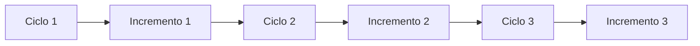
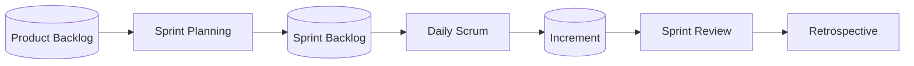

## Lezione 3.2: Agile e Scrum

Modulo 3: Metodi di gestione. Informatica per l'Impresa e Soft Skills Digitale

---

## Il Manifesto Agile (2001)

- Gli individui e le interazioni più che i processi e gli strumenti
- Il software funzionante più che la documentazione esaustiva
- La collaborazione col cliente più che la negoziazione dei contratti
- Rispondere al cambiamento più che seguire un piano

https://agilemanifesto.org/iso/it/manifesto.html

---

## Iterativo e incrementale

- Il cliente vede presto il prodotto e corregge la direzione

---

## Scrum

- Framework leggero per problemi complessi; empirismo
- Pilastri: trasparenza, ispezione, adattamento
- Valori: impegno, focus, apertura, rispetto, coraggio
- Team di 10 persone o meno: Developers, Product Owner, Scrum Master

Adattamento da La Guida a Scrum 2020, Schwaber e Sutherland, CC BY-SA 4.0

---

## Eventi, artefatti, impegni

- Impegni: Product Goal, Sprint Goal, Definition of Done

Adattamento da La Guida a Scrum 2020, Schwaber e Sutherland, CC BY-SA 4.0

---

## Laboratorio

1. Fabbrica di aeroplani di carta: tre sprint di 7 minuti
2. `python registro_sprint.py sprint.csv`: velocità, precisione, qualità; 13 test
3. Discussione: quali elementi di Scrum si sono riconosciuti?

---

## Aspetti orientativi

- Product Owner e Scrum Master: ruoli professionali
- Metodi agili anche fuori dall'informatica
- La retrospettiva ha migliorato il lavoro?
