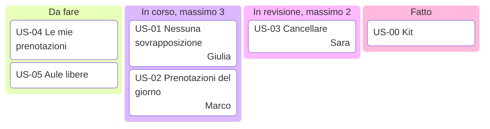

# Lezione 3.3: Kanban, stime e pianificazione

> Contenuto originale. Riferimenti: Wikipedia, "Kanban (development)", https://en.wikipedia.org/wiki/Kanban_%28development%29 ; Wikipedia, "Planning poker", https://en.wikipedia.org/wiki/Planning_poker ; Wikipedia, "Risk matrix", https://en.wikipedia.org/wiki/Risk_matrix ; documentazione di Mermaid, diagrammi Kanban, https://github.com/mermaid-js/mermaid/blob/develop/packages/mermaid/src/docs/syntax/kanban.md . I materiali del laboratorio sono nella cartella `laboratorio`.

Obiettivo: usare una board Kanban con limiti al lavoro in corso, stimare le storie con stime relative e planning poker, usare la velocità per pianificare, e gestire i rischi con un registro.

## 3.3.1 Kanban

Kanban nasce nella produzione industriale della Toyota, alla fine degli anni Quaranta, come sistema per produrre in base alla domanda; dalla metà degli anni Duemila è stato adattato al lavoro intellettuale e allo sviluppo del software. Il lavoro non viene "spinto" sulle persone, ma "tirato" da chi ha capacità libera.

Pratiche principali:

- **visualizzare il flusso**: una board con una colonna per ogni stato del lavoro, e una scheda per ogni elemento
- **limitare il lavoro in corso** (WIP, work in progress): ogni colonna intermedia ha un numero massimo di schede; per iniziare qualcosa di nuovo bisogna prima finire
- **gestire il flusso**: osservare dove le schede si accumulano, cioè dove c'è un collo di bottiglia
- **rendere esplicite le regole**: per esempio quando una scheda può passare a "Fatto"
- **migliorare continuamente**

Diagramma: una board Kanban del progetto, con i limiti nei titoli delle colonne.



Perché limitare il lavoro in corso? Se ogni persona inizia molte cose, tutte avanzano lentamente, nessuna è finita e utilizzabile, e i problemi restano nascosti. Con pochi elementi in corso, ognuno arriva prima alla fine: il **tempo di attraversamento** (lead time, dal momento in cui si inizia al momento in cui è fatto) si riduce.

| | Scrum | Kanban |
|---|---|---|
| Cadenza | sprint di durata fissa | flusso continuo |
| Ruoli | Product Owner, Scrum Master, sviluppatori | non prescritti |
| Limiti | quantità di lavoro scelta per lo sprint | limite di schede per colonna |
| Cambiamenti | di norma tra uno sprint e l'altro | in qualunque momento, se c'è capacità |
| Uso tipico | sviluppo di prodotti | assistenza, manutenzione, attività operative |

Molti team combinano i due metodi: sprint di Scrum e board Kanban con limiti. Il progetto del corso fa così.

## 3.3.2 Stime relative

Stimare in ore o giorni è difficile: le persone lavorano a velocità diverse e le previsioni assolute sono spesso ottimistiche. I team agili usano spesso **stime relative**: si confrontano le storie tra loro ("questa è circa il doppio di quella").

- **Punti storia** (story points): numero che esprime lo sforzo relativo di una storia, considerando quantità di lavoro, complessità e incertezza. Non corrisponde a ore.
- Si usa una scala con valori sempre più distanti, per esempio 1, 2, 3, 5, 8, 13, 20, 40, 100: per le storie grandi l'incertezza è maggiore e non ha senso distinguere tra 14 e 15.
- Si sceglie una **storia di riferimento** a cui dare un valore (per esempio US-02, 2 punti) e si stimano le altre per confronto.

### Planning poker

Tecnica definita da James Grenning nel 2002 e resa popolare da Mike Cohn:

1. il Product Owner legge una storia e risponde alle domande;
2. ogni membro sceglie in segreto una carta con la propria stima;
3. tutti mostrano la carta insieme;
4. se le stime sono diverse, chi ha dato la più bassa e chi la più alta spiegano il perché;
5. si ripete finché le stime convergono.

Mostrare le carte insieme evita l'**effetto ancoraggio**: il primo numero detto ad alta voce influenza tutti gli altri. Le spiegazioni di chi è in disaccordo sono la parte più utile: spesso rivelano un aspetto della storia che gli altri non avevano considerato. La carta "?" indica che mancano informazioni per stimare.

### Velocità e pianificazione

- **Velocità**: punti delle storie completate in uno sprint (lezione 3.2).
- Con la velocità si stima quanti sprint servono: 40 punti di storie e una velocità di 10 punti per sprint danno circa 4 sprint.
- La velocità si misura, non si decide: il primo sprint è sempre una stima; si corregge con l'esperienza.
- Non ha senso confrontare le velocità di team diversi: ogni team ha la sua scala di punti.

## 3.3.3 Rischi

- **Rischio**: evento incerto che, se si verifica, ha un effetto sugli obiettivi del progetto.
- Si valuta con la **probabilità** che si verifichi e l'**impatto** che avrebbe; un modo semplice è dare a ciascuno un voto da 1 a 5 e moltiplicarli.
- **Registro dei rischi**: elenco dei rischi con valutazione, risposta, azione e responsabile, aggiornato durante il progetto.

Strategie di risposta:

| Strategia | Significato | Esempio nel progetto |
|---|---|---|
| Evitare | cambiare il piano in modo che il rischio non esista | verificare i PC prima di iniziare |
| Ridurre | diminuire probabilità o impatto | integrare spesso per ridurre i conflitti sul codice |
| Trasferire | affidare le conseguenze a qualcun altro | un'assicurazione, un fornitore con penali (nelle aziende) |
| Accettare | non intervenire, ma prepararsi | accettare possibili cambi del cliente e discuterli nella pianificazione |

La **matrice probabilità-impatto** colloca i rischi in una griglia per vedere a colpo d'occhio i più gravi. È uno strumento approssimativo: le valutazioni sono soggettive, e rischi diversi possono ottenere lo stesso punteggio. Serve a decidere dove concentrare l'attenzione, non a misurare il rischio con precisione.

## 3.3.4 Laboratorio

Tempo indicativo: 45 minuti. Cartella di lavoro `C:\corso-impresa\lab33`, con i file della cartella `laboratorio`, e la copia di riferimento del progetto del team.

### Parte 1: board del team (10 minuti)

1. Aprire `docs\board.md` nella copia del progetto.
2. Aggiornare la board: nella colonna "Da fare" le storie Must e Should del backlog ordinato (lezione 2.3), in ordine di priorità.
3. Decidere i limiti di lavoro in corso per le colonne "In corso" e "In revisione" e scriverli nel titolo, come nel diagramma della sezione 3.3.1: `inCorso[In corso, massimo 3]`.
4. Scrivere sotto la board le regole del team per spostare una scheda: per esempio, "In revisione" quando il codice e i test sono pronti, "Fatto" quando un compagno ha rivisto il codice e i test passano.

### Parte 2: planning poker (20 minuti)

Ogni membro prepara le carte 0, 1, 2, 3, 5, 8, 13, 20, 40, 100 e "?" su foglietti. Il Product Owner legge le storie Must e Should, a partire dalla storia di riferimento scelta dal team; lo Scrum Master registra ogni giro in `stime.csv` (modello: `stime_esempio.csv`, con una colonna per ogni membro).

```powershell
python planning_poker.py stime.csv --velocita 10 --backlog C:\corso-impresa\progetto_orione\docs\backlog.md
```

```text
Storia  Carte                 Esito          Stima  Note
US-01   3 3 5 3               quasi accordo      5  carte vicine: si propone la più alta, per prudenza
US-02   2 2 2 2               accordo            2  tutti uguali
US-03   3 3 3 5               quasi accordo      5  carte vicine: si propone la più alta, per prudenza
US-05   5 5 8 ?               da chiarire           Davide non ha abbastanza informazioni: chiarire la storia con il Product Owner
US-11   13 20 13 13           quasi accordo     20  carte vicine: si propone la più alta, per prudenza; storia grande: valutare se dividerla

Storie stimate: 4 su 5; punti in tutto: 32
```

- per ogni storia il programma considera l'ultimo giro registrato
- **accordo**: tutte le carte uguali; **quasi accordo**: carte vicine nel mazzo, si propone la più alta (il team può scegliere diversamente, correggendo il valore nel backlog); **da discutere**: carte lontane, il programma indica chi deve spiegare; **da chiarire**: qualcuno ha giocato "?"
- con `--velocita` stima quanti sprint servono; con `--backlog` scrive le stime nella colonna Stima (copia precedente in `.bak`)
- il valore 10 per la velocità è un'ipotesi: la velocità reale del team si misurerà nello sprint 1

Come si riconosce il quasi accordo:

```python
posizioni = [MAZZO.index(v) for v in valori]
minimo, massimo = min(posizioni), max(posizioni)
if minimo == massimo:
    return "accordo", int(MAZZO[minimo]), "tutti uguali"
if massimo - minimo == 1:
    return "quasi accordo", int(MAZZO[massimo]), "carte vicine: ..."
```

- le carte si confrontano per posizione nel mazzo, non per valore: 13 e 20 sono vicine (posizioni 6 e 7), 2 e 8 no (posizioni 2 e 5)
- così il criterio vale allo stesso modo per storie piccole e grandi

Test: `python test_planning_poker.py` (14 test).

### Parte 3: registro dei rischi (15 minuti)

Il team individua almeno cinque rischi del proprio progetto, compresi rischi del team (assenze, disaccordi) e tecnici (perdita di file, stime sbagliate), e li scrive in `rischi.csv` (modello: `rischi_esempio.csv`).

```powershell
python registro_rischi.py rischi.csv
```

```text
ID    P  I Punti  Livello  Strategia  Rischio
R02   4  4    16  alto     ridurre    Due membri modificano lo stesso file e si perdono modifiche
R05   4  4    16  alto     accettare  Una storia si rivela molto più lunga della stima
...
DA SISTEMARE: R04: manca il responsabile
ATTENZIONE: R05: rischio alto accettato senza intervenire: va motivato
DA SISTEMARE: R05: rischio alto senza azione

Matrice scritta in rischi.matrice.md
```

- punteggio = probabilità x impatto; livelli: basso fino a 4, medio fino a 9, alto fino a 16, critico oltre
- i rischi alti e critici devono avere un'azione e un responsabile; accettarli senza intervenire va motivato
- la matrice probabilità-impatto è una tabella Markdown da vedere con l'anteprima

Test: `python test_registro_rischi.py` (15 test).

Salvare `stime.csv`, `rischi.csv` e la matrice nella cartella `docs` della copia del progetto: il registro dei rischi si rivede nelle retrospettive.

## 3.3.5 Aspetti orientativi (discussione)

- Stimare, pianificare e gestire i rischi sono competenze richieste a project manager, Scrum Master e team leader, ma anche a ogni sviluppatore, che deve saper dire quanto tempo gli serve e quali problemi prevede.
- Kanban è molto usato nei team di assistenza e di gestione dei sistemi (help desk, operations), che ricevono richieste continue.
- Domanda: nel planning poker, quale storia ha dato le stime più diverse? Che cosa è emerso dalla discussione?
