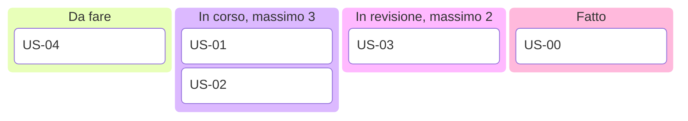

## Contenuti

- Kanban
- Una board con limiti
- Stime relative e planning poker
- Velocità
- Rischi
- Laboratorio
- Aspetti orientativi

## Kanban

- Visualizzare il flusso; limitare il lavoro in corso
- Gestire il flusso; regole esplicite; migliorare
- Lavoro "tirato" da chi ha capacità libera
- Meno lavoro in corso, tempo di attraversamento più breve

## Una board con limiti

## Stime relative e planning poker

- Punti storia: sforzo relativo, non ore
- Scala 1, 2, 3, 5, 8, 13, 20, 40, 100 e "?"
- Carte mostrate insieme: niente effetto ancoraggio
- Spiegano la stima più bassa e la più alta

## Velocità

- Punti completati in uno sprint
- 40 punti con velocità 10: circa 4 sprint
- Si misura, non si decide; non si confronta tra team

## Rischi

- Probabilità x impatto, da 1 a 25
- Strategie: evitare, ridurre, trasferire, accettare
- Registro con azione e responsabile; matrice probabilità-impatto

## Laboratorio

1. Board del team con limiti e regole
2. `python planning_poker.py stime.csv --velocita 10 --backlog ...`; 14 test
3. `python registro_rischi.py rischi.csv`; 15 test

## Aspetti orientativi

- Stimare e prevedere i problemi: compito di ogni sviluppatore
- Kanban nei team di assistenza e operations
- Quale storia ha dato le stime più diverse?
