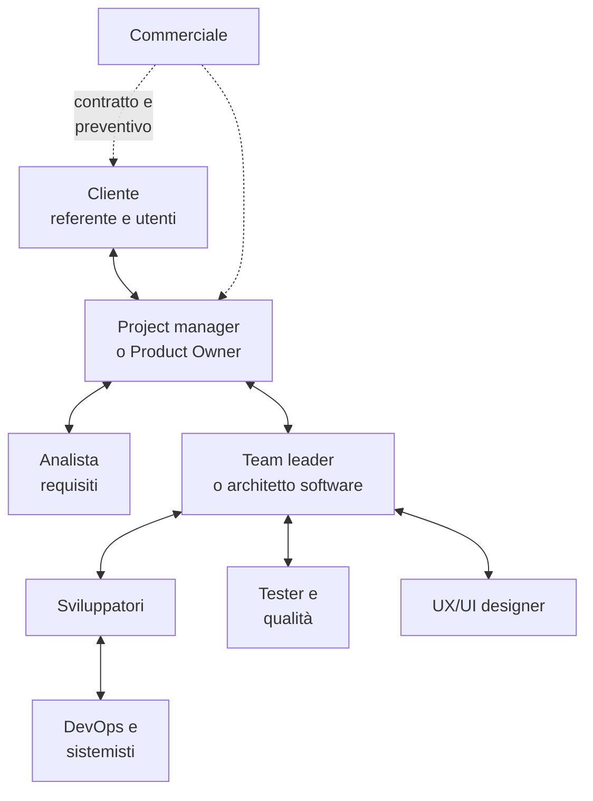

# Lezione 3.4: Come lavorano le aziende ICT

> Contenuto originale. Riferimenti: ISO, "ISO 9001 Quality management", https://www.iso.org/iso-9001-quality-management.html ; ISO/IEC 25010:2023, modello di qualità del prodotto, https://www.iso.org/standard/78176.html ; ISO/IEC 27001:2022, sistemi di gestione della sicurezza delle informazioni, https://www.iso.org/standard/27001 ; Garante per la protezione dei dati personali, Regolamento (UE) 2016/679, https://www.garanteprivacy.it/regolamentoue ; AgID, accessibilità, https://www.agid.gov.it/it/design-servizi/accessibilita . La lezione è condotta dal docente, che la completa con la propria esperienza; i materiali del laboratorio sono nella cartella `laboratorio`.

Obiettivo: conoscere i tipi di aziende del settore ICT, i ruoli nei progetti, i contratti e i preventivi, le norme sulla qualità e sui dati, e gli strumenti di lavoro dei team, anche distribuiti.

## 3.4.1 Tipi di aziende ICT

| Tipo | Che cosa fa | Come lavora sui progetti |
|---|---|---|
| **Software house** | sviluppa software su misura per clienti | progetti con contratto, spesso per fasi o a tempo e materiali |
| **Azienda di prodotto** | sviluppa e vende un proprio prodotto, spesso come servizio in abbonamento (SaaS, software as a service) | sviluppo continuo del prodotto, con metodi agili e rilasci frequenti |
| **System integrator** | integra prodotti di fornitori diversi (hardware, software, reti) in un sistema per il cliente | grandi progetti, spesso con molti fornitori e gare |
| **Società di consulenza** | analizza processi e bisogni, propone e guida i progetti di cambiamento | analisti e project manager presso il cliente |
| **Fornitore di servizi gestiti e cloud** | gestisce infrastrutture e servizi per conto dei clienti | contratti di servizio con livelli garantiti (SLA) |
| **Reparto informatico interno** | in banche, industrie, pubbliche amministrazioni, sviluppa e gestisce i sistemi dell'organizzazione | progetti interni e gestione di fornitori esterni |
| **Startup** | giovane impresa che sviluppa un prodotto innovativo | team piccoli, molta flessibilità, prodotto minimo e sperimentazione |

Molti professionisti lavorano anche come **liberi professionisti** (freelance), con contratti per singoli progetti.

## 3.4.2 Ruoli nei progetti

Diagramma: ruoli tipici in un progetto per un cliente esterno.



- **Commerciale**: tiene i rapporti con il cliente fino al contratto
- **Project manager**: pianifica, controlla tempi, costi e rischi, riferisce al cliente; nei progetti agili parte dei suoi compiti sono del Product Owner e dello Scrum Master
- **Analista**: raccoglie e scrive i requisiti
- **Team leader o architetto**: decide le scelte tecniche principali
- **Sviluppatori, tester, designer, DevOps**: realizzano, verificano, progettano l'interazione, rilasciano e gestiscono in esercizio

Nei progetti piccoli una persona ricopre più ruoli; in quelli grandi ogni ruolo può essere un gruppo.

## 3.4.3 Contratti e preventivi

### Il preventivo

Per un progetto su misura il fornitore prepara un **preventivo**:

1. scompone il lavoro in attività e stima i **giorni-persona** per ciascuna (un giorno-persona è una giornata di lavoro di una persona);
2. moltiplica per la **tariffa giornaliera** di ogni ruolo;
3. aggiunge una **riserva per i rischi** (contingency), proporzionata all'incertezza;
4. aggiunge il **margine**, cioè il guadagno che copre anche i costi generali dell'azienda (uffici, commerciali, formazione);
5. sul prezzo si applica l'IVA, oggi al 22% per i servizi informatici.

### Tipi di contratto

| Contratto | Come funziona | Chi sopporta il rischio di una stima sbagliata |
|---|---|---|
| **A corpo** (prezzo fisso) | prezzo e ambito fissati all'inizio; le modifiche si gestiscono come varianti a pagamento | il fornitore |
| **A tempo e materiali** | il cliente paga i giorni effettivamente lavorati, a tariffe concordate | il cliente |
| **A canone** | pagamento periodico per un servizio continuativo (assistenza, gestione, software in abbonamento), con livelli di servizio (SLA) | condiviso, secondo gli SLA |

Il contratto a corpo si adatta al modello a cascata, perché richiede requisiti definiti in anticipo; i progetti agili usano più spesso tempo e materiali, o contratti a corpo per singoli rilasci. Gli enti pubblici acquistano servizi informatici con gare e procedure definite dal Codice dei contratti pubblici.

## 3.4.4 Qualità, norme e sicurezza

| Riferimento | Di che cosa si occupa |
|---|---|
| **ISO 9001** (edizione 2026) | sistema di gestione della qualità di un'organizzazione: processi documentati, controllo, miglioramento continuo; molte aziende sono certificate, e la certificazione è spesso richiesta nelle gare |
| **ISO/IEC 25010:2023** | modello di qualità del prodotto software: nove caratteristiche (come idoneità funzionale, affidabilità, sicurezza, manutenibilità) usate per specificare e valutare la qualità |
| **ISO/IEC 27001:2022** | sistema di gestione della sicurezza delle informazioni: riservatezza, integrità, disponibilità dei dati |
| **Regolamento (UE) 2016/679** (GDPR) | protezione dei dati personali: il software che tratta dati di persone deve rispettarne i principi fin dalla progettazione |
| **Legge 4/2004** e norme collegate | accessibilità dei servizi digitali, anche per le persone con disabilità; obbligatoria per le pubbliche amministrazioni e per alcune imprese; AgID vigila |

Nel progetto del corso questi temi compaiono in piccolo: i criteri di accettazione e i test (qualità del prodotto), la definizione di "fatto" (processo), i soli nomi e iniziali nelle prenotazioni (protezione dei dati).

## 3.4.5 Strumenti e team distribuiti

| Attività | Strumenti tipici | Nel corso |
|---|---|---|
| Codice e versioni | piattaforme basate su Git con revisione del codice | Git e repository condiviso (modulo 4) |
| Backlog, board, segnalazioni | sistemi di gestione delle attività e dei difetti | Markdown e Mermaid nel repository |
| Documentazione | wiki, documenti condivisi | Markdown nel repository |
| Comunicazione | chat di team, videoconferenze | a voce in classe |
| Integrazione e rilascio | sistemi che eseguono i test e preparano le versioni automaticamente a ogni modifica | test eseguiti a mano (modulo 5) |

Nei **team distribuiti**, con persone in città o paesi diversi, valgono le regole della lezione 1.2: comunicazione scritta chiara, informazioni in luoghi condivisi, riunioni brevi e regolari, attenzione ai fusi orari e alle differenze culturali.

## 3.4.6 Laboratorio

Tempo indicativo: 25 minuti, all'interno della lezione del docente. Cartella di lavoro `C:\corso-impresa\lab34`, con i file della cartella `laboratorio`.

### Parte 1: domande (preparazione a casa o nei primi 5 minuti)

Ogni team compila `domande_per_il_docente.md` con almeno quattro domande, una per area. Durante l'ultima parte della lezione il docente risponde a rotazione.

### Parte 2: un preventivo (20 minuti)

Il file `attivita_preventivo.csv` contiene la stima del progetto "Prenotazioni dei laboratori" fatta da un'azienda; `tariffe_esempio.json` contiene tariffe giornaliere di fantasia.

```powershell
python preventivo.py attivita_preventivo.csv tariffe_esempio.json --scostamento 30
```

```text
Ruolo                 Giorni         Tariffa               Costo
analista                   9     420,00 euro       3.780,00 euro
sviluppatore              18     360,00 euro       6.480,00 euro
tester                     5     320,00 euro       1.600,00 euro
project manager            4     520,00 euro       2.080,00 euro

Costo del lavoro                                  13.940,00 euro  (36 giorni-persona)
Riserva per i rischi 15%                           2.091,00 euro
Margine 10%                                        1.603,10 euro
Prezzo (imponibile)                               17.634,10 euro
IVA 22%                                            3.879,50 euro
Totale                                            21.513,60 euro

Se il lavoro reale è il 30% in più del previsto (costo reale 18.122,00 euro), IVA esclusa:
Contratto                      Paga il cliente    Guadagno del fornitore
A corpo                         17.634,10 euro              -487,90 euro
Tempo e materiali               19.934,20 euro             1.812,20 euro
```

Come si confrontano i contratti:

```python
costo_reale = voci["costo"] * (1 + scostamento / 100)
a_corpo_cliente = voci["imponibile"]
a_corpo_fornitore = a_corpo_cliente - costo_reale
tm_cliente = costo_reale * (1 + margine / 100)
```

- a corpo il cliente paga il prezzo concordato, qualunque sia il lavoro reale; il fornitore guadagna la differenza tra prezzo e costo reale, che può diventare negativa
- a tempo e materiali il cliente paga il lavoro reale più il margine; non serve la riserva per i rischi, perché il rischio è del cliente
- la funzione `euro` scrive gli importi nel formato italiano, con il punto per le migliaia e la virgola per i decimali

Test: `python test_preventivo.py` (14 test).

Attività, a coppie:

1. Con quale scostamento il contratto a corpo smette di essere conveniente per il fornitore? (Provare valori diversi di `--scostamento`.)
2. Con scostamento 0, conviene di più al cliente il contratto a corpo o a tempo e materiali? Perché?
3. Il cliente chiede la modifica delle ore di lezione (lezione 3.1): aggiungere al CSV le attività necessarie e calcolare il prezzo della variante.
4. Quale tipo di contratto si adatta meglio a un progetto svolto con Scrum? Perché?

## 3.4.7 Aspetti orientativi (discussione)

- Il settore ICT offre ambienti di lavoro molto diversi: una startup, una grande società di consulenza e il reparto informatico di un ospedale richiedono le stesse basi tecniche ma competenze e ritmi diversi.
- Accanto ai ruoli tecnici esistono ruoli ibridi: commerciale tecnico (presales), consulente, responsabile della qualità, esperto di protezione dei dati; per questi contano anche diritto, economia e comunicazione.
- Domanda: in quale dei tipi di azienda presentati sarebbe più interessante lavorare, e perché?
