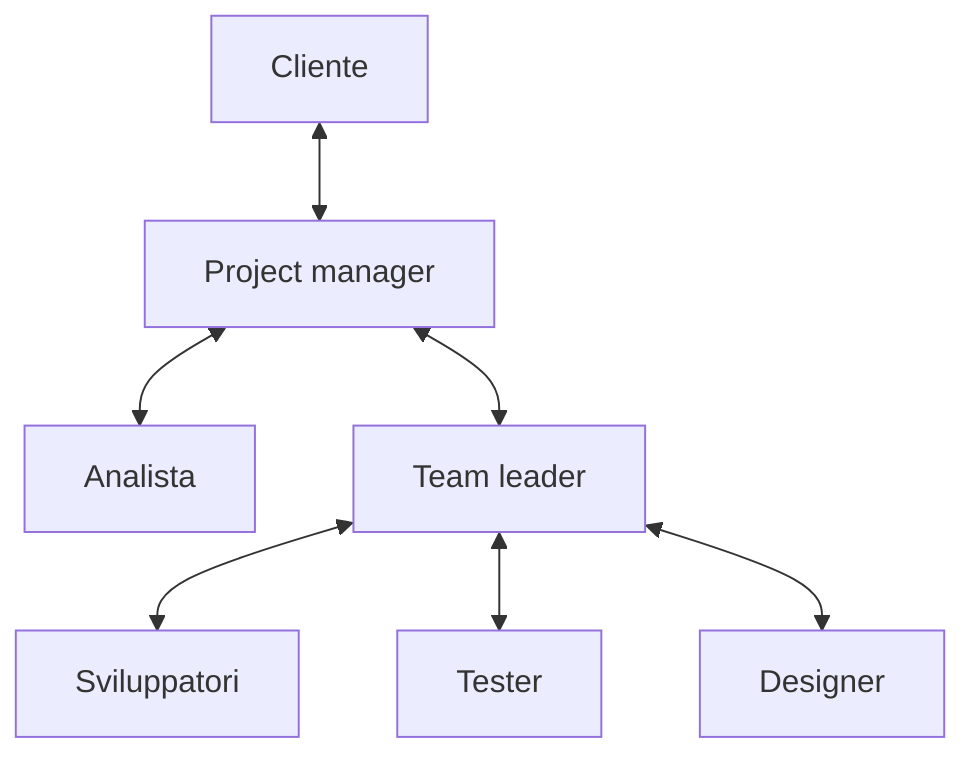

## Lezione 3.4: Come lavorano le aziende ICT

Modulo 3: Metodi di gestione. Informatica per l'Impresa e Soft Skills Digitale

---

## Tipi di aziende

- Software house, aziende di prodotto (SaaS), system integrator
- Consulenza, servizi gestiti e cloud
- Reparti informatici interni, startup, liberi professionisti

---

## Ruoli nei progetti

---

## Preventivo e contratti

- Giorni-persona x tariffa + riserva per i rischi + margine + IVA
- A corpo: rischio del fornitore
- Tempo e materiali: rischio del cliente
- Canone con livelli di servizio (SLA)

---

## Qualità, norme e sicurezza

- ISO 9001: gestione della qualità
- ISO/IEC 25010: qualità del prodotto software
- ISO/IEC 27001: sicurezza delle informazioni
- GDPR: dati personali; Legge 4/2004: accessibilità

---

## Strumenti e team distribuiti

- Git e revisione del codice; board e segnalazioni; wiki
- Chat e videoconferenze; integrazione e rilascio automatici
- Comunicazione scritta, luoghi condivisi, fusi orari

---

## Laboratorio

1. Domande dei team al docente
2. `python preventivo.py attivita_preventivo.csv tariffe_esempio.json --scostamento 30`; 14 test
3. Quando il contratto a corpo va in perdita?

---

## Aspetti orientativi

- Ambienti di lavoro molto diversi, stesse basi tecniche
- Ruoli ibridi: presales, consulente, qualità, protezione dei dati
- In quale tipo di azienda sarebbe interessante lavorare?
