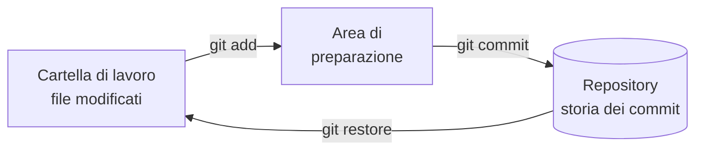
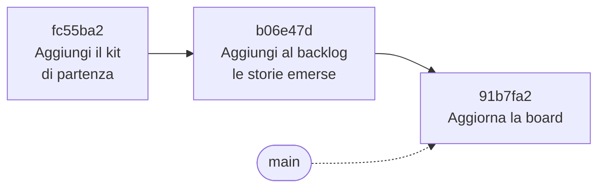

# Lezione 4.1: Git, repository e commit

> Contenuto originale. Riferimenti: Scott Chacon e Ben Straub, "Pro Git", licenza CC BY-NC-SA 3.0, capitolo 2 (in inglese nella versione italiana del sito), https://git-scm.com/book/it/v2/Git-Basics-Recording-Changes-to-the-Repository ; documentazione di Git, gitignore, https://git-scm.com/docs/gitignore ; Visual Studio Code, "Source control in VS Code", https://code.visualstudio.com/docs/sourcecontrol/overview ; Chris Beams, "How to Write a Git Commit Message", https://cbea.ms/git-commit/ . I materiali del laboratorio sono nella cartella `laboratorio`.

Obiettivo: capire a che cosa serve il controllo di versione, usare Git per registrare la storia di un progetto con commit ben descritti, dal terminale e da VS Code, e trasformare la copia di riferimento del team in un repository.

## 4.1.1 Il controllo di versione

Nel modulo 2 ogni team ha lavorato sui documenti del progetto in una copia di riferimento, e probabilmente qualcuno ha modificato un file su un altro PC, o ha salvato una versione "backlog_nuovo.md". Senza uno strumento adatto, lavorare in più persone sugli stessi file porta a copie diverse, modifiche perse e nessuna idea di chi ha cambiato che cosa.

- **Controllo di versione**
  sistema che registra le modifiche ai file nel tempo, permette di tornare a versioni precedenti, di sapere chi ha cambiato che cosa e perché, e di unire il lavoro di più persone.
- **Git**
  il sistema di controllo di versione più usato. È **distribuito**: ogni persona ha sul proprio PC una copia completa della storia del progetto, e può lavorare anche senza rete.

## 4.1.2 Repository, area di preparazione, commit

- **Repository**: la cartella del progetto più la sua storia, conservata da Git nella sottocartella nascosta `.git`.
- **Commit**: fotografia dello stato dei file in un momento, con autore, data, messaggio e riferimento al commit precedente. Ogni commit ha un identificativo (hash), per esempio `fc55ba2`, calcolato dal contenuto.
- **Area di preparazione** (staging area, o indice): l'elenco delle modifiche che faranno parte del prossimo commit. Serve a scegliere che cosa registrare: per esempio solo la correzione di un file, e non una prova lasciata in un altro.

Diagramma: le tre aree di Git e i comandi che spostano le modifiche.



Diagramma: la storia è una catena di commit, ciascuno collegato al precedente.



## 4.1.3 I comandi principali

| Comando | Che cosa fa |
|---|---|
| `git init -b main` | trasforma la cartella corrente in un repository, con ramo principale `main` |
| `git config user.name "Anna R."` | imposta l'autore per questo repository (senza `--global`) |
| `git status` | mostra i file modificati, preparati o non ancora tracciati |
| `git add file` oppure `git add .` | prepara le modifiche di un file, o di tutti i file della cartella |
| `git commit -m "messaggio"` | registra un commit con le modifiche preparate |
| `git log --oneline` | mostra la storia, un commit per riga |
| `git diff` | mostra le modifiche non ancora preparate, riga per riga |
| `git restore file` | annulla le modifiche non registrate di un file, tornando all'ultimo commit |

Esempio, dopo aver aggiunto una storia al backlog:

```powershell
git status --short
```

```text
 M docs/backlog.md
```

- `M` indica un file tracciato e modificato; `??` indicherebbe un file nuovo, non ancora tracciato
- la versione breve (`--short`) è più facile da leggere; senza l'opzione Git spiega anche i comandi possibili, in inglese o in italiano secondo la configurazione

```powershell
git add docs/backlog.md
git commit -m "Aggiungi al backlog le storie emerse dall'intervista"
git log --oneline
```

```text
b06e47d Aggiungi al backlog le storie emerse dall'intervista
fc55ba2 Aggiungi il kit di partenza del progetto
```

### Da VS Code

La vista **Controllo del codice sorgente** (icona a sinistra con i rami, oppure `Ctrl+Shift+G`) mostra le stesse informazioni:

- l'elenco delle modifiche; un clic su un file apre il confronto tra la versione registrata e quella attuale
- il pulsante `+` accanto a un file equivale a `git add`
- la casella del messaggio e il pulsante Commit equivalgono a `git commit -m`

I comandi del terminale e i pulsanti di VS Code agiscono sullo stesso repository: si possono usare insieme.

## 4.1.4 Buoni messaggi di commit

La storia serve a chi, tra una settimana o un anno, dovrà capire perché il codice è così. Regole del progetto, adattate da quelle più diffuse:

- il titolo dice **che cosa cambia**, in una frase breve (al massimo 72 caratteri; meglio 50)
- verbo all'imperativo, come se completasse la frase "questo commit...": "Aggiungi", "Correggi", "Rimuovi"
- iniziale maiuscola, senza punto finale
- se serve una spiegazione, una riga vuota e poi la descrizione: perché la modifica, a quale storia si riferisce
- un commit per una modifica coerente: non "tutto il lavoro di oggi"

| Da evitare | Meglio |
|---|---|
| `modifiche` | `Aggiungi il controllo delle sovrapposizioni (US-01)` |
| `fix` | `Correggi il messaggio per le date non valide` |
| `aggiornato tutto.` | due commit: `Aggiorna il backlog con le priorità` e `Aggiungi l'obiettivo del prodotto` |

## 4.1.5 Che cosa non va nel repository: .gitignore

Nel repository si registrano i file scritti dalle persone, non quelli generati dai programmi. Il file `.gitignore` elenca i file che Git deve ignorare. Quello del kit:

```text
# File generati da Python
__pycache__/
*.pyc

# File temporanei dell'archivio
dati/*.tmp

# Ambienti virtuali e impostazioni personali dell'editor
.venv/
.vscode/
```

- le righe che iniziano con `#` sono commenti
- `__pycache__/` con la barra finale indica una cartella; Python vi salva i file compilati quando esegue il programma
- `*.pyc` usa il carattere jolly `*`: tutti i file che finiscono con `.pyc`
- `dati/*.tmp` vale solo nella cartella `dati`

Un file già registrato non viene ignorato anche se si aggiunge al `.gitignore`: va tolto dal repository con `git rm --cached file`.

## 4.1.6 Laboratorio

Tempo indicativo: 45 minuti. Cartella di lavoro `C:\corso-impresa\lab41`, con i file della cartella `laboratorio` e una copia del kit.

### Parte 1: repository di prova, ciascuno sul proprio PC (25 minuti)

1. Copiare la cartella del kit in `C:\corso-impresa\lab41\prova` e aprirla in VS Code con un terminale.
2. Creare il repository e impostare l'identità solo per questo repository:

```powershell
git init -b main
git config user.name "Anna R."
git config user.email "anna.r@classe.invalid"
git status
```

3. Registrare il kit: `git add .` e `git commit -m "Aggiungi il kit di partenza del progetto"`. Eseguire `git status` e verificare che la cartella `__pycache__` non compaia (è nel `.gitignore`).
4. Dal terminale: aggiungere una riga al README, osservare `git status` e `git diff`, preparare e registrare la modifica con un buon messaggio.
5. Da VS Code: modificare `docs/board.md`, osservare la modifica nella vista Controllo del codice sorgente, registrarla con il pulsante Commit.
6. Provare ad annullare una modifica: cambiare una riga di `logica.py`, eseguire i test (falliscono o no?), poi `git restore logica.py` ed eseguirli di nuovo.
7. Controllare il repository:

```powershell
python controlla_repository.py C:\corso-impresa\lab41\prova
```

```text
OK           identità impostata
OK           .gitignore presente
OK           nessun file generato nel repository
OK           commit: 3

Repository in ordine.
```

Il programma controlla identità, `.gitignore`, file generati registrati per errore, numero di commit, messaggi di commit e modifiche non ancora registrate. Esegue i comandi di Git con `subprocess.run` e ne legge il risultato; per esempio i messaggi si leggono così:

```python
_, storia = git(cartella, "log", "--format=%h%x1f%B%x1e")
for voce in storia.split("\x1e"):
    ...
    breve, messaggio = voce.strip().split("\x1f", 1)
```

- `--format` sceglie che cosa stampare di ogni commit: `%h` è l'identificativo breve, `%B` il messaggio completo
- `%x1f` e `%x1e` sono caratteri di separazione che non compaiono nei messaggi: il programma divide il testo prima per commit e poi tra identificativo e messaggio
- i messaggi dei merge, scritti automaticamente da Git, non vengono controllati

Test: `python test_controlla_repository.py` (17 test; creano repository di prova in cartelle temporanee).

### Parte 2: il repository del team (20 minuti)

Sul PC del Product Owner, con tutto il team:

1. Nella copia di riferimento del progetto (`C:\corso-impresa\progetto_<team>`), sostituire `dati\prenotazioni.json` con quello del kit originale fornito dal docente: il repository parte da dati puliti.
2. Controllare che in `docs` ci siano i documenti del modulo 2 e 3 (backlog, obiettivo del prodotto, decisioni, stime, rischi) e che non ci siano file `.bak` (il `.gitignore` del kit non li esclude: aggiungere la riga `*.bak`).
3. `git init -b main`, identità del Product Owner, `git add .`, primo commit.
4. Eseguire `controlla_repository.py` con `--minimo-commit 1`.

Nella lezione 4.3 questo repository verrà inviato al repository condiviso, da cui tutti i membri lo cloneranno.

## 4.1.7 Aspetti orientativi (discussione)

- Git è usato praticamente in tutte le aziende di software: saperlo usare è un requisito di base per sviluppatori, tester, DevOps, ma anche per chi scrive documentazione tecnica.
- Leggere la storia di un progetto (chi ha cambiato che cosa e perché) è il primo passo per capire un codice esistente, come succede a chi entra in un nuovo team.
- Domanda: quali problemi dei lavori di gruppo scolastici avrebbe risolto un controllo di versione?
