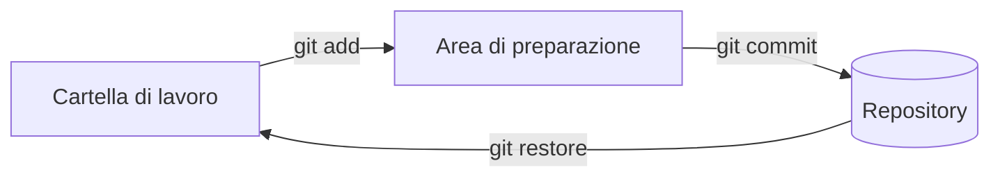

## Lezione 4.1: Git, repository e commit

Modulo 4: Strumenti del team. Informatica per l'Impresa e Soft Skills Digitale

---

## Il controllo di versione

- Registra le modifiche nel tempo: chi, che cosa, quando, perché
- Permette di tornare indietro e di unire il lavoro di più persone
- Git: distribuito, ogni PC ha la storia completa

---

## Le tre aree

- Commit: fotografia con autore, data, messaggio, commit precedente

---

## I comandi principali

- `git init -b main`, `git config user.name`
- `git status`, `git diff`
- `git add`, `git commit -m`
- `git log --oneline`, `git restore`
- In VS Code: vista Controllo del codice sorgente (`Ctrl+Shift+G`)

---

## Buoni messaggi di commit

- Che cosa cambia, al massimo 72 caratteri
- Imperativo: "Aggiungi", "Correggi"; maiuscola, senza punto
- Riga vuota, poi il perché
- Da evitare: "modifiche", "fix"

---

## .gitignore

- Nel repository i file scritti dalle persone, non quelli generati
- `__pycache__/`, `*.pyc`, `dati/*.tmp`, `*.bak`
- File già registrato: `git rm --cached`

---

## Laboratorio

1. Repository di prova: tre commit, da terminale e da VS Code
2. `python controlla_repository.py cartella`; 17 test
3. Repository del team nella copia di riferimento, con dati puliti

---

## Aspetti orientativi

- Git: requisito di base in ogni team di software
- Leggere la storia per capire un progetto esistente
- Quali problemi dei lavori di gruppo avrebbe risolto?
