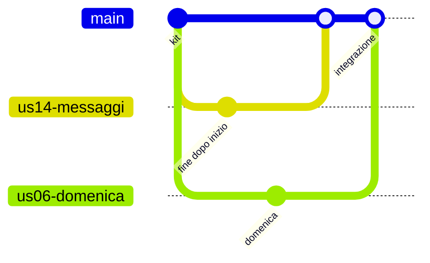
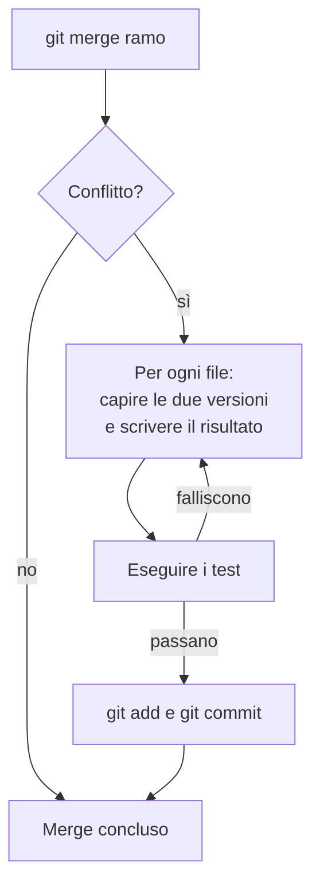

# Lezione 4.2: Branch, merge e conflitti

> Contenuto originale. Riferimenti: Scott Chacon e Ben Straub, "Pro Git", licenza CC BY-NC-SA 3.0, capitolo 3 (in inglese nella versione italiana del sito), https://git-scm.com/book/it/v2/Git-Branching-Basic-Branching-and-Merging ; Visual Studio Code, "Resolve merge conflicts", https://code.visualstudio.com/docs/sourcecontrol/merge-conflicts . I materiali del laboratorio sono nella cartella `laboratorio`.

Obiettivo: lavorare su rami separati, integrarli nel ramo principale, riconoscere e risolvere i conflitti con l'editor a tre vie di VS Code, e adottare il flusso di lavoro "un ramo per storia".

## 4.2.1 I rami

- **Ramo** (branch)
  linea di sviluppo indipendente. In Git un ramo è semplicemente un nome che punta a un commit e avanza a ogni nuovo commit fatto su quel ramo.
- **main**
  il ramo principale del progetto; per regola del team contiene sempre una versione funzionante.
- **HEAD**
  indica il ramo su cui si sta lavorando.

Un ramo permette di sviluppare una storia senza disturbare il lavoro degli altri e senza rendere instabile `main`: se l'esperimento non funziona, il ramo si abbandona.

| Comando | Che cosa fa |
|---|---|
| `git branch` | elenca i rami; l'asterisco indica quello corrente |
| `git switch -c us03-cancella` | crea il ramo `us03-cancella` a partire dal commit corrente e ci si sposta |
| `git switch main` | torna al ramo `main`: i file della cartella cambiano di conseguenza |
| `git merge us03-cancella` | integra nel ramo corrente i commit del ramo indicato |
| `git branch -d us03-cancella` | cancella un ramo già integrato |
| `git log --oneline --graph --all` | mostra la storia di tutti i rami come grafico |

Prima di cambiare ramo conviene registrare o annullare le modifiche in corso: Git rifiuta il cambio se andrebbero perse.

In VS Code il ramo corrente è indicato in basso a sinistra, nella barra di stato; un clic permette di crearne uno nuovo o di cambiarlo.

## 4.2.2 Integrare: merge

Diagramma: due rami che partono dallo stesso commit e vengono integrati in `main`.



- Se `main` non è cambiato dopo la creazione del ramo, l'integrazione è un **avanzamento veloce** (fast-forward): `main` si sposta semplicemente in avanti.
- Se entrambi sono cambiati, Git crea un **commit di merge** con due genitori, che unisce le due linee.
- Se le modifiche riguardano parti diverse dei file, Git le unisce da solo. Se riguardano **le stesse righe**, o righe vicine, Git non può sapere quale versione è giusta: è un **conflitto**.

## 4.2.3 I conflitti

Durante un conflitto Git interrompe il merge e scrive nel file entrambe le versioni, separate da marcatori:

```text
<<<<<<< HEAD
    if inizio >= fine:
        return "l'orario di fine deve essere successivo a quello di inizio"
=======
    if giorno.weekday() == 6:
        return "la scuola è chiusa la domenica"
>>>>>>> us06-domenica
```

- tra `<<<<<<< HEAD` e `=======` c'è la versione del ramo corrente (Current)
- tra `=======` e `>>>>>>> us06-domenica` quella del ramo da integrare (Incoming)
- il file risultante deve essere scritto a mano, scegliendo una versione, l'altra, entrambe o una combinazione, e i marcatori vanno eliminati

Passi per risolvere:

1. `git status` elenca i file in conflitto;
2. per ogni file si decide il risultato corretto: **richiede di capire il codice**, non è una scelta meccanica;
3. si eseguono i test;
4. `git add` sui file risolti e `git commit` per concludere il merge (oppure `git merge --abort` per annullarlo e tornare alla situazione precedente).

Diagramma: come si risolve un conflitto.



### L'editor a tre vie di VS Code

Aprendo un file in conflitto, VS Code evidenzia le due versioni e offre le azioni **Accept Current Change**, **Accept Incoming Change**, **Accept Both Changes**. Il pulsante **Resolve in Merge Editor** apre l'editor a tre vie:

- a sinistra la versione in arrivo (Incoming), a destra quella corrente (Current)
- in basso il risultato (Result), che si può modificare liberamente
- **Complete Merge** salva il risultato e lo prepara per il commit (equivale a `git add` sul file)

"Accetta entrambe" non è sempre la risposta giusta: se due persone hanno cambiato lo stesso messaggio in modi diversi, tenerli entrambi produce codice sbagliato. Il risultato va letto e provato.

### Come evitare conflitti inutili

- rami brevi: una storia piccola, integrata in pochi giorni
- integrare spesso e aggiornare il proprio ramo con le novità di `main`
- dividersi il lavoro in modo che due persone non modifichino la stessa funzione nello stesso momento
- non riformattare file interi insieme ad altre modifiche

## 4.2.4 Il flusso "un ramo per storia"

1. Si parte da `main` aggiornato.
2. Si crea un ramo con il codice della storia: `git switch -c us03-cancella`.
3. Si sviluppa con piccoli commit, ciascuno con test che passano.
4. Si chiede la revisione a un compagno (lezione 4.3).
5. Si integra in `main`, si eseguono i test, si cancella il ramo.

I nomi dei rami seguono una regola del team, per esempio codice della storia e una parola: `us03-cancella`, `us05-aule-libere`.

## 4.2.5 Laboratorio

Tempo indicativo: 45 minuti. Cartella di lavoro `C:\corso-impresa\lab42`, con i file della cartella `laboratorio`.

### Parte 1: rami nel repository di prova (15 minuti)

Nel repository di prova della lezione 4.1 (`C:\corso-impresa\lab41\prova`):

1. `git switch -c us14-messaggi`; modificare in `logica.py` il messaggio "indicare chi prenota" in "indicare chi prenota (nome e iniziale del cognome)"; aggiornare il test corrispondente se serve; commit.
2. `git switch main`: il messaggio in `logica.py` torna quello di prima. Perché?
3. `git log --oneline --graph --all` e poi `git merge us14-messaggi`: che tipo di integrazione è?
4. `git branch -d us14-messaggi`.

### Parte 2: un conflitto preparato (25 minuti)

1. Preparare il repository di esercizio:

```powershell
python prepara_conflitto.py C:\corso-impresa\lab42\esercizio
cd C:\corso-impresa\lab42\esercizio
git log --oneline --graph --all
```

Il repository contiene `regole_orario.py` e i suoi test. Giulia (ramo `us14-messaggi`, già integrato in `main`) ha aggiunto il controllo "fine dopo inizio"; Marco (ramo `us06-domenica`) ha aggiunto il controllo "chiuso la domenica", nello stesso punto della funzione. Entrambi hanno aggiunto un test in fondo allo stesso file.

2. Integrare il lavoro di Marco:

```powershell
git merge us06-domenica
```

```text
CONFLICT (content): Merge conflict in regole_orario.py
CONFLICT (content): Merge conflict in test_regole_orario.py
Automatic merge failed; fix conflicts and then commit the result.
```

3. Controllare lo stato:

```powershell
python ..\controlla_conflitti.py .
```

```text
DA SISTEMARE merge non concluso: risolvere i conflitti, poi git add e git commit
DA SISTEMARE marcatori di conflitto in regole_orario.py, righe 11, 14, 17
DA SISTEMARE marcatori di conflitto in test_regole_orario.py, righe 20, 23, 26
DA SISTEMARE i test non passano o non sono stati trovati (eseguiti: 1)
```

4. Aprire i due file in VS Code e risolvere i conflitti con l'editor a tre vie. Qui i due controlli e i due test sono indipendenti: il risultato corretto li contiene tutti.
5. Eseguire `python -m unittest`, poi `git add .`, `git commit` (Git propone il messaggio "Merge branch 'us06-domenica'") e di nuovo `controlla_conflitti.py`:

```text
OK           integrazione conclusa, nessun marcatore di conflitto
OK           test superati: 4
```

Come si riconoscono i marcatori:

```python
MARCATORE = re.compile(r"^(<{7}( |$)|={7}$|>{7}( |$))")
```

- `^` indica l'inizio della riga: i marcatori di Git stanno sempre a inizio riga
- `<{7}` significa esattamente sette caratteri `<`, seguiti da uno spazio (e dal nome) o dalla fine della riga
- `={7}$` è una riga fatta solo di sette `=`: una riga di otto `=` non viene scambiata per un marcatore
- durante un conflitto `git ls-files` elenca un file più volte (una per versione): il programma li conta una volta sola

Test: `python test_conflitti.py` (12 test; creano repository di prova in cartelle temporanee).

6. Per riflettere: ripetere l'esercizio in una nuova cartella e risolvere scegliendo in entrambi i file solo la versione corrente (Accept Current). `controlla_conflitti.py` dà esito positivo e i test passano: che cosa è andato perso? Perché nessuno strumento automatico può accorgersene?

### Parte 3: regole del team (5 minuti)

Ogni team scrive nell'accordo di team (sezione "Lavoro e impegni") la regola per i nomi dei rami e chi può integrare in `main`.

## 4.2.6 Aspetti orientativi (discussione)

- Nei team professionali integrare il lavoro di più persone è un'attività quotidiana; esistono ruoli e strumenti dedicati a renderla automatica e sicura (integrazione continua, lezione 3.4).
- Risolvere un conflitto richiede di capire il lavoro dell'altro, e spesso di parlargli: è un buon esempio di competenza tecnica e comunicativa insieme.
- Domanda: nel lavoro di gruppo senza Git, come si risolvevano i "conflitti" tra versioni diverse dello stesso documento?
