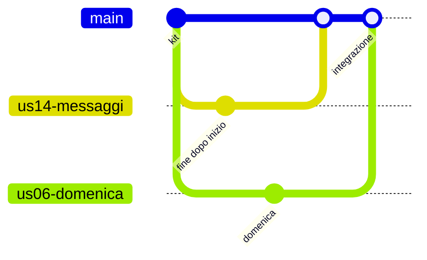

## Lezione 4.2: Branch, merge e conflitti

Modulo 4: Strumenti del team. Informatica per l'Impresa e Soft Skills Digitale

---

## I rami

- Linea di sviluppo indipendente: un nome che punta a un commit
- `main` funziona sempre
- `git switch -c us03-cancella`, `git switch main`, `git merge`, `git branch -d`

---

## Integrare

- Avanzamento veloce, commit di merge, conflitto

---

## I conflitti

- Stesse righe modificate in due rami
- Marcatori `<<<<<<<`, `=======`, `>>>>>>>`
- Capire le due versioni, scrivere il risultato, eseguire i test
- `git add` e `git commit`, oppure `git merge --abort`

---

## L'editor a tre vie

- Incoming a sinistra, Current a destra, Result in basso
- Accept Current, Accept Incoming, Accept Both
- Complete Merge
- "Accetta entrambe" non è sempre giusto

---

## Un ramo per storia

- Da `main` aggiornato, un ramo per storia
- Piccoli commit con test che passano
- Revisione, integrazione, cancellazione del ramo
- Rami brevi, integrazione frequente

---

## Laboratorio

1. Rami nel repository di prova
2. `python prepara_conflitto.py esercizio`, `git merge us06-domenica`, editor a tre vie
3. `python controlla_conflitti.py .`; 12 test

---

## Aspetti orientativi

- Integrare il lavoro di più persone: attività quotidiana
- Risolvere un conflitto: capire il lavoro dell'altro, e parlargli
- Come si risolvevano i conflitti senza Git?
