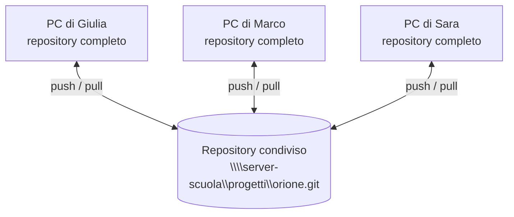
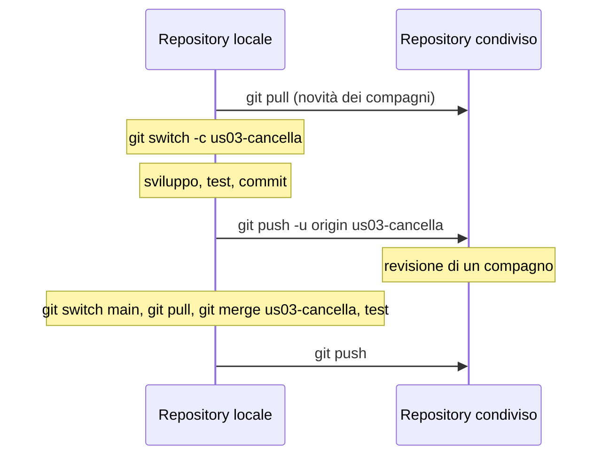

# Lezione 4.3: Repository condiviso e revisione

> Contenuto originale, salvo la lista di controllo per la revisione. Riferimenti: Scott Chacon e Ben Straub, "Pro Git", licenza CC BY-NC-SA 3.0, "Working with Remotes" e "The Protocols" (in inglese nella versione italiana del sito), https://git-scm.com/book/it/v2/Git-Basics-Working-with-Remotes e https://git-scm.com/book/it/v2/Git-on-the-Server-The-Protocols . Il file `laboratorio/lista_revisione_codice.md` è un adattamento di Google, "What to look for in a code review", https://google.github.io/eng-practices/review/reviewer/looking-for.html , licenza CC BY 3.0.

Obiettivo: collegare i repository dei membri del team a un repository condiviso, scambiare il lavoro con `clone`, `pull` e `push`, e rivedere il codice di un compagno prima di integrarlo.

## 4.3.1 Repository remoto

- **Repository remoto**
  copia del repository in un altro luogo (un server, una cartella condivisa), usata dal team come punto d'incontro.
- **Repository bare**
  repository senza cartella di lavoro, che contiene solo la storia: è la forma usata per i repository condivisi, su cui nessuno lavora direttamente.
- **origin**
  nome convenzionale del repository remoto da cui si è clonato.

Git può comunicare con un repository remoto con vari protocolli: HTTPS e SSH per i server, oppure il **protocollo locale**, cioè un percorso di una cartella, anche di rete. Nel corso si usa il protocollo locale: il repository condiviso di ogni team è una cartella `.git` sulla rete della scuola o su una chiavetta, e non servono account.

Diagramma: il repository condiviso e i repository dei membri del team.



Ogni membro ha la storia completa: se il repository condiviso andasse perso, si potrebbe ricreare da uno qualunque dei PC.

## 4.3.2 I comandi

| Comando | Che cosa fa |
|---|---|
| `git remote add origin percorso` | collega il repository locale a quello condiviso (una sola volta) |
| `git push -u origin main` | invia il ramo `main`; `-u` ricorda il collegamento per i comandi successivi |
| `git clone percorso cartella` | crea una copia locale completa del repository condiviso |
| `git pull` | riceve le novità del ramo corrente e le integra (equivale a `git fetch` più `git merge`) |
| `git fetch` | riceve le novità senza integrarle: si possono prima guardare |
| `git push` | invia i commit locali del ramo corrente |
| `git push -u origin us03-cancella` | invia un nuovo ramo, per esempio per la revisione |

Git rifiuta un `push` se nel repository condiviso ci sono commit che il repository locale non ha: prima si esegue `git pull`, si risolvono eventuali conflitti, si eseguono i test, poi si invia. È una protezione: impedisce di cancellare il lavoro di un compagno.

Diagramma: il ciclo di lavoro quotidiano.



## 4.3.3 Revisione del codice

- **Revisione del codice** (code review)
  lettura del codice scritto da un compagno prima che entri nel ramo principale.

Scopi:

- trovare errori e casi non gestiti prima che arrivino agli utenti
- mantenere il codice leggibile e coerente
- condividere la conoscenza: almeno due persone conoscono ogni parte del programma
- imparare dagli altri, in entrambe le direzioni

Che cosa guardare (dalla lista di controllo del laboratorio): progettazione, funzionalità, complessità, test, nomi, commenti, stile e coerenza, documentazione.

Come si rivede senza una piattaforma web:

```powershell
git fetch
git log --oneline main..origin/us03-cancella
git diff main...origin/us03-cancella
git switch us03-cancella
python -m unittest
```

- `git log main..origin/us03-cancella` elenca i commit del ramo che non sono ancora in `main`
- `git diff main...origin/us03-cancella` (tre punti) mostra le modifiche fatte nel ramo rispetto al punto in cui si è staccato da `main`
- `git switch us03-cancella` crea automaticamente il ramo locale collegato a quello remoto: si può provare il programma ed eseguire i test
- in VS Code, la vista Controllo del codice sorgente mostra gli stessi confronti file per file

Come si scrivono i riscontri: sul codice e non sulla persona, con una motivazione, distinguendo ciò che va corretto dai suggerimenti facoltativi, e segnalando anche ciò che è fatto bene. Nelle aziende la revisione si fa con le "richieste di integrazione" (pull request o merge request) delle piattaforme Git; il docente può mostrarne una con il proprio account.

## 4.3.4 Regole di integrazione del team

Una proposta, da adattare nell'accordo di team:

1. `main` funziona sempre: i test passano.
2. Nessuno lavora direttamente su `main`: un ramo per storia.
3. Prima di iniziare e prima di inviare: `git pull`.
4. Prima di ogni `push`: test superati (`prima_del_push.py`).
5. Un ramo entra in `main` solo dopo la revisione di un compagno.
6. Chi integra esegue di nuovo i test su `main` e aggiorna la board.

## 4.3.5 Laboratorio

Tempo indicativo: 50 minuti. Cartella di lavoro `C:\corso-impresa\lab43`, con i file della cartella `laboratorio`. Prima della lezione il docente crea i repository condivisi:

```powershell
python crea_repository_condivisi.py \\server-scuola\progetti orione vega lira
```

```text
orione      creato: \\server-scuola\progetti\orione.git
vega        creato: \\server-scuola\progetti\vega.git
lira        creato: \\server-scuola\progetti\lira.git
```

Lo script esegue per ogni team `git init --bare` e imposta `main` come ramo principale, così chi clona si trova subito su `main`. Se la cartella di rete appartiene a un altro utente del sistema, Git può rifiutarsi di usarla con l'errore "detected dubious ownership": il messaggio indica il comando `git config --global --add safe.directory ...` da eseguire (file di avvertenze del corso).

### Parte 1: condividere il repository del team (10 minuti)

Sul PC del Product Owner, nella copia di riferimento diventata repository nella lezione 4.1:

```powershell
git remote add origin \\server-scuola\progetti\orione.git
git push -u origin main
```

Gli altri membri clonano e impostano la propria identità nel repository:

```powershell
git clone \\server-scuola\progetti\orione.git C:\corso-impresa\progetto_orione
cd C:\corso-impresa\progetto_orione
git config user.name "Marco T."
git config user.email "marco.t@classe.invalid"
python -m unittest
```

### Parte 2: una modifica ciascuno, con revisione (30 minuti)

Ogni membro:

1. crea un ramo, per esempio `accordo-marco`;
2. fa una piccola modifica utile: il primo aggiunge l'accordo di team della lezione 1.2 in `docs/accordo_di_team.md`; gli altri completano il criterio di accettazione mancante di una storia, correggono un refuso nel README, aggiungono una sezione al manuale (lezione 4.4);
3. registra la modifica e controlla:

```powershell
python C:\corso-impresa\lab43\prima_del_push.py
```

```text
OK           ramo corrente: accordo-marco
OK           il ramo accordo-marco non esiste ancora nel repository condiviso: primo invio con git push -u origin accordo-marco
OK           test superati: 27
```

4. invia il ramo con `git push -u origin accordo-marco` e chiede la revisione a un compagno;
5. il compagno rivede con i comandi della sezione 4.3.3 e la lista `lista_revisione_codice.md`, e comunica il riscontro;
6. dopo l'approvazione, l'autore integra: `git switch main`, `git pull`, `git merge accordo-marco`, test, `git push`.

Quando più persone integrano quasi insieme, l'ultimo si vede rifiutare il `push`: è il momento di applicare la regola 3 della sezione 4.3.4.

Come `prima_del_push.py` capisce se il ramo è indietro:

```python
_, conteggi = git(cartella, "rev-list", "--left-right", "--count", f"origin/{ramo}...HEAD")
indietro, avanti = (int(x) for x in conteggi.split())
```

- dopo `git fetch`, `origin/accordo-marco` è la versione del ramo nel repository condiviso
- `--left-right --count` conta i commit presenti solo a sinistra (nel repository condiviso: quelli che mancano in locale) e solo a destra (quelli locali da inviare)
- se `indietro` è maggiore di zero, serve prima `git pull`
- i test vengono eseguiti senza scrivere i file `.pyc`, per non usare versioni compilate vecchie

Test: `python test_repository_condiviso.py` (13 test; simulano il repository condiviso e due membri del team in cartelle temporanee).

### Parte 3: verifica (10 minuti)

Alla fine tutti eseguono `git pull` su `main` e `git log --oneline --graph`: la storia deve essere la stessa su tutti i PC. Il team aggiunge all'accordo di team le proprie regole di integrazione (sezione 4.3.4).

## 4.3.6 Aspetti orientativi (discussione)

- La revisione del codice è una pratica standard nelle aziende di software: chi entra in un team riceve revisioni sul proprio codice fin dal primo giorno, e presto le fa agli altri.
- Dare e ricevere riscontri sul lavoro in modo costruttivo è una competenza trasversale apprezzata in ogni professione.
- Domanda: è stato più utile ricevere la revisione o farla? Che cosa si è imparato leggendo il codice di un compagno?
